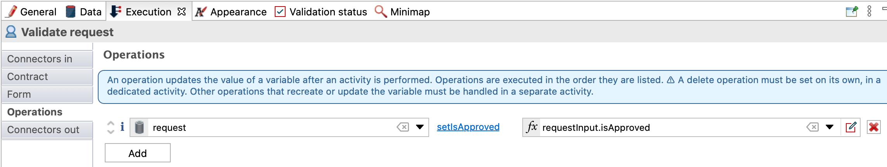

## Goal

The goal of this exercise is to continue the leave request process implementation by:

1. Setting up a Business Data Model (BDM)
1. Specifying contracts for the case instantiation and human tasks

Once completed, the process will be executable with automatically generated forms.

> ⚠ It is mandatory to strictly observe the case and syntax of the technical names provided in the instructions. Failing to do so will result in errors.

## Instructions overview

Duplicate the process diagram from the previous exercise to create a 2.0.0 version

Create a *LeaveRequest* business object (this is a technical name so it should not contain spaces or special characters) with the following attributes (don't use the **Multiple** option):

Name | Type | Multiple | Mandatory
---- | ---- | -------- | ---------
*requestorId* | `Long` | ◻ | ☑
*leaveStart* | `Date only` | ◻ | ☑
*dayCount* | `Integer` | ◻ | ☑
*isApproved* | `Boolean` | ◻ | ◻

Declare a business variable *request* of type *LeaveRequest* on your pool.

Using the Studio assistant (i.e.: **Add from data...**), generate the case instantiation contract, as well as the initialization script, from the *request* data with the following mandatory attributes:

- leaveStart
- dayCount

Add these two constraints on the case instantiation contract:

- *leaveStart* must be in the future
- *dayCount* must be strictly greater than zero

Initialize the *request* business variable using the auto-generation provided by the contract creation.

Add a step contract on the *Validate request* task use the Studio assistant with the following attribute:

- isApproved

## Step by step instructions

1. Duplicate the process diagram from the previous exercise to create a *2.0.0* version:
   - In the Studio's top menu, click on **File / Duplicate diagram...**
   - Update the process diagram AND pool version numbers
1. Create the *LeaveRequest* BDM:
   - Navigate to the **Development / Business Data Model / Define...** top menu
   - Click on **New Business Object** (A) in the **List of Business Objects**
   - Name the object *LeaveRequest* (B) (this is a technical name so it should not contain spaces or special characters)
   - With the *LeaveRequest* object selected, add the following attributes (C):

   Name | Type | Multiple | Mandatory
   ---- | ---- | -------- | ---------
   *requestorId* | `Long` | ◻ | ☑
   *leaveStart* | `Date only` | ◻ | ☑
   *dayCount* | `Integer` | ◻ | ☑
   *isApproved* | `Boolean` | ◻ | ◻

   
    
   - Click on **Finish**
   - You should be displayed with the following message that confirm the deployment of the BDM:
   
   
   
   - Check the box **Don't show me this message again**
   - Click on **Ok**
1. Declare a business variable of type *LeaveRequest* on your process:
   - Select the process pool
   - Navigate to the **Data / Pool variables** tab
   - In the **Business variables** section, click on **Add...**
   - Name the variable *request* and select the *com.company.model.LeaveRequest* business object
   - Click on **Finish**
   
   
   
1. Set up the case instantiation contract:
   - Select the process pool
   - Navigate to the **Execution / Contract / Inputs** tab
   - Click on **Add from data...**
   - Select the *request* business data
   - Keep the default input name *requestInput*
   - Click on **Next**
   - Uncheck the *requestorId* and *isApproved* attributes   
   
   
   
   - Click on **Finish** (not on **Finish & Add**) and dismiss the warning message about the incomplete initialization of the business variable
   
   
   
   - Still in the **Execution / Contract** tab, switch to the **Constraints** tab
   - Add the following constraint:

   Property | Value
   -------- | -----
   Name | leaveStartIsFuture
   Expression | `requestInput.leaveStart.isAfter(java.time.LocalDate.now())`
   Error message | Leave start must be in the future
   
   - Add a second constraint:
   
   Property | Value
   -------- | -----
   Name | atLeastOneDay
   Expression | `requestInput.dayCount > 0`
   Error message | Day count must be greater than zero
   
   

1. Update the *request* business variable initialization:
   - Select the process pool, and navigate to the **Data / Pool variables** tab
   - Select the *request* business variable
   - Click on **Edit...**
   - Click on the **pencil** icon next to the **Default value** field to open the expression editor
   - Clear all of the generated code and replace it by the following:

   ```groovy
   def leaveRequestVar = new com.company.model.LeaveRequest()
   leaveRequestVar.leaveStart = requestInput?.leaveStart
   leaveRequestVar.dayCount = requestInput?.dayCount

   // Retrieve current process instance
   def processInstance = apiAccessor.processAPI.getProcessInstance(processInstanceId)
   // Add requestor id to the new request
   leaveRequestVar.requestorId = processInstance.startedBy

   return leaveRequestVar
   ```
   
   - This will initialize the business variable from the contract data and set the process initiator as the request author
   - Click on **OK** button to close the expression editor
   - Click again on **OK** button to confirm the modification of the business data

1. Set up the *Validate request* step contract
   - Select the *Validate request* task
   - Navigate to the **Execution / Contract / Inputs** tab
   - Click on **Add from data...**
   - Select the *request* business data, keep the default input name *requestInput*
   - Click on **Next**
   - Check only the *isApproved* attribute
   - Click on **Finish** (not on **Finish & Add**) and dismiss the warning message about the incomplete initialization of the business variable

1. Note that an operation (**Execution / Operations**) on *Validate request* task to update the request has been automatically generated:
   
   

1. Use the business data to dynamically control the process flow by configuring the *Yes* transition condition to use *isApproved* attribute value:
   - Select the transition *Yes*
   - Navigate to the **General / General** tab
   - Click on the pencil icon next to the **Condition** drop-down to open the expression editor
   - In the expression editor, select **Java** as the expression type
   - Select the *request* variable and the *isIsApproved* method
   
   
   
1. Save the process:
   - Click on the **Save** button from the Studio's top menu bar

1. Run the process to test your contract constraints:
   - Run the process and use the automatically generated forms to test your constraints

> ℹnformation :
> - For the *leaveStart* input, enter a date in the YYYY-MM-DD format
> - For the *isApproved* input, enter a boolean value: either `true` or `false`

   

[Next exercise: create forms](03-forms.md)
