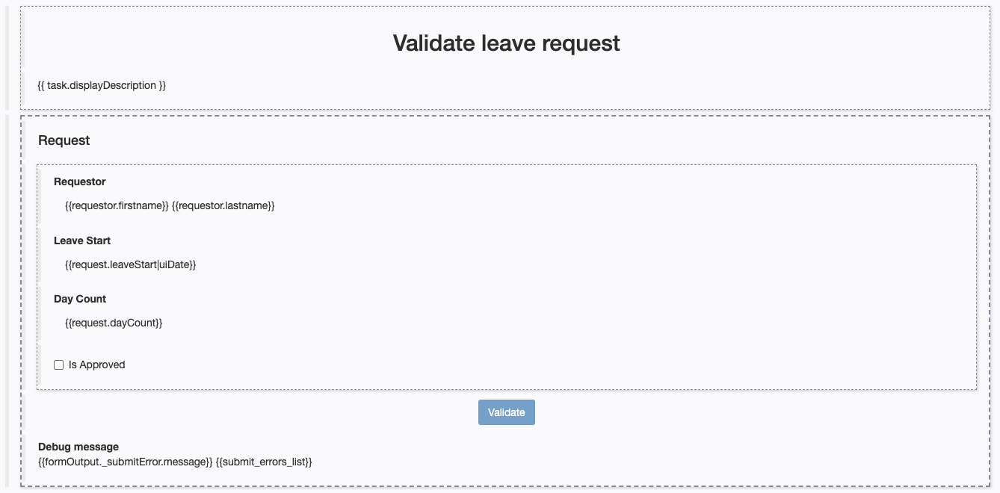

## Goal

The goal of this exercise is to provide simplified but user friendly forms for the execution of the process.

## Instructions overview

Duplicate the process diagram from the previous exercise to create a *2.1.0* version.

Create the following forms:
- A case instantiation form at pool level that sets the *leaveStart* and *dayCount* attribute of *leaveRequest* business variable
- A form for the *Validate request* task that displays the requestor user details, the *leaveStart* and *dayCount* data in read-only mode and that sets the *isApproved* data

## Step by step instructions
1. Duplicate the process diagram from the previous exercise to create a *2.1.0* version
1. Create a case instantiation form:
   - Select the process pool
   - Navigate to the **Execution / Instantiation form** tab
   - Click on the **pencil** next to the **Target form** input
   
   
   
   - This will open the UI Designer in a browser with a form automatically generated from your instantiation contract
     
     
1. Rename the form:
   - Use the text field on top of the screen to rename the form from *newForm* to *fillLeaveRequest* (this is a technical name so it should not contain spaces or special characters)
   - Click on **Save**
1. Update the form title:
   - Select the top most widget *Request*
   - In the section on the right edit the following properties:

   Property | Value
   -------- | -----
   Text | Fill a new leave request
   Text level | Level 2
   Alignment | center

1. Update the *Leave Start* widget:
   - Select the *Leave Start* widget and edit the following properties:
   
   Property | Value
   -------- | -----
   Text | Leave start date
   Show Today button | no
   
1. Update the *Day Count* widget:
   - Select the *Day Count* widget and edit the following properties:
   
   Property | Value
   -------- | -----
   Label | Number of days
   Min value (not to be confused with the **Value min length** property) | 1

1. Update the *Submit* widget
   - Select the *Submit* widget
   - Change the label to *Submit request*
1. Check the form's appearance:
   - Make sure that the form looks like this in the editor:
   
   
   
   - Click on the **Save** button at the top of the screen
   - Click on the **Preview** button at the top of the screen
   - The form should look like this:
   
   
   
   - Verify the following points:
     - The widget presenting the error is not visible
     - It is possible to test the preview on different devices, from the mobile phone to the big screen
     - The *Submit* button is disabled by default (this is due to the validation provided by the form container)
     - The *Submit* button is enabled when the form is valid
   > **Note:** the form cannot be submitted from the preview mode even if it is valid.

1. Close the preview window
1. Create a form for the *Validate request* task:
   - In the Studio, select the *Validate request* task
   - Navigate to the **Execution / Form** tab
   - Click on the **Pencil** next to the **Target form** input to open a new form in the UI Designer
   - Answer **Yes** to the question regarding generation of read-only widgets
   
   > **Note:** the form was automatically generated from the BDM and the contract, and displays read-only data from the BDM that is not expected by the contract at this stage.

1. Rename the form:
   - In the UI Designer, rename the form into *validateLeaveRequest* and save it
1. Retrieve the requestor's user data
   - Click on the **Create a new variable** button to declare a new variable with the following properties:
   
   
   > **Note:** you can use the examples that allow you to automatically retrieve API call patterns. Here we will retrieve `identity API` because we are looking for information related to a user.

1. Edit the form title:
   - Select the **Title** widget located at the top of the form
   - Configure the widget with the following settings:
   
   Property | Value
   --------- | ------
   Text | Validate leave request
   Title level | Level 2

1. Modify the text widget *Requestor id* to display requestor first and last names:
   - Change the label value to *Requestor*   
   - Configure the widget with the following settings:`{{requestor.firstname}} {{requestor.lastname}}`

  

1. Modifiy the *Submit* widget:
   - Select the widget
   - Modify the label to *Validate*
    
1. Check the form's appearance
   - Make sure that the form looks like this in the editor:
   
   

1. Save the form:
   - Use the top **Save** button to save the form
1. Test the process execution:
   - Run the process from the Studio and execute all of its steps
   - Validate that the proper execution path was taken at the end of process execution by looking at the case history in the Bonita user application
   
[Next exercise : actors configuration](04-actors.md)
