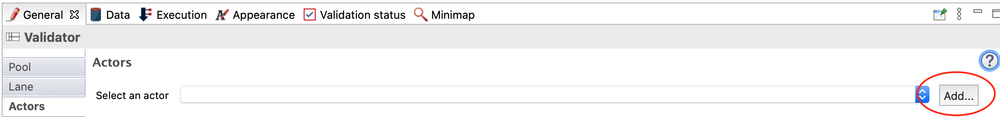
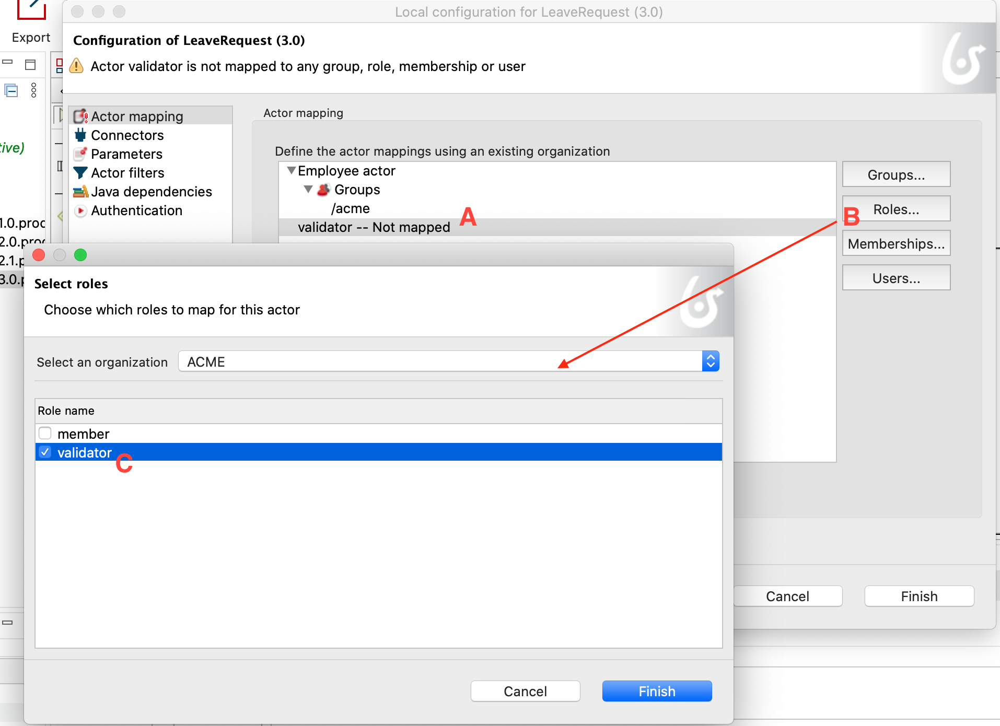

## Goal

The goal of this exercise is to add collaboration to the existing process by dispatching the tasks between two actors: a requestor and a validator.

## Instructions overview

Duplicate the process diagram from the previous exercise to create a *3.0.0* version.

Add a *Validator* lane to the diagram and move the *Validate request* task in it.

Define a role **Validator** in the organisation and map it to the *Validator* lane.

## Step by step instructions

1. Duplicate the process diagram from the previous exercise to create a *3.0.0* version

1. Add a *Validator* lane to the process:
   - Select the **Lane** element from the BPMN palette on the left hand side of Studio:
   
   
   
   - Click in the process pool to add the lane
   - Select the lane
   - Navigate to the **General / Lane** tab
   - Set the name to *Validator*

1. Rename the other lane into *Requestor*

1. Drag and drop the *Validate request* task into the *Validator* lane

1. Make sure that the diagram looks like this:

   

1. Create a role *validator* in the organization :
   - In the project explorer, click on **Organization** and select the test organization *ACME.organization*.   
     The organization editor opens, with an overview of *groups*, *roles* and *users*.
     
   - Click on the pencil to edit roles.
   - Click on **Add a role** (A) and edit (B) the technical name of the role (by clicking on the pencil) to specify *validator*.
   - Add the display name *Validator*.
     
     
1.Map this new role to the user *Helen Kelly* who is in charge of validating the vacation requests of our user by default *Walter Bates*.
   - Go to the tab**User** and select *Helen Kelly*.
   - In **Membership**, change the role from *member* to *validator*
     
   - Deploy the organization to apply the changes by clicking on the **Deploy** icon.
   
   >**Note** To go further, it is also possible to define an actor filter. This method is described in a next exercise.

1. Define actors on the process
   - In the diagram select the lane *Validator*
   - Navigate to the tabl **General / Actor**
   - Click on **Add**
     
   - In the filed **Name** add *validator*.Do not check the **Initiator** box because the initiator is the requestor.
   - Click on **Finish**.
   - Check that the actor defined in the *Requestor* lane is the default actor *Employee actor*.

1. Link the organization to the actors in the process:
   - Click on the *Configure* icon  which will associate actors with the correct roles in the organization.
   - In the editor, select **Actor mapping**. The employee actor is already associated with a group, so do the same with the **validator** actor
   - Select the **validator** actor (A) then click on the **Roles** button (B)
   - In the window, select the **validator** role (C)
     

1. Execute the process with the two actors:
   - Run the process from the Studio (user "Walter Bates" will be used)
   - Submit the *Fill leave request* form. If the actors are properly set, the *Validate request* task should not be available anymore
   - Disconnect from the Portal by clicking on the user name in upper right corner of the screen and clicking on **Logout**
   
   
   
   - Connect as user *helen.kelly* with *bpm* as password
   - If the actor and the role are correctly set, the *Validate request* tasks should now be available in the inbox

[Next exercise: connector configuration](05-connectors.md)
