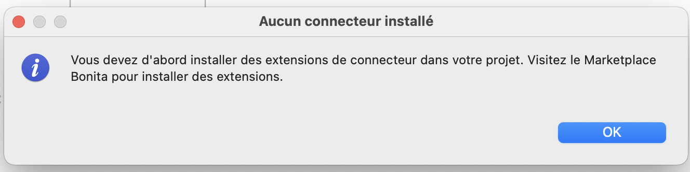
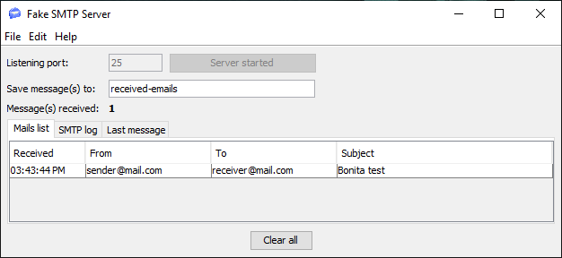
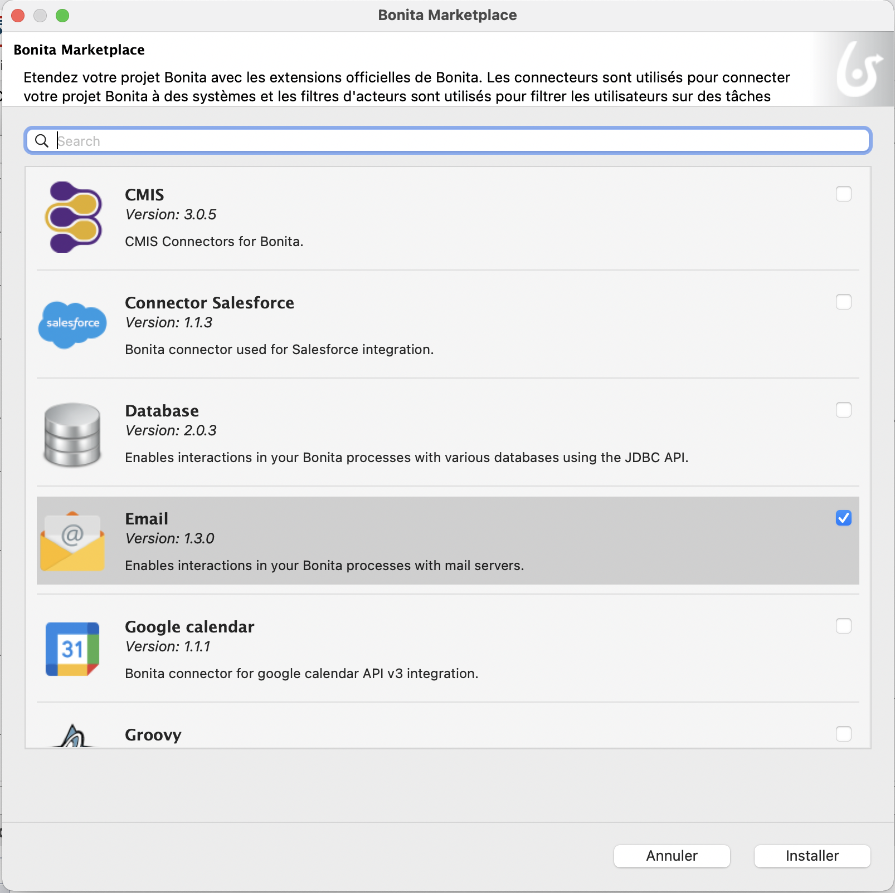
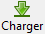

## Goal

The goal of this exercise is to demonstrate an interaction between Bonita and an external system with the use of a connector. In this exercise, we will notify the leave request initiator about his request status with an email connector.

>  ⚠ Depending on your network configuration, your firewall or the security settings of your email server you may not be able to send an email from Bonita.  
> In order to get rid of those technical constraints, we will use a program that simulates an email server (FakeSMTP).

## Instructions overview

Obtain and start the [FakeSMTP](http://nilhcem.github.io/FakeSMTP/downloads/fakeSMTP-latest.zip) server.

Duplicate the process diagram from the previous exercise to create a *3.1.0* version.

Add an email connector on the *Notify request approved* and *Notify request rejected* service tasks. They will send an email to the requestor with the request validation status.

A script must be defined to retrieve the requestor's email in the connector.

## Step by step instructions

1. FakeSMTP setup:
   - Download FakeSMTP from this link: [http://nilhcem.github.com/FakeSMTP/downloads/fakeSMTP-latest.zip](http://nilhcem.github.com/FakeSMTP/downloads/fakeSMTP-latest.zip)
   - Unzip the file `fakeSMTP-latest.zip`
   - Run FakeSMTP by either double-clicking on the JAR file or running this shell command: `java -jar fakeSMTP-2.0.jar`
   - Once the user interface is displayed, set the listening port to *2525* and click on the **Start server** button

1. Duplicate the process diagram from the previous exercise to create a *3.1.0* version

1. Test the email connector to obtain the right SMTP configuration:
   - Navigate to the **Development / Connectors / Test connector...** top menu
   - Select the **Email (SMTP)** connector by using either the text filter or the **Messaging** category
   - Click on **Next**
   - Set these connection parameters (username and password remain empty):

   Property | Value
   -------- | -----
   SMTP host | *localhost*
   SMTP port | *2525* (the port number specified in FakeSMTP)
   SSL (in the **Security** section) | unchecked
   
   - Click on **Next**
   - Enter some email addresses (not necessarily existing addresses) in the **From** and **To** fields
   - Click on **Next**
   - Enter *Bonita test* as the subject
   - Click on the **Test** button
   - Confirm the test without checking any dependency
   - At this stage, you should get a message similar to this one (click on the **OK** button):
   
   
   
   - Make sure that the email is received by FakeSMTP as shown below:
   
   
   
   - Once the configuration is valid, click on 
   - Name the configuration *emailConfig* and save it
   - Close the connector test interface

1. Add an email connector on the *Notify request approved* task:
   - Select the task *Notify request approved*
   - Navigate to the **Execution / Connectors in** tab
   - Click on **Add...**
   - Select the **Email (SMTP)** connector
   - Click on **Next**
   - Name it *sendRequestApprovedEmail*
   - Click on **Next**
   - Do not fill in the parameters
   - Click on 
   - Select the *emailConfig*
   - Move to the *Email addressee* configuration page
   - Enter *hr@acme.com* in the **From** field
   - Use the **pencil** icon to edit the expression of the **To** field
   - Name the script *getRequestorEmail*
   - In the script editor, select *processInitiatorUser* from the menu **Code templates/Bonita Users**.
   - Drag and drop the template into the editor. A script template is automatically generated.
   
   
   
   - To be able to return the email of the process initiator, drag and drop *userProfessionalContact* from the **Code templates/Bonita Users** menu between `.getStartedBy()` and `}catch(UserNotFoundException e){`.
   - Replace *userId* with `processInitiator.id`.
   - Add a "." and select *email: string* in the drop-down list
   - We can replace `def proContactData = ` by `return`.
   
   
   - Click on **OK** to close the script editor window
   - Move to the next page
   - Set *Leave request approved* as the subject
   - Click on **Finish**
1. Add an email connector on the *Notify request rejected* task:
   - Repeat the previous steps by naming the connector *sendRequestRejectedEmail* and setting *Leave request rejected* as the subject

   >**Note**: alternatively you can use the feature that let you create a copy of an already configured connector and add it to another task

1. Test the process:
   - Execute the process twice to test the different paths and check that FakeSMTP receives the right emails

[Next exercise: create an application](06-applications.md)
