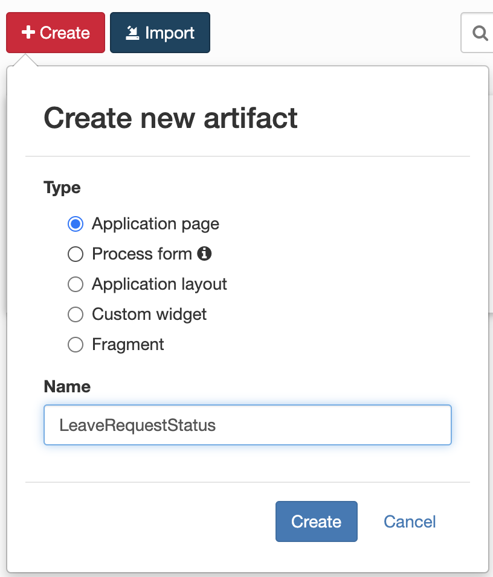
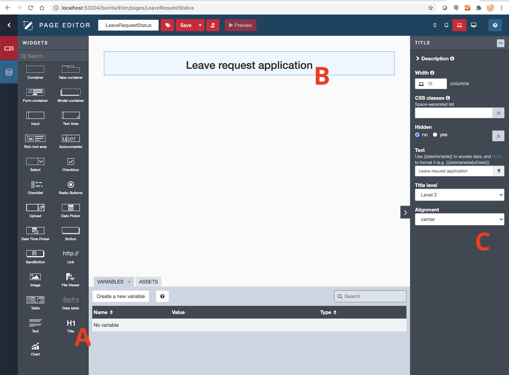
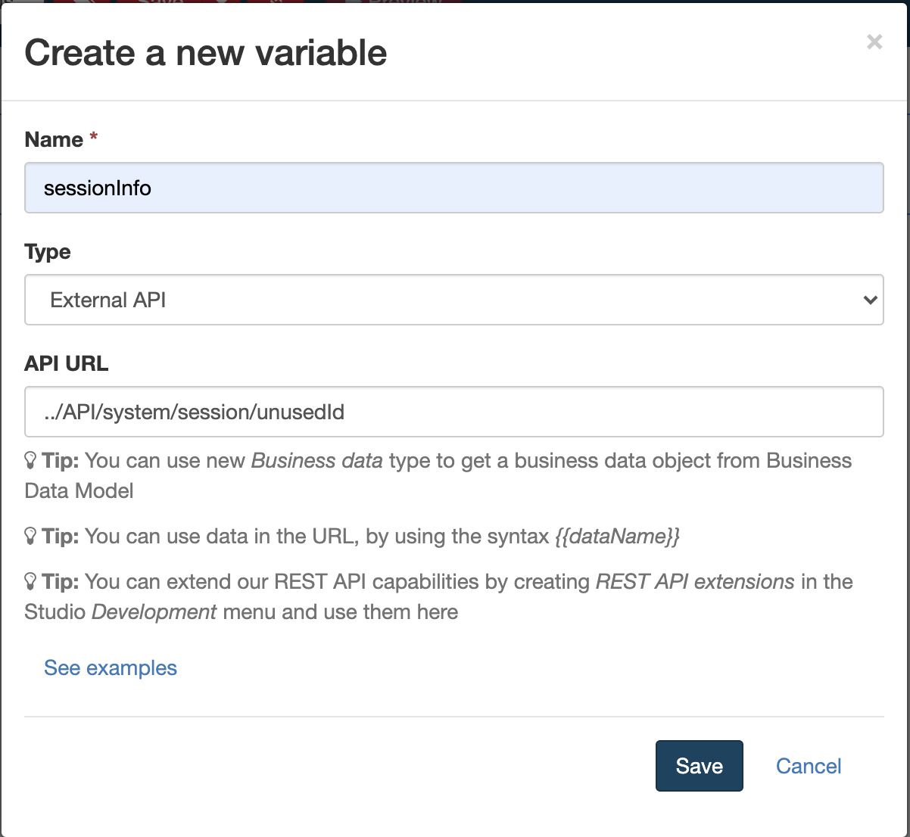
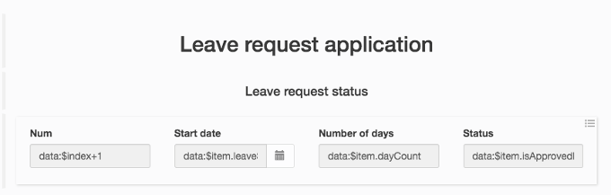
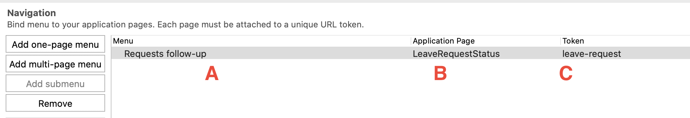
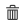
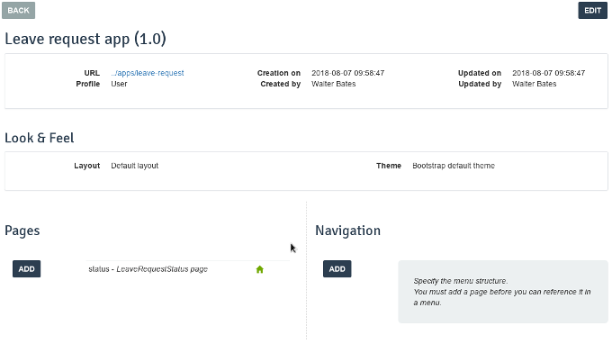
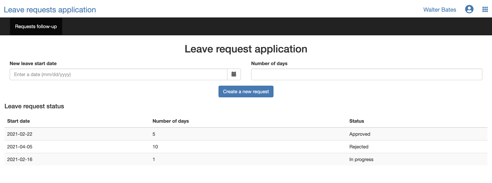
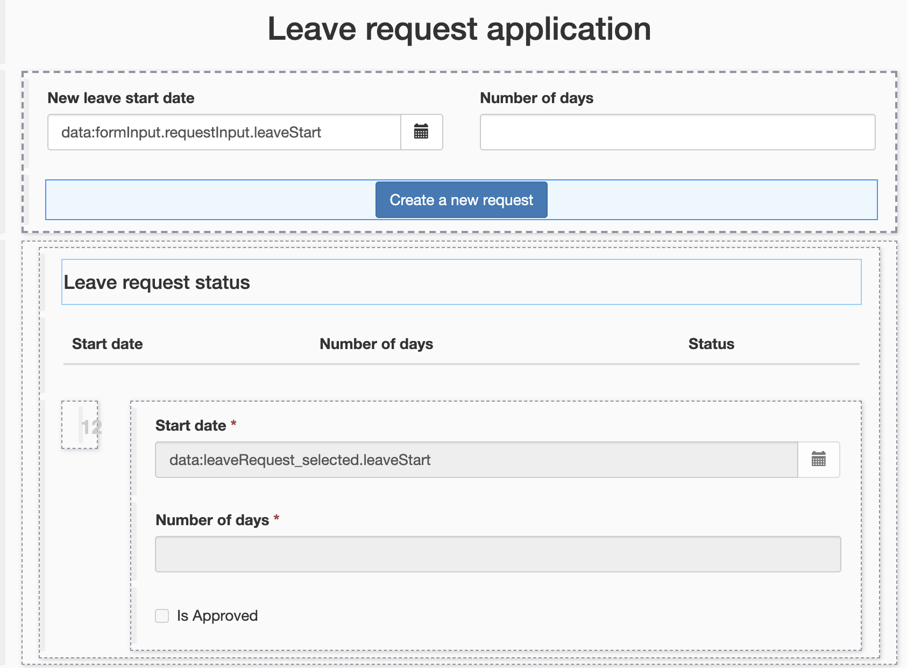

## Goal

The goal of this exercise is to build an application for users to create and manage their leave requests.

## Instructions overview

Open the UI Designer and create a new **Application page** named *LeaveRequestStatus* to follow the progress of the connected user leave request.

This page will contain one "multiple container" that list the on-going leave requests. For each request, the start date, number of days and status will be displayed.

Deploy the application page using the **Deploy** button from the Studio.

Create a new application. Then add the *LeaveRequestStatus* page in the application.

Access the application using the generated URL.

Optional: Add a date widget and an input widget to collect new leave request information in the page. Then add a submit button to start a new leave request.

## Step by step instructions

1. Create a new page:
   - In the Studio, click on the **UI Designer** button
   - Click on the **Create** button
   - Select **Application page**
   - Set the name to: *LeaveRequestStatus*
   - Click on **Create**
   
   
   
   - You should now be on the designer page

1. Add a title to your page:
   - Drag the widget **Title** (A) from the palette to the top of the page (B)
   - Select the widget
   - On the right panel, enter *Leave request application* in the **Text** field (C)
   - Select **center** for **Alignment**
   
   

1. Add another title below:
   - Name it *Leave request status*
   - Select **Level 4** from the **Title level** drop-down list
   - Select **center** for **Alignment**

1. Create a variable to store the session information:
   - Click on **Create a new variable**
   - Name it *sessionInfo*
   - Choose **External API** for the type
   - In the field API URL, enter: `../API/system/session/unusedId`
   
   
   
1. Create a variable to list the leave request:
   - Click on **Data model** icon
   - Drag and drop *LeaveRequest* onto the page
   - In section **"Find By" queries on an attribute**, select *requestorId*
   - In section **"requestorId" value** enter : `{{sessionInfo.user_id}}`
   - Click on **Save** button

1. Declare a new JavaScript expression to format the list of request:
   - Click on **Create a new variable**
   - Name it *updateLeaveRequestStatus*
   - Choose **JavaScript expression** type
   - Replace the existing value with the following script:
   ```javascript
   if($data.hasOwnProperty('leaveRequest') && $data.leaveRequest) {
     for (let line of $data.leaveRequest) {
       if (line.isApproved === null) {
         line.isApprovedLabel = "In progress";
       } else if (line.isApproved) {
         line.isApprovedLabel = "Approved";
       } else {
         line.isApprovedLabel = "Rejected";
       }
     }
   }
   
   return $data.leaveRequest;
   ```

1. Create a multiple container:
   - Drag the widget **Container** from the palette and place it below the Title *Leave request status*
   - Select the container
   - In the right panel, enter *leaveRequest* in the field **Collection**

1. Add 4 widgets in the container:
   - One **Input** widget with the following options:
   
     Property | Value
     -------- | -----
     Width | *3*
     Read-Only | **Yes**
     Label | *#*
     Value | `$index + 1`

   - One **Date picker** widget with the following options:
   
     Property | Value
     -------- | -----
     Width | *3*
     Read-Only | **Yes**
     Label | *Start date*
     Value | `$item.leaveStart`
     Show Today button | **No**

   - One **Input** widget with the following options:
   
     Property | Value
     -------- | -----
     Width | *3*
     Read-Only | **Yes**
     Label | *Number of days*
     Value | `$item.dayCount`

   - One **Input** widget with the following options:
   
     Property | Value
     -------- | -----
     Width | *3*
     Read-Only | **Yes**
     Label | *Status*
     Value | `$item.isApprovedLabel`

   - Save the page
   - The page should look like this:
   
   
   
   - You can preview the page at anytime by clicking on **Preview** button
   
   > Tip: if you are logged in the Portal in the same browser, the current leave request will be displayed.

1. Deploy the application page in the Portal:
   - On the left hand side of the Studio, in the project **Explorer**, unfold **Pages/Forms/Layouts**
   - Select the page *LeaveRequestStatus*
   - Do a right click and select **Deploy**
   - Click on **OK** button

1. Create a new application:
   - In the Portal, switch to **Administatior** view
   - Navigate to the **Applications** tab
   - Click on **New**
   - Enter *Leave request app* in the field **Display name** (A)
   - Enter *leave-request* in the field **URL** (B)
   - Leave the defaults value for the **Version** (C) and **Profile** (D)
   
   
   
   - Click on **Create** to create the application
   - Click on **...** to access the configuration page
   - Find the **Pages** section on the bottom left part of the screen
   - Click on **Add**
   - Select the page *custompage_LeaveRequestStatus*
   - Enter *status* in the **URL** field
   - Click on the **Add** button
   - Define the *leaveRequest* page as the homepage by clicking on the **house** icon 
   - Once done, click on the trash icon  to delete the default homepage
   - The configuration page should now look like that:
   
   
   
   - Click on the link *../apps/leave-request* to load the application:
   
   

1. Add a new form container:
   - Go back to edit your page in the UI Designer
   - Drag a form container from the palette and place it between the two titles

1. Create a new variable to store the new leave request values:
   - Click on **Create a new variable**
   - Name it *formInput*
   - Choose **JSON** type
   - Enter the following script in the **Value** text field:
   
   ```
   {
     "requestInput" : {
       "leaveStart" : null,
       "dayCount" : null
     }
   }
   ```

1. Create a new variable to store the process information:
   - Click on **Create a new variable**
   - Name it *processDefinitionInfo*
   - Choose **External API** type
   - In the field API URL, enter: `../API/bpm/process?p=0&c=100&o=version%20DESC&f=name=LeaveRequest`

1. Add 2 widgets in the form container:
   - One **Date picker** widget with the options:
     - Width: *6*
     - Value: `formInput.requestInput.leaveStart`
     - Label: *Leave start date*
   - One input widget with the options:
     - Width: *6*
     - Value: `formInput.requestInput.dayCount`
     - Label: *Number of days*

1. Add a submit button in the form container:
   - Drag the **Button** widget from the palette and place it in the form container below the two widgets
   - Enter *Create a new request* in the field **Label**
   - Select **POST** in the **Action** drop-down list
   - Click on **fx** to switch the **Data sent on click** field mode and then enter *formInput*
   - In the field **URL to call**, enter: `../API/bpm/process/{{processDefinitionInfo[0].id}}/instantiation`
   - In the field **Target URL on success**, enter: `/bonita/apps/leave-request`
   - Save the page
   - The page should look like that:
   
   
   
   - You can preview the page to make sure it works as expected

1. Update the page in the portal:
   - Repeat the steps you took to deploy the page
   - Refresh your application, the change should be visible
