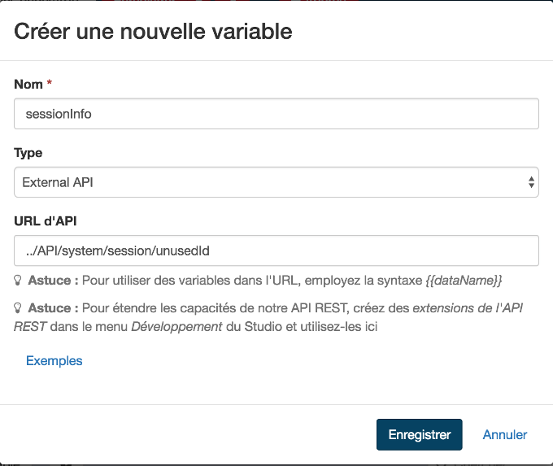
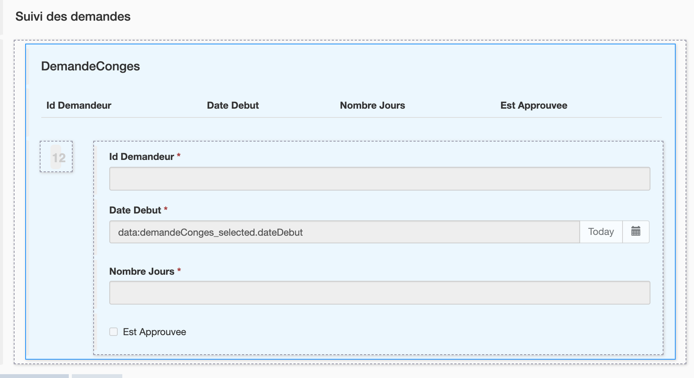
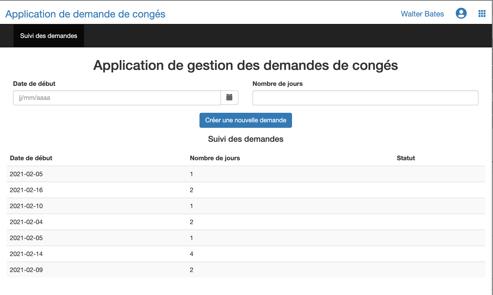

## Goal

The goal of this exercise is to build an application for users to create and manage their leave requests.

## Instructions overview

Open the UI Designer and create a new **Application page** named *LeaveRequestStatus* to follow the progress of the connected user leave request.

This page will contain one "multiple container" that list the on-going leave requests. For each request, the start date, number of days and status will be displayed.

*Optional: Add a date widget and an input widget to collect new leave request information in the page. Then add a submit button to start a new leave request.*

Create a new application. Then add the *LeaveRequestStatus* page in the application.

Deploy the application page using the **Deploy** button from the Studio.

Access the application using the generated URL.


## Step by step instructions

1. Create a new page:
   - In the Studio, click on the **UI Designer** button
   - Click on the **Create** button
   - Select **Application page**
   - Set the name to: *LeaveRequestStatus*
   - Click on **Create**
   
   
   
   - You should now be on the designer page

1. Add a title to your page:
   - Drag the widget **Title** (A) from the palette to the top of the page (B)
   - Select the widget
   - On the right panel, enter *Leave request application* in the **Text** field (C)
   - Select **center** for **Alignment**
   
   

1. Create a variable to store the session information:
   - Click on **Create a new variable**
   - Name it *sessionInfo*
   - Choose **External API** for the type
   - In the field API URL, enter: `../API/system/session/unusedId`
   
   
   
1. Create a variable to list the leave request:
   - Click on **Data model** icon 
   - Drag and drop *LeaveRequest* onto the page just below the main title (a dotted line should appear)
   - Keep the name by default *leaveRequest*
   - In section **"Find By" queries on an attribute**, select *requestorId*
   - In section **Filter the query of findByRequestorId** enter the followig variable: 
        

   - Click on **Save** button
    
   A multiple container is automatically generated with a table showing the attributes of the RequestConges object.
   

1. Modify the container title like follows:
   
     Property | Value
     -------- | -----
     Title | *Leave request status*
     Title level | **Level 4**
     Alignment | **left**

1. Modify the labels of the widget **Table**:
    - Select the widget **Table**
    - In the right panel, in the **Headers** field, delete *RequestorId*.
    - Replace *Leave Start* with *Start date*, *Day Count* with *Number of days* and *Is Approved* with *Status*.

1. Declare a new JavaScript expression to format the column *Status* of the list:
   - Click on **Create a new variable**
   - Name it *updateLeaveRequestStatus*
   - Choose **JavaScript expression** type
   - Replace the existing value with the following script:
   ```javascript
   if($data.hasOwnProperty('leaveRequest') && $data.leaveRequest) {
     for (let line of $data.leaveRequest) {
       if (line.isApproved === null) {
         line.isApprovedLabel = "In progress";
       } else if (line.isApproved) {
         line.isApprovedLabel = "Approved";
       } else {
         line.isApprovedLabel = "Rejected";
       }
     }
   }
   
   return $data.leaveRequest;
   ```

1. Display the information in the columns of the table more clearly :
    - In the right panel, in the field **Column keys**, delete *requestorId*.
    - In the same field, replace *isApproved* with *isApprovedLabel*.
    - Delete the Input *IdDemandor* widget in the details container because this information is not useful
    
1. Select the **Date picker** widget called *Leave Start* and edit the following properties:
   
     Property | Value
     -------- | -----
     Read-Only | **Yes**
     Label | *Start date*
     Show Today button | **No**

1. Select the **Input** widget called *Day Count* and edit the following properties:
   
     Property | Value
     -------- | -----
     Read-Only | **Yes**
     Label | *Number of days*

   - Save the page
   - The page should look like this:
   
   
   
   - You can preview the page at anytime by clicking on **Preview** button
   
   

   
   > Tip: if you are logged in the Portal in the same browser, the current leave request will be displayed.

1. Add a new form container:
   - Go back to edit your page in the UI Designer
   - Drag a form container from the palette and place it between the two titles

1. Create a new variable to store the new leave request values:
   - Click on **Create a new variable**
   - Name it *newLeaveRequest*
   - Choose **JSON** type
   - Enter the following script in the **Value** text field:
   
   ```
      var request = {
     "requestInput" : {
       "leaveStart" : null,
       "dayCount" : null,
       requestorId : $data.sessionInfo.user_id
     }
   };
   return request;
   ```
1. Create a new variable to store the process information:
   - Click on **Create a new variable**
   - Name it *processDefinitionInfo*
   - Choose **External API** type
   - In the field API URL, enter: `../API/bpm/process?p=0&c=100&o=version%20DESC&f=name=LeaveRequest`

1. Add 2 widgets in the form container:
   - One **Date picker** widget with the options:
     - Width: *6*
     - Value: `formInput.requestInput.leaveStart`
     - Label: *New leave start date*
   - One input widget with the options:
     - Width: *6*
     - Value: `formInput.requestInput.dayCount`
     - Label: *Number of days*
     - Type: *number*

1. Add a submit button in the form container:
   - Drag the **Button** widget from the palette and place it in the form container below the two widgets
   - Enter *Create a new request* in the field **Label**
   - Select **POST** in the **Action** drop-down list
   - Click on **fx** to switch the **Data sent on click** field mode and then enter *leaveRequest*
   - In the field **URL to call**, enter: `../API/bpm/process/{{processDefinitionInfo[0].id}}/instantiation`
   - In the field **Target URL on success**, enter: `/bonita/apps/leave-request`
   - Save the page
   - The page should look like that:
   
   
   You can click on Preview to verify the page is displayed correctly.

   > **Note**: at this stage the target URL on success won't work, as we are pointing to the application home page we are going to define in the next steps 
   
We will now deploy the application in the portal from the Studio.

1. Add an application descriptor :
   - In the Studio, in the **Development/Application Descriptor** menu select **New**. An .xml file is automatically initialized.
   - Click *Add an Application Descriptor*.
   - Enter *leave-request* in the field **Application URL token**.
   - Enter *Leave requests application* in the field **Displayed name**.
   - Click on the button **Add**.
   
   

1. Create a new application :
   - In the Navigation menu, click *Add Single Menu Page* (A)
   - Enter *Requests follow-up* in the field **Menu**.
   - Select the *custompage_LeaveRequestStatus* page in the field **Application Page** (B)
   - Enter *leave-request* in the **Token** field (C)  
   
   
   
1. Define the *Requests follow-up* page as the application home page :
   - Select the *leave-request* token from the Menu **HomePage**.
   
   - Save
   - Check that the configuration page looks like this :
   
   

1. Deploy the application in the Portal:
   - Click on the link *http://localhost:8080/bonita/apps/demande-conges* to access the application. (A)
   - A deployment window opens. Click on *Deploy* (B) 
   
   
   
   - To open the application, select *Leave requests application as User*.
   - Click on *Open*.
   
    
    
 The application should look like this once deployed :
 
   
      

And that's it!