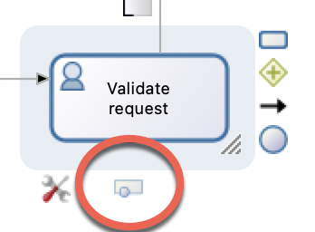

## Goal

The goal of this exercise is to enrich the first version of the leave request process diagram with a **timer** on the validation task.

This timer will automatically send a reminder to the validator if he doesn't perform the task on time, without interrupting the process.

## Instructions overview

Duplicate the process diagram from the previous exercise to create a 3.2.0 version

Add a non-interrupting boundary timer on the task *Validate request*.
The timer duration is set to **5 seconds**. 

Add a service task named  *Send validation reminder* and an end event named *End - Reminder sent*.

Add an email connector on the *Send validation reminder* service task. It will send a reminder email to the validator.

## Step by step instructions

1. Add a non-interruptive boundary timer to the task *Validate request*:
   - Click on the task *Validate request*
   - In the tool box, add a boundary event  
   
   - Select the **non-interrupting timer event** in the list. It will be automatically added to the task.
   

1. Create a service task named *Send validation reminder* after the boundary event by dragging and dropping the task from the event to the lane.
1. Add an end event named *End - reminder sent* next to the newly added service task.
   
1. Configure the timer event:
   - Select the boundary timer event
   - Navigate to the **General / General** tab 
   - Add the name of the timer *Send reminder after 5s*
   - Set the timer condition by clicking on **Edit**
   - In the editor, select **Duration** to set the timer condition and put *5* in the field **Seconds** (A)
   - Click on **Generate duration expression** (B)
   - Click on **Finish**
   
     The timer condition is automatically generated and must appear in the tab **General** 

1. Add an email connector on the *Send validation reminder* task:
   - Select the task *Notify request approved*
   - Navigate to the **Execution / Connectors in** tab
   - Select the existing email connector *sendRequestApprovedEmail*
   - Click on **Move/Copy...**
   - In the editor, select the action to perform **Copy** and the service task *Send Validation Reminder* 
   - Click on **Finish**  
     
1.Configure the email connector on the *Send validation reminder* task:
   - Select the task *Send validation reminder*
   - Navigate to the **Execution / Connectors in** tab
   - Select the email connector and click on **Edit**
   - Update the name to *sendReminderEmail*
   - Click on **Next**
   - Do not change the parameters
   - Move to the *Email addressee* configuration page
   - Keep *hr@acme.com* in the **From** field
   - Use the **pencil** icon to edit the expression of the **To** field
   - Name the script *getValidatorEmail*
   - In the script editor, enter the following script:
   <pre>
   def processApi = apiAccessor.getProcessAPI();
   def identityApi = apiAccessor.getIdentityAPI();

   //Get the TaskInstance
   def humanTaskInstance = processApi.getHumanTaskInstances(processInstanceId, "Validate request", 0, 1).get(0);

   //Get the user id assigned to the task review request
   def reviewRequestAssignedId = humanTaskInstance.getAssigneeId();

   //Get the review request email
   String reviewRequestAssignedEmail = "";
   
   if(reviewRequestAssignedId >0){
	  reviewRequestAssignedEmail = identityApi.getUserContactData(reviewRequestAssignedId, false).getEmail();
   }
   
   else{
	  reviewRequestAssignedEmail = "william.jobs@acme.com"
   }
   
   return reviewRequestAssignedEmail;</pre>

   - Move to the next page
   - Set *A pending request is waiting for approval* as the subject
   - Click on **Finish**

1. Run the process to test it:
   - Make sure FakeSMTP server is still running.
   - Click on **Run** and instantiate a new case
   - After 5 seconds, check FakeSMTP box. An email has been sent.

[Next exercise: adding constraints to a contract](08-data-contract-constraints.md)
