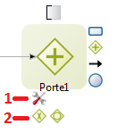
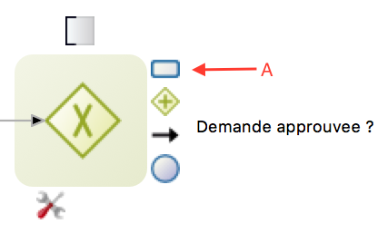

## Goal

The goal of this exercise is to create a first basic version of the leave request process diagram.

At this stage the process is executable but has very limited value from the business point of view as it does not yet contain forms or data.
We will extend it in the upcoming exercises.

Note that validation of diagrams in Bonita Studio needs to be triggered manually. If you just fix an error or a warning you might want to go to **Validation status** tab and click on the **Refresh** button or go to Studio menu **File** and click on **Validate**.

## Instructions overview

In order to complete the exercise, create a *LeaveRequestDiagram* diagram in version *1.0.0* containing a *LeaveRequest* process in version 1.0.0.

The process pool should contain the following BPMN elements:
* A start event named *Fill request*
* A human task named *Validate request*
* An exclusive gateway named *Is Approved?*
* A service task named *Notify request approved*
* A condition always `true` (for testing purpose) on the transition connecting the gateway to the notification approval task
* A service task named *Notify request rejected*
* A default transition connecting the gateway to the reject task
* An end event named *End - Request rejected*
* An end event named *End - Request approved*

## Step by step instructions
1. Start the Bonita Studio
1. On the Studio home page, click on **New Project** in the Design menu.
1. Enter the project name *LeaveRequest* and click on **Create**

> Note : Vous avez la possibilité de choisir dès la création du projet les extensions à intégrer. Cela peut être utile dans le cas d'un projet réel, mais dans notre exemple nous aborderons les extensions plus tard.

1. Create a new process diagram
   - From the project overview, click on **Create** in the *Process diagram* section
      
   - or from the menu
       

1. Set the diagram and process names:
   - Right click on the diagram name *MyDiagram-1.0.proc* in the explorer, **Rename**
   - Enter *LeaveRequestDiagram* as the diagram name, *LeaveRequest* as the pool name and set the version to *1.0.0* for both  
   
1. Rename the start event into *Fill request*:
   - Select the start event from the diagram
   - Navigate to the **General / General** tab and enter the new name
1. Rename the human task into *Validate request*
1. Add an exclusive gateway named *Is approved?* next to the human task *Validate request*:
   - Select the *Validate request* task, perform a drag and drop from the gateway contextual icon  
   
   - Once you have created the gateway, use the context **tool** icon (1) to change its type to **Exclusive** (2)  
   
   - Rename the gateway into *Is approved?*
1. Create a service task named *Notify request approved* after the gateway:
   - Select the gateway, perform drag and drop from the contextual event icon (A)  
   
   - Once the service task is created, rename it
1. Create a service task named *Notify request rejected* after the gateway
1. Add an end event named *End - Request approved* next to the newly added service task *Notify request approved*:
   - Select the task *Notify request approved*
   - Perform drag and drop from the contextual event icon (A) and select the end event (B)  
   
   - Once the event is created, rename it
1. Add an end event named *End - Request rejected* next to the service task *Notify request rejected*
1. Name the two transitions going out of the gateway:
   - Select the transition
   - Navigate to the **General / General** tab and enter the name
   - The transition leading to the *Notify request approved* task should be named *Yes* and the other *No*
1. Configure condition on the **Yes** transition so the flow always goes this path:
   - Select the transition
   - Type `true` in the condition field (**General / General** tab). If you don't see the **Condition** field it is probably because you defined a parallel gateway instead of an exclusive one  
   
1. Set the *No* transition as the default flow:
   - Select the *No* transition
   - Check the **Default flow** property
1. Validate the diagram:
   - Navigate to the **Validation status** tab
   - Click on **Refresh**
   - You may safely ignore the 3 warnings related to the UI Designer
1. Make sure that your diagram matches this:  
   
1. Save the process:
   - Click on the **Save** button from the Studio's top menu bar
1. Run the process to test it:
   - Select the process pool (the rectangle shape that includes tasks and events)
   - Click on the  button of the Studio's top menu bar (if button is disabled make sure the process pool is actually selected)
   - Your browser should open and display an automatically generated case start form
   - Submit the form
   - You should be redirected to the task inbox of the Bonita user application
   - Select the *Validate request* task
   - Click on the **Take** button  
   
   - Submit the form of the *Validate request* task by clicking on the **Execute** button to complete your case

[Next exercise: create data model and contracts definition](02-data-contract.md)
