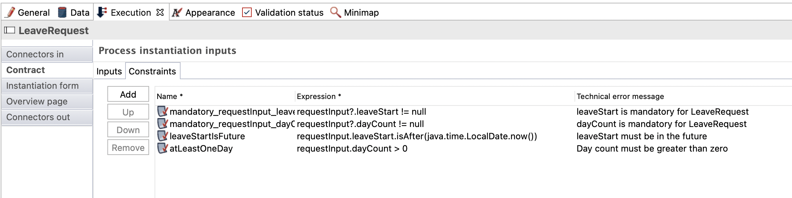

## Goal

The goal of this exercise is to continue the leave request process implementation by specifying constraints to the contract for the case instantiation

> ⚠ It is mandatory to strictly observe the case and syntax of the technical names provided in the instructions. Failing to do so will result in errors.

## Instructions overview

Duplicate the process diagram from the previous exercise to create a 4.0.0 version

Add these two constraints on the case instantiation contract:

- *leaveStart* must be in the future
- *dayCount* must be strictly greater than zero

## Step by step instructions

1. Duplicate the process diagram from the previous exercise to create a *4.0.0* version:
 
   
1. Set up the case instantiation contract constraints:
   - Select the process pool
   - Navigate to the **Execution / Contract / Constraints** tab
   - Add the following constraint:

   Property | Value
   -------- | -----
   Name | leaveStartIsFuture
   Expression | `requestInput.leaveStart.isAfter(java.time.LocalDate.now())`
   Error message | Leave start must be in the future
   
   - Add a second constraint:
   
   Property | Value
   -------- | -----
   Name | atLeastOneDay
   Expression | `requestInput.dayCount > 0`
   Error message | Day count must be greater than zero
   
   

> **Note**: Two constraints have been automatically created when the contrat is initialized, because the attributes selected in the contract are mandatory

1. Save the process:
   - Click on the **Save** button from the Studio's top menu bar

1. Run the process to test your contract constraints:
   - Run the process and use the automatically generated forms to test your constraints

[Next exercise: add an actor filter](09-actor-filter.md)
