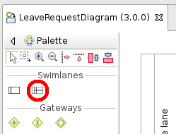
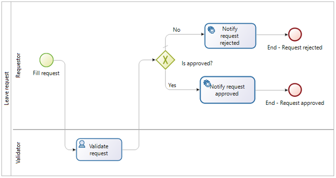
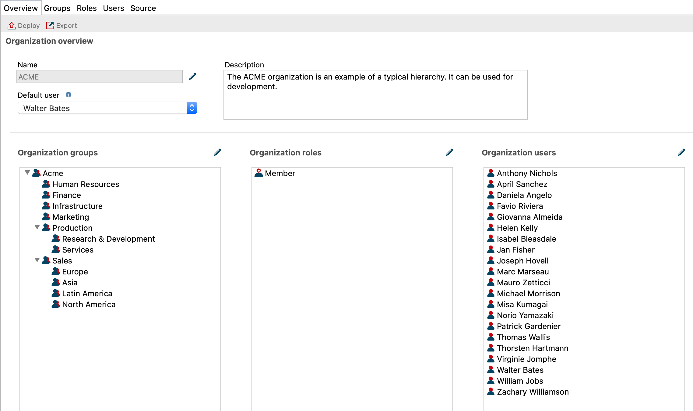

## Goal

The goal of this exercise is to add collaboration to the existing process by dispatching the tasks between two actors: a requestor and a validator.

## Instructions overview

Duplicate the process diagram from the previous exercise to create a *3.0.0* version.

Add a *Validator* lane to the diagram and move the *Validate request* task in it.

Add an actor filter of type **Initiator manager** on the *Validator* lane.

## Step by step instructions

1. Duplicate the process diagram from the previous exercise to create a *3.0.0* version

1. Add a *Validator* lane to the process:
   - Select the **Lane** element from the BPMN palette on the left hand side of Studio:
   
   
   
   - Click in the process pool to add the lane
   - Select the lane
   - Navigate to the **General / Lane** tab
   - Set the name to *Validator*

1. Rename the other lane into *Requestor*

1. Drag and drop the *Validate request* task into the *Validator* lane

1. Add an **Initiator manager** actor filter on the *Validator* lane:
   - Select the *Validator* lane
   - Navigate to the **General / Actors** tab
   - Select the *Employee actor* from the drop-down menu
   - Click on the **Set...** button of the actor filter
   - Select an **Initiator manager** filter
   - Click on **Next**
   - Name the filter *requestorManager*
   - Click on **Finish**

1. Make sure that the diagram looks like this:

   
   
1. Execute the process with the two actors:
   - Run the process from the Studio (user "Walter Bates" will be used)
   - Submit the *Fill leave request* form. If the actors are properly set, the *Validate request* task should not be available anymore
   - Disconnect from the Portal by clicking on the user name in upper right corner of the screen and clicking on **Logout**
   
   
   
   - Connect as user *helen.kelly* with *bpm* as password
   - If the actor filter ran correctly, the *Validate request* tasks should now be available in the inbox

[Next exercise: connector configuration](05-connectors.md)
