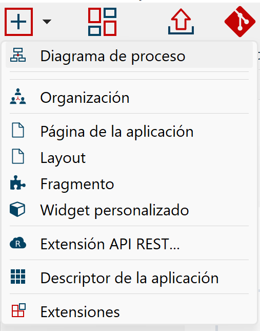
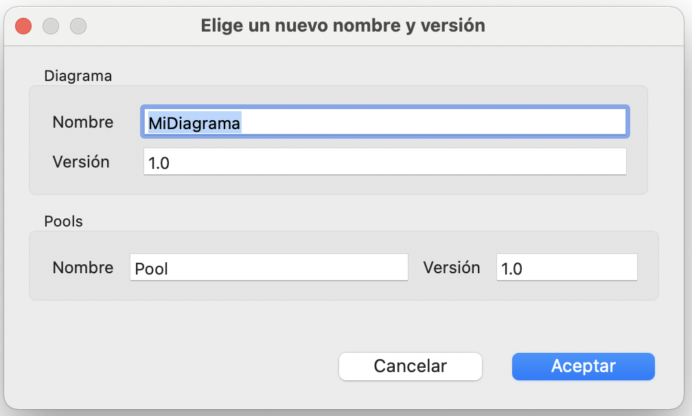
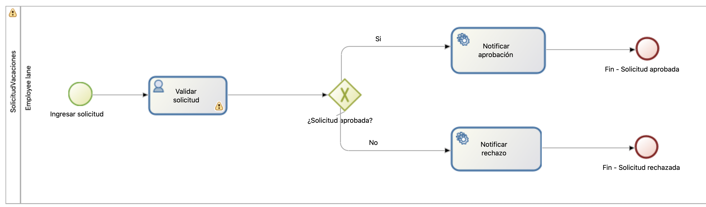

## Objetivo

El objetivo de este ejercicio es crear una primera versión "básica" del diagrama del proceso de solicitud de vacaciones.

En esta etapa, el proceso es ejecutable pero aún no presenta interés funcional porque no tiene formularios ni datos.
Los completaremos en los siguientes ejercicios.

> Nota: la validación de los diagramas en Bonita Studio debe activarse manualmente. Si corriges un error o un mensaje de advertencia, debes ir a la pestaña **Estado de validación** y hacer clic en el botón **Refrescar** o ir al menú **Archivo**.

## Instrucciones resumidas

1. Crea un diagrama *DiagramaSolicitudVacaciones* que contenga un proceso *SolicitudVacaciones* en la versión *1.0.0*.

1. Agrega a la definición de dicho proceso los siguientes elementos BPMN:
* Un evento de inicio *Ingresar solicitud*
* Una tarea humana *Validar solicitud*
* Una puerta exclusiva *¿Solicitud aprobada?*
* Una tarea automática *Notificar aprobación*
* Una condición siempre verdadera (`true`) en la transición que conecta la puerta exclusiva a la tarea de notificación de aprobación
* Una tarea automática *Notificar rechazo*
* Una transición predeterminada que conecta la puerta exclusiva a la tarea de notificación de rechazo
* Un evento final *Fin - Solicitud aceptada*
* Un evento final *Fin - Solicitud rechazada*

## Instrucciones paso a paso

1. Inicia Bonita Studio
1. En la página de inicio de Studio o desde el menú **Archivo**, haz clic en **Nuevo proyecto**.
1. Ingresa el nombre del proyecto _"SolicitudVacaciones"_.
1. Deja los valores de los otros campos vacíos o los que vienen por defecto 
1. Haz clic en **Crear**

> Nota: Tienes la posbilidad de elegir de agregar *Extensiones* desde la creación del rpoyecto. Esto puede ser útil en un proyecto real pero en nuestro ejemplo, las extensiones las abordaremos más tarde.

### Crea un diagrama *DiagramaSolicitudVacaciones* que contenga un proceso *SolicitudVacaciones* en la versión *1.0.0*

1. Crea un nuevo diagrama de procesos. 
    - Ya sea desde la vista general del proyecto, sección _Diagrama de procesos_, haciendo clic en **Crear**, y después en **Crear un nuevo diagrama de procesos**

    
    - O ya sea desde la barra de herramientas, haciendo clic en **Nuevo** y seleccionando **Diagrama de proceso**:
    

1. Especifica el nombre del diagrama y el del proceso:
    - En el **Explorador de proyectos**, selecciona el diagrama, da clic derecho con tu ratón y selecciona **Renombrar...**
    - Ingresa *DiagramaSolicitudVacaciones* para el nombre del diagrama y *SolicitudVacaciones* para el de la *Pool* y *1.0.0* para la versión del diagrama y de la *Pool*
   

### Agrega a la definición de dicho proceso los elementos BPMN

1. Cambia el nombre del evento de inicio :
    - Selecciona el evento de inicio presente en el diagrama
    - Navega a la pestaña **General / General** e ingresa el nuevo nombre: *Ingresar solicitud*

1. Siguiendo los mismos pasos, cambia el nombre de la tarea humana a *Validar solicitud*

1. Agrega una puerta exclusiva *¿Solicitud aprobada?* Después de la tarea *Validar solicitud*:
    - Selecciona la tarea *Validar solicitud*, arrastra y suelta desde el icono contextual de la puerta lógica

        
    - Una vez que se ha creado la puerta, usa el ícono contextual **caja de herramientas** (1) para cambiar su tipo a **Exclusivo** (2)
    
        
    - Cambia el nombre de la puerta a *¿Solicitud aprobada?*

1. Crea una tarea automática *Notificar aprobación* desde la puerta lógica:
    - Selecciona la puerta lógica, arrastra y suelta desde el icono de tarea contextual (A)
        
    - Una vez creada la tarea automática, cámbiale el nombre a *Notificar aprobación*

1. Crea una tarea automática *Notificar rechazo* desde la puerta lógica

1. Agrega un evento de terminación *Fin - Solicitud aprobada* después de la tarea automática *Notificar aprobación*:
    - Selecciona la tarea automática *Notificar aprobación*
    - Arrastra y suelta desde el ícono de evento contextual (A) y selecciona el evento final (B)
        
    - Una vez el evento creado, cámbiale el nombre

1. Agrega un evento de finalización *Fin - Solicitud rechazada* después de la tarea automática *Notificar rechazo*

1. Nombra las 2 transiciones entre la puerta lógica y los pasos automáticos:
    - Selecciona la transición a la etapa *Notificar aprobación*
    - Navega a la pestaña **General / General** e ingresa *Sí* como nombre
    - Repite la operación para la otra transición que se llamará *No*, para responder a la pregunta de la puerta lógica "¿Solicitud aprobada?"
    - La validación es automática. Da clic en cualquier otro lado y el nuevo valor será guardado. 

1. Configura la condición en la transición *Sí* para que el flujo siga esta rama:
    - Selecciona la transición
    - Ingresa el valor `true` en el campo **Condición** (pestaña **General / General**). Si no ves el campo **Condición**, probablemente sea porque agregaste una puerta lógica paralela en lugar de una exclusiva.
    

1. Configura la transición *No* como el flujo por defecto:
    - Selecciona la transición *No*
    - Marca la casilla **Flujo por defecto**

1. Actualiza la validación del diagrama:
    - Navega en la pestaña **Estado de validación**
    - Haz clic en el botón **Actualizar**
    - Por el momento, ignora las 3 advertencias sobre los formularios

1. Si lo deseas, puedes reajustar la posición de los elementos y la froma de las transiciones para mejorar la estética y legibilidad del diagrama

1. Verifica que el diagrama se vea así:
   

1. Guarda el proceso:
    - Haz clic en el botón **Guardar** en la barra de herramientas de Bonita Studio

1. Ejecuta el proceso para probarlo:
    - Selecciona la *Pool* del proceso (el área rectangular que contiene las tareas y eventos)
    - Haz clic en el botón **Ejecutar**  en la barra de herramientas del Studio (si el botón está desactivado, asegúrate de que el diagrama esté seleccionado)
    - Tu navegador debe abrir y presentar un formulario de creación de instancias (generado automáticamente para pruebas)
    - Envía el formulario. Esta acción creará una nueva instancia del proceso.
    - Debes ser redirigido a la bandeja de entrada de tareas de la aplicación **Bonita User Application**
    - Selecciona la tarea *Validar solicitud*
    - Haz clic en **Tomar** en la parte superior derecha de la pantalla
    
    - Envía el formulario para el paso *Validar solicitud* haciendo clic en el botón **Ejecutar** para completar el caso

[Ejercicio siguiente: creación de datos y definición de contratos](02-timers.md)
