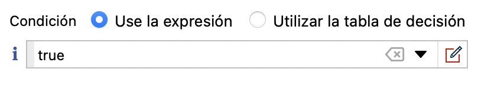
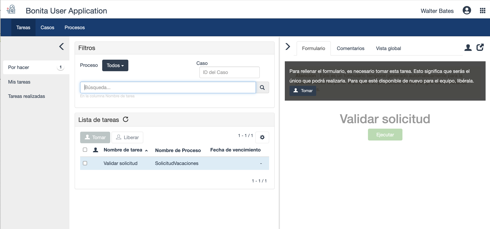

## Objetivo

El objetivo de este ejercicio es crear una primera versión "básica" del diagrama del proceso de solicitud de vacaciones.

En esta etapa, el proceso es ejecutable pero aún no presenta ningún interés funcional porque no tiene formularios ni datos.
Lo completaremos en los siguientes ejercicios.

Nota: la validación de los diagramas en Bonita Studio debe activarse manualmente. Si corrige un error o un mensaje de advertencia, debe ir a la pestaña **Estado de validación** y hacer clic en el botón **Refrezcar** o ir al menú **Archivo** y hacer clic en el botón **Validar**.

## Resumen de las instrucciones

Para hacer el ejercicio, cree un diagrama *DiagramaSolicitudVacaciones* que contenga un proceso *SolicitudVacaciones* en la versión *1.0.0*.

El grupo de procesos debe contener los siguientes elementos BPMN:
* Un evento de inicio *Introducir solicitud*
* Una tarea humana *Validar solicitud*
* Una puerta exclusiva *¿Solicitud aprobada?*
* Una tarea automática *Notificar aprobación*
* Una condición siempre verdadera (`verdadero`) en la transición que conecta la puerta exclusiva a la tarea de notificación de aprobación
* Una tarea automática *Notificar rechazo*
* Una transición predeterminada que conecta la puerta exclusiva a la tarea de notificación de rechazo
* Un evento final *Fin - Solicitud aceptada*
* Un evento final *Fin - Solicitud rechazada*

## Instrucciones paso a paso
1. Inicie Bonita Studio
1. Cree un nuevo diagrama de proceso
1. Especifique el nombre del diagrama y el del proceso:
    - Haga clic en el menú **Archivo / Renombrar Diagrama...** en la parte superior del Studio
    - Ingrese *DiagramaSolicitudVacaciones* para el nombre del diagrama y *SolicitudVacaciones* para el del pool y *1.0.0* para la versión del diagrama y del pool
   
1. Cambie el nombre del evento de inicio a *Ingresar solicitud*:
    - Seleccione el evento de inicio presente en el diagrama
    - Navegue a la pestaña **General / General** y luego ingrese el nuevo nombre
1. Cambie el nombre de la tarea humana a *Validar solicitud*
1. Agregar una puerta exclusiva *¿Solicitud aprobada?* Después de la tarea *Validar solicitud*:
    - Seleccione la tarea *Validar solicitud*, arrastre y suelte desde el icono contextual de la puerta lógica
   
    - Una vez que se ha creado la puerta, use el ícono contextual **caja de herramientas** (1) para cambiar su tipo a **Exclusivo** (2)
   
   - Cambiar el nombre de la puerta a *¿Solicitud aprobada?*
1. Cree una tarea automática *Notificar aprobación* desde la puerta lógica:
    - Seleccione la puerta lógica, arrastre y suelte desde el icono de tarea contextual (A)
   
   - Una vez que se ha creado la tarea automática, cambiela el nombre
1. Crear una tarea automática *Notificar rechazo* desde la puerta lógica
1. Agregue un evento de terminación *Fin - Solicitud aprobada* después de la tarea automática *Notificar aprobación*:
    - Seleccione la tarea automática *Notificar aprobación*
    - Arrastra y suelta desde el ícono de evento contextual (A) y selecciona el evento final (B)
   
   - Una vez que se ha creado el evento, cámbiele el nombre
1. Agregue un evento de finalización *Fin - Solicitud rechazada* después de la tarea automática *Notificar rechazo*
1. Nombra las 2 transiciones entre la puerta lógica y los pasos automáticos:
    - Seleccione la transición
    - Navegue a la pestaña **General / General** luego ingrese el nombre
    - La transición que conduce al paso *Notificar aprobación* se llamará *Sí* y la otra *No*
1. Configure la condición en la transición *Sí* para que el flujo siga esta rama:
    - Seleccione la transición
    - Ingrese el valor `verdadero` en el campo **Condición** (pestaña **General / General**). Si no ve el campo **Condición**, probablemente sea porque agregó una puerta lógica paralela en lugar de una exclusiva.
   
1. Configure la transición *No* como el flujo por defecto:
    - Seleccione la transición *No*
    - Marque la casilla **Flujo por defecto**
1. Actualice la validación del diagrama:
    - Navegue en la pestaña **Estado de validación**
    - Haga clic en el botón **Actualizar**
    - Ignorar las 3 advertencias sobre los formularios
1. Verifique que el diagrama se vea así:
   
1. Guardar el proceso:
    - Haga clic en el botón **Guardar** en la barra de menú superior de Bonita Studio
1. Ejecute el proceso para probarlo:
    - Seleccione el pool de procesos (la forma rectangular que contiene las tareas y eventos)
    - Haga clic en el botón  en la barra de menú superior del Studio (si el botón está desactivado, asegúrese de que el grupo esté seleccionado)
    - Su navegador debe abrir y presentar un formulario de creación de instancias generado automáticamente
    - Envíe el formulario
    - Debería ser redirigido a la bandeja de entrada de tareas del Portal Bonita
    - Seleccione la tarea *Validar solicitud*
    - Haga clic en **Tomar** en la parte superior derecha de la pantalla 
    - Envíe el formulario para el paso *Validar solicitud* haciendo clic en el botón **Ejecutar** para completar el caso

[Ejercicio siguiente: creación de datos y definición de contratos](02-data-contract)
