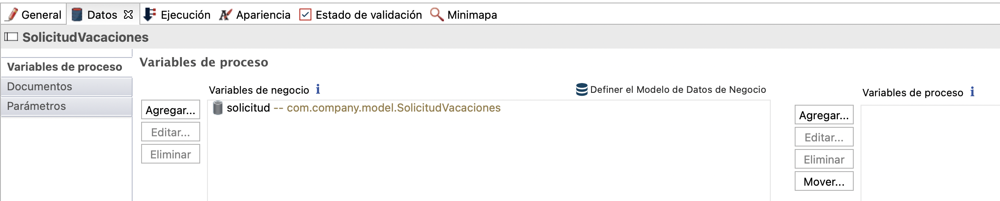

## Objetivo

El objetivo de este ejercicio es continuar implementando el proceso de solicitud de licencia mediante:

1. Configuración de un modelo de datos de negocio comúnmente llamado BDM (Business Data Management)
1. Especificar contratos para crear instancias del proceso y ejecutar tareas humanas

Una vez completado, el proceso será ejecutable con formularios generados automáticamente que permiten la entrada de datos.

> ⚠ Es importante respetar estrictamente el caso y la sintaxis de los nombres técnicos proporcionados en las instrucciones.

## Resumen de las instrucciones

Duplique el diagrama de proceso del ejercicio anterior para crear una versión 2.0.0.

Cree un objeto BDM *SolicitudVacaciones* (este es un nombre técnico, por lo que debe omitir espacios, acentos y otros caracteres especiales) con los siguientes atributos (no use la opción **Múltiple**):

Nombre | Tipo | Múltiple | Requerido
--- | ---- | -------- | -----------
*solicitanteID* | `Long` | ◻ | ☑
*fechaInicio* | `Date only` | ◻ | ☑
*numeroDias* | `Integer` | ◻ | ☑
*estaAprobado* | `Boolean` | ◻ | ◻

Declare una variable empresarial *solicitud* de tipo *solicitudVacaciones* en el pool.

Usando el asistente de Bonita Studio (es decir, **Añadir a partir de datos ...**), genere un contrato de creación de instancias, así como el script de inicialización para la variable de negocio utilizando la variable de negocio *solicitud* y por lo tanto incluye lo siguiente:

        fechaInicio
        numeroDias

Agregue las siguientes dos restricciones en el contrato de instanciación:

- *fechaInicio* debe estar en el futuro
- *numeroDias* debe ser estrictamente mayor que cero

Inicialice la BDM *solicitud* utilizando la generación automática del contrato.

Agregue un contrato en el paso *Validar solicitud* utilizando el asistente con el siguiente elemento:

        estaAprobado

## Instrucciones paso a paso

1. Duplique el diagrama de proceso existente para crear una versión *2.0.0*:
   - En el menú superior de Studio, haga clic en **Archivo / Duplicar diagrama ...**
   - Actualice los números de versión del proceso Y diagrama (grupo)
1. Cree el BDM *SolicitudVacaciones*:
   - Navegue en el menú **Desarrollo / Modelo de datos de negocio / Definir ...**
   - Haga clic en **Nuevo objeto de negocio** (A), en la lista de objetos de negocio
   - Nombre el objeto *SolicitudVacaciones* (B) (este es un nombre técnico, por lo que debe omitir espacios, acentos y otros caracteres especiales)
   - Con el objeto *SolicitudVacaciones* seleccionado, agregue los siguientes atributos (C):

    Nombre | Tipo | Múltiple | Requerido
    --- | ---- | -------- | -----------
    *solicitanteID* | `Long` | ◻ | ☑
    *fechaInicio* | `Date only` | ◻ | ☑
    *numeroDias* | `Integer` | ◻ | ☑
    *estaAprobado* | `Boolean` | ◻ | ◻

    
    
   - Haga clic en **Finalizar**
   - Se muestra el siguiente mensaje para confirmar la implementación del BDM
    
    
    
   - Marque la opción **No volver a mostrar este mensaje**
   - Haga clic en **Ok**
 
1. Declare una variable de negocio de tipo *solicitudVacaciones* en el proceso:
   - Seleccione el pool de procesos
   - Navegue en la pestaña **Datos / Variables del proceso**
   - Haga clic en **Agregar ...** en la sección **Variables de negocio**
   - Asigne un nombre a la variable *solicitud* y seleccione el tipo de objeto de negocio *com.company.model.SolicitudVacaciones*
   - Haga clic en **Finalizar**
   
   
   
1. Configure el contrato de instanciación:
   - Seleccione el pool de procesos
   - Navegue en la pestaña **Ejecución / Contrato / Entradas**
   - Haga clic en el botón **Añadir desde datos ...**
   - Seleccione la variable de negocio *solicitud*
   - Mantenga el nombre predeterminado *solicitudInput*
   - Haga clic en **Siguiente**
   - Desmarque los atributos *solicitanteID* y *estaAprobado*
   
   
   
   - Haga clic en **Finalizar** (no en **Finalizar y Añadir**) e ignore los mensajes de advertencia sobre la inicialización parcial de la variable de negocio
     
      
   
   - Siguiendo en la pestaña **Ejecución / Contrato**, cambie a la pestaña **Restricciones**
   - Agregue la siguiente restricción:
  
    Propiedad | Valor
    --------- | ------
    Nombre    | fechaInicioEnFuturo
    Expresión | `solicitudInput.fechaInicio.isAfter(java.time.LocalDate.now())`
    Mensaje de error| La fecha de inicio debe ser en el futuro

   - Agregue una segunda restricción:
  
    Propiedad | Valor
    -------- | ------
    Nombre | alMenosUnDía
    Expresión | `solicitudInput.numeroDias>0`
    Mensaje de error | El número de días debe ser mayor que cero.

   
   
1. Modifique la inicialización de la variable empresarial *solicitud*:
   - Seleccione el pool de procesos y navegue a la pestaña **Datos / Variables de proceso**
   - Seleccione la variable *solicitud*
   - Haga clic en **Editar ...**
   - Haga clic en el icono de **lápiz** asociado con el campo **Valor predeterminado** para abrir el editor de expresiones
   - Ingrese el siguiente código (o simplemente aplique las modificaciones):
   
```groovy
   def solicitudVacacionesVar = new com.company.model1.SolicitudVacaciones()
   solicitudVacacionesVar.fechaInicio = solicitudInput?.fechaInicio
   solicitudVacacionesVar.numeroDias = solicitudInput?.numeroDias

   // Recuperar la instancia de proceso actual
   def processInstance = apiAccessor.processAPI.getProcessInstance(processInstanceId)
   // Agregue la ID del solicitante a la nueva solicitud
   solicitudVacacionesVar.solicitanteID = processInstance.startedBy

   return solicitudVacacionesVar
```

   El script inicializará la variable de negocio utilizando los datos del contrato y el identificador del solicitante. 
   - Haga clic en el botón **Aceptar** para cerrar el editor de expresiones
   - Haga clic otra vez en el botón **Aceptar** para validar la modificación de la variable de negocio

1. Configure el contrato para el paso *Validar solicitud*:
    - Seleccione el paso *Validar solicitud*
    - Navegue en la pestaña **Ejecución / Contrato / Entradas**
    - Haga clic en el botón **Añadir desde datos ...**
    - Seleccione la variable de negocio *solicitud*, mantenga el nombre de la entrada predeterminada *solicitudInput*
    - Haga clic en **Siguiente**
    - Seleccione solo el atributo *estaAprobado*
    - Haga clic en **Finalizar** (y no en **Finalizar y Añadir**) e ignore los mensajes de advertencia sobre la inicialización parcial de la variable de negocio


1. Tenga en cuenta que se ha generado automáticamente una operación (**Ejecución / Operaciones**) en la tarea *Validar solicitud* para actualizar la solicitud
 
    
   
1. Configure la condición en la transición *Sí* desde el atributo *estaAprobado* del BDM *solicitud*:
    - Seleccione la transición *Sí*
    - Navegue en la pestaña **General / General**
    - Haga clic en el ícono de lápiz junto al campo **Condición** para abrir el editor de expresiones
    - En el editor de expresiones, seleccione **Java** como tipo de expresión
    - Seleccione la variable *solicitud* y el método *isEstaAprobado*
   
   
   
1. Guarde el proceso:
    - Haga clic en el botón **Guardar** en la barra de menú superior de Bonita Studio
1. Ejecute el proceso y pruebe las restricciones de los contratos:
    - Inicie el proceso y complete los formularios generados automáticamente

> Información:
> - para el campo *fechaInicio*, el formato de fecha esperado es AAAA-MM-DD
> - para el campo *estaAprobado*, se espera un valor booleano: `true` o` false`

   

[Siguiente ejercicio: crear formularios](03-forms)
