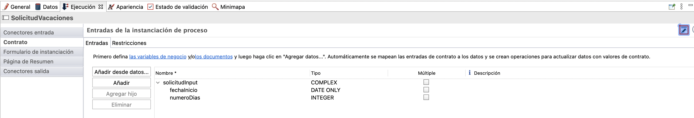
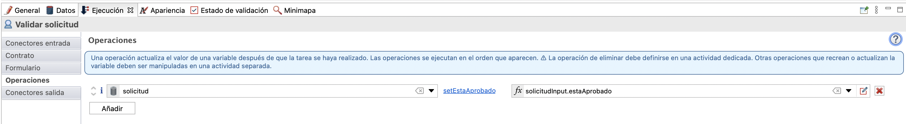
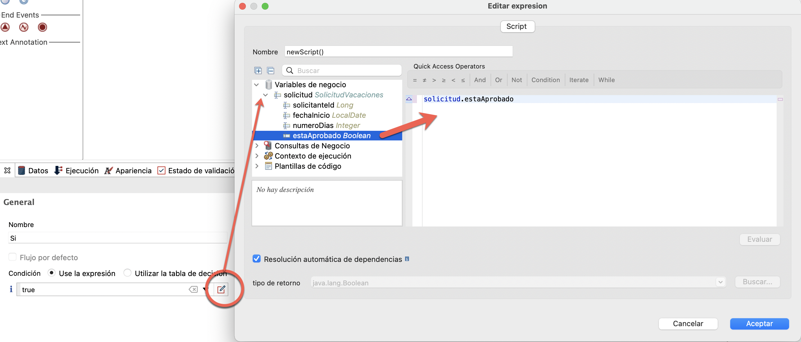

## Objetivo

El objetivo de este ejercicio es seguir con la implantación del proceso de solicitud de vacaciones mediante :

1. La configuración de un modelo de datos de negocio comúnmente llamado BDM (Business Data Management)
1. La especificación de contratos para crear instancias del proceso y ejecutar tareas humanas

Una vez completado, el proceso será ejecutable con formularios generados automáticamente que permiten la entrada de datos.

> ⚠ Es importante respetar estrictamente el caso y la sintaxis de los nombres técnicos proporcionados en las instrucciones.

## Resumen de las instrucciones

Duplica el diagrama de proceso del ejercicio anterior para crear una versión 2.0.0.

Crea un objeto BDM *SolicitudVacaciones* (este es un nombre técnico, por lo que debes omitir espacios, acentos y otros caracteres especiales) con los siguientes atributos (no usa la opción **Múltiple**):

Nombre | Tipo | Múltiple | Requerido
--- | ---- | -------- | -----------
*solicitanteId* | `Long` | ◻ | ☑
*fechaInicio* | `Date only` | ◻ | ☑
*numeroDias* | `Integer` | ◻ | ☑
*estaAprobado* | `Boolean` | ◻ | ◻

Declara una variable empresarial *solicitud* de tipo *solicitudVacaciones* en el pool.

Usando el asistente de Bonita Studio (es decir, **Añadir a partir de datos ...**), genera un contrato de creación de instancias, así como el script de inicialización para la variable de negocio utilizando la variable de negocio *solicitud* y por lo tanto incluya lo siguiente:

        fechaInicio
        numeroDias

Agrega las siguientes dos restricciones en el contrato de instanciación:

- *fechaInicio* debe estar en el futuro
- *numeroDias* debe ser estrictamente mayor que cero

Inicializa la BDM *solicitud* utilizando la generación automática del contrato.

Agrega un contrato en el paso *Validar solicitud* utilizando el asistente con el siguiente elemento:

        estaAprobado

## Instrucciones paso a paso

1. Duplica el diagrama de proceso existente para crear una versión *2.0.0*:
   - En el menú superior de Studio, haz clic en **Archivo / Duplicar diagrama ...**
   - Actualiza los números de versión del proceso Y diagrama (pool)
1. Crea la BDM *SolicitudVacaciones*:
   - Navega en el menú **Desarrollo / Modelo de datos de negocio / Definir ...**
   - Cambia el nombre del objeto initializado por defecto **BusinessObject** en la lista de objetos de negocio a *SolicitudVacaciones* (A) (este es un nombre técnico, por lo que debes omitir espacios, acentos y otros caracteres especiales)
   - Con el objeto *SolicitudVacaciones* seleccionado, agrega los siguientes atributos (B):

    Nombre | Tipo | Múltiple | Requerido
    --- | ---- | -------- | -----------
    *solicitanteId* | `Long` | ◻ | ☑
    *fechaInicio* | `Date only` | ◻ | ☑
    *numeroDias* | `Integer` | ◻ | ☑
    *estaAprobado* | `Boolean` | ◻ | ◻

    
    
   - Guardalo. El siguiente mensaje se muestra para indicar que la BDM debe ser desplegada
   
   
   
   - Haz clic en el botón  en el editor de BDM para desplegar el BDM.
   - Se muestra el siguiente mensaje para confirmar el despliegue de la BDM
    
    
    
   - Marca la opción **No volver a mostrar este mensaje**
   - Haz clic en **Ok**
 
1. Declara una variable de negocio de tipo *solicitudVacaciones* en el proceso:
   - Selecciona el pool de procesos
   - Navega en la pestaña **Datos / Variables del proceso**
   - Haz clic en **Agregar ...** en la sección **Variables de negocio**
   - Asigna un nombre a la variable *solicitud* y seleccione el tipo de objeto de negocio *com.company.model.SolicitudVacaciones*
   - Haz clic en **Finalizar**
   
   
   
1. Configura el contrato de instanciación:
   - Selecciona el pool de procesos
   - Navega en la pestaña **Ejecución / Contrato / Entradas**
   - Haz clic en el botón **Añadir desde datos ...**
   - Selecciona la variable de negocio *solicitud*
   - Mantenga el nombre predeterminado *solicitudInput*
   - Haz clic en **Siguiente**
   - Desmarca los atributos *solicitanteId* y *estaAprobado*
   
   
   
   - Haz clic en **Finalizar** (no en **Finalizar y Añadir**) e ignora los mensajes de advertencia sobre la inicialización parcial de la variable de negocio
    
   
   - Siguiendo en la pestaña **Ejecución / Contrato**, cambia a la pestaña **Restricciones**
   - Agrega la siguiente restricción:
  
    Propiedad | Valor
    --------- | ------
    Nombre    | fechaInicioEnFuturo
    Expresión | `solicitudInput.fechaInicio.isAfter(java.time.LocalDate.now())`
    Mensaje de error| La fecha de inicio debe ser en el futuro

   - Agrega una segunda restricción:
  
    Propiedad | Valor
    -------- | ------
    Nombre | alMenosUnDía
    Expresión | `solicitudInput.numeroDias>0`
    Mensaje de error | El número de días debe ser mayor que cero.

   
   
1. Modifica la inicialización de la variable de negocio *solicitud*:
   - Selecciona el pool de procesos y navega a la pestaña **Datos / Variables de proceso**
   - Selecciona la variable *solicitud*
   - Haz clic en **Editar ...**
   - Haz clic en el icono de **lápiz** asociado con el campo **Valor predeterminado** para abrir el editor de expresiones de script.  
   
   Ya se inicializó el script.
   Ahora queremos recuperar la Id del solicitante arrancando la instancia de proceso actual.
   
   - En el menú de la izquierda, selecciona **Plantillas de código/Usuarios de Bonita** (A) y arrastra la plantilla *processInitiatorUser*  
     
      El script para recuperar la instancia del proceso y el iniciador se crea automáticamente.
   - Ingresa `solicitudVacacionesVar.solicitanteId = processInitiator.id` para recuperar el Id del iniciador de la instancia en el atributo *solicitanteId* (B)

    
   
   El script inicializará la variable de negocio utilizando los datos del contrato y el identificador del solicitante. 
   
   > Las etiquetas `try` y `catch se inicializan para la validación del script. Es posible eliminarlos.

    - Haz clic en el botón **Aceptar** para cerrar el editor de expresiones
    - Haz clic otra vez en el botón **Aceptar** para validar la modificación de la variable de negocio. 
   
1. Configura el contrato para el paso *Validar solicitud*:
    - Selecciona el paso *Validar solicitud*
    - Navega en la pestaña **Ejecución / Contrato / Entradas**
    - Haz clic en el botón **Añadir desde datos ...**
    - Selecciona la variable de negocio *solicitud*, mantenga el nombre de la entrada predeterminada *solicitudInput*
    - Haz clic en **Siguiente**
    - Selecciona solo el atributo *estaAprobado*
    - Haz clic en **Finalizar** (y no en **Finalizar y Añadir**) e ignora los mensajes de advertencia sobre la inicialización parcial de la variable de negocio

1. Ten en cuenta que se ha generado automáticamente una operación (**Ejecución / Operaciones**) en la tarea *Validar solicitud* para actualizar la solicitud
    
   
1. Configura la condición en la transición *Sí* desde el atributo *estaAprobado* del BDM *solicitud*:
    - Selecciona la transición *Sí*
    - Navega en la pestaña **General / General**
    - Haz clic en el ícono de lápiz junto al campo **Condición** para abrir el editor de expresiones
    - En el editor de expresiones, selecciona **Java** como tipo de expresión
    - Selecciona la variable *solicitud* y el método *isEstaAprobado*
   
   
   
1. Guarda el proceso:
    - Haz clic en el botón **Guardar** en la barra de menú superior de Bonita Studio
1. Ejecuta el proceso y prueba las restricciones de los contratos:
    - Inicia el proceso y completa los formularios generados automáticamente

> Información:
> - para el campo *fechaInicio*, el formato de fecha esperado es AAAA-MM-DD
> - para el campo *estaAprobado*, se espera un valor booleano: `true` o` false`

   

[Siguiente ejercicio: crear formularios](03-forms.md)
