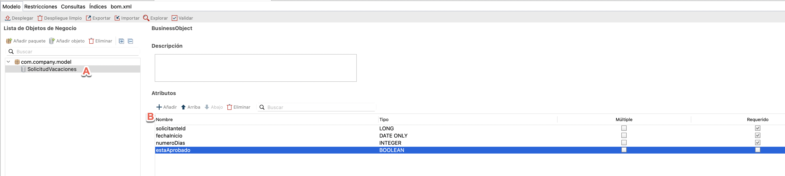

## Objetivo

El objetivo de este ejercicio es continuar la implementación del proceso de solicitud de vacaciones mediante:

1. La creación de un modelo de datos de negocio comúnmente llamado BDM (Business Data Model)
1. La especificación de variables de negocio que unan al modelo de datos de negocio y al proceso
1. La especificación de contratos entre el proceso y el formulario para crear instancias del proceso y para ejecutar tareas humanas

Una vez completado, el proceso será ejecutable y gracias a los formularios generados automáticamente se podrán capturar datos.

> ⚠ Es importante respetar estrictamente la sintaxis de los nombres técnicos (incluyendo mayúsculas, minúsculas y signos)proporcionados en las instrucciones.

## Instrucciones resumidas

1. Duplica el diagrama de proceso del ejercicio anterior para crear una versión 2.0.0.

1. Crea un objeto de negocio *SolicitudVacaciones* (al ser un nombre técnico, debes omitir espacios, acentos y otros caracteres especiales) con los siguientes atributos (sin seleccionar la opción **Múltiple**):

   Nombre | Tipo | Múltiple | Requerido
   --- | ---- | -------- | -----------
   *solicitanteId* | `Long` | ◻ | ☑
   *fechaInicio* | `Date only` | ◻ | ☑
   *numeroDias* | `Integer` | ◻ | ☑
   *estaAprobado* | `Boolean` | ◻ | ◻

1. Declara una variable de negocio *solicitud* de tipo *SolicitudVacaciones* en la *pool*.

1. Genera un contrato de instanciación de proceso que incluya los siguientes elementos:

        fechaInicio
        numeroDias

   Para esto, utiliza el asistente de Bonita Studio seleccionando **Añadir desde datos ...**

1. Inicializa la variable de negocio *solicitud* utilizando la generación automática del contrato.

1. Modifica la inicialización de la variable de negocio *solicitud* para recuperar automáticamente *solicitanteId*

1. Agrega un contrato en la etapa *Validar solicitud* utilizando el asistente con el siguiente elemento:

        estaAprobado
1. Configura como condición de la transición *Sí* el atributo *estaAprobado* de la variable de negocio *solicitud*

## Instrucciones paso a paso

1. Duplica el diagrama de proceso existente para crear una versión *2.0.0*:
   - En el explorador del proyecto, haz clic derecha en el diagrama y selecciona **Duplicar...**
   - Actualiza los números de versión de ambos: del proceso y de la *pool* (el diagrama)
1. Crea un objeto de negocio *SolicitudVacaciones*:
   - Haz clic en el ícono **Vista global** . 
   - Haz clic en **+ Crear** en la sección *Modelo de datos de negocio*. El editor del modelo de datos de negocio aparece.   
   - Cambia el nombre del objeto creado por defecto **BusinessObject** a *SolicitudVacaciones* (A). Al ser un nombre técnico, se deben omitir espacios, acentos y otros caracteres especiales. Como es un objeto, su nombre debe empezar con mayúscula.
   - Con el objeto *SolicitudVacaciones* seleccionado, en la sección *Atributos*, selecciona el atributo inicializado por defecto **atributo** y cambia el nombre a *solicitanteId*. Como es un atributo, su nombre debe empezar con minúscula.
   - Como *Tipo* selecciona **Long**, deja libre la casilla *Múltiple* y marca la casilla *Requerido*

      Nombre | Tipo | Múltiple | Requerido
      --- | ---- | -------- | -----------
      *solicitanteId* | `Long` | ◻ | ☑

   - Haz clic en **Añadir** para agregar igualmente los siguientes atributos (B):

      Nombre | Tipo | Múltiple | Requerido
      --- | ---- | -------- | -----------
      *fechaInicio* | `Date only` | ◻ | ☑
      *numeroDias* | `Integer` | ◻ | ☑
      *estaAprobado* | `Boolean` | ◻ | ◻

    
    
   - Guarda los cambios. El siguiente mensaje se muestra para indicar que el modelo de datos de negocio debe ser desplegado:
   
   
   
   - Haz clic en el botón  en el editor de BDM.
   - El siguiente mensaje aparece para confirmar el despliegue del modelo de datos de negocio:
    
    
    
   - Marca la opción **No volver a mostrar este mensaje**
   - Haz clic en **Ok**

   > No olvides desplegar tu modelo de datos de negocio después de cada modifciación. Esto hace que los objetos y atributos estén disponibles al generar los contratos y los scripts Groovy, y también permite al motor de ejecución BPM de tomar en cuenta los cambios al momento de probar el proceso.
 
1. Declara una variable de negocio de tipo *solicitudVacaciones* en el proceso:
   - En el diagrama, selecciona la *pool* del proceso
   - Navega a la pestaña **Datos / Variables de proceso**
   - Haz clic en **Agregar ...** en la sección **Variables de negocio**
   - Asigna el nombre *solicitud* a la variable y selecciona el tipo de objeto de negocio *com.company.model.SolicitudVacaciones*
   - Haz clic en **Finalizar**
   
   
   
1. Configura el contrato de instanciación:
   - En el diagrama, selecciona la *pool* del proceso
   - Navega a la pestaña **Ejecución / Contrato / Entradas**
   - Haz clic en el botón **Añadir desde datos ...**
   - Selecciona la variable de negocio *solicitud*
   - Deja el nombre de entrada predeterminado *solicitudInput*
   - Haz clic en **Siguiente**
   - Desmarca los atributos *solicitanteId* y *estaAprobado*
   
   
   
   - Haz clic en **Finalizar** (no en **Finalizar y Añadir**). Ignora por el momento los mensajes de advertencia sobre la inicialización parcial de la variable de negocio.
    

   > Al crear un contrato se genera un script de inicalización de la variable en cuestión, que será ejecutado al momento de validar el contrato después de la captura de los datos via el formulario.
   
1. Modifica la inicialización de la variable de negocio *solicitud* para recuperar automáticamente *solicitanteId*
   - Selecciona la *pool* del proceso y navega a la pestaña **Datos / Variables de proceso**
   - Selecciona la variable *solicitud*
   - Haz clic en **Editar ...**
   - Haz clic en el icono de **lápiz** asociado al campo **Valor predeterminado**. 
   - El editor de expresiones se abre y muestra el script que ha sido inicializado cuando se ha creado el contrato con la opción "Instanciar".
   
   - En el menú de la izquierda, selecciona **Plantillas de código/Usuarios de Bonita** (A).
   - Selecciona la plantilla *processInitiatorUser* y arrástrala para colocarla antes de la última línea del script (que commienza por `return`). El script permite recuperar la instancia del proceso y el iniciador se crea automáticamente.
   - Antes del `}catch`, ingresa `solicitudVacacionesVar.solicitanteId = processInitiator.id` para recuperar el identificador del iniciador de la instancia en el atributo *solicitanteId* (B)

    
   
      El script inicializará la variable de negocio utilizando los datos del contrato y el identificador del solicitante. 
      
      > Las etiquetas `try` y `catch` se inicializan para la validación del script. Es posible eliminarlos.

   - Haz clic en el botón **Aceptar** para cerrar el editor de expresiones.
   - Haz clic otra vez en el botón **Aceptar** para validar la modificación de la variable de negocio. 
   
1. Agrega un contrato a la etapa *Validar solicitud*:
    - En la *pool*, selecciona la tarea *Validar solicitud*
    - En la zona de propiedades, navega a la pestaña **Ejecución / Contrato / Entradas**
    - Haz clic en el botón **Añadir desde datos ...**
    - Las opciones *Variable de negocio* y *Editar* aparecen seleccionadas. 
    - La variable de negocio *solicitud* aparece seleccionada.
    - Deja el valor predeterminado *solicitudInput* como nombre de la entrada 
    - Haz clic en **Siguiente**
    - Deselecciona todos los atributos excepto *estaAprobado*
    - Haz clic en **Finalizar** (y no en **Finalizar y Añadir**). Ignora por el momento los mensajes de advertencia sobre la inicialización parcial de la variable de negocio

      Nota: Ten en cuenta que se ha generado automáticamente una operación (**Ejecución / Operaciones**) en la tarea *Validar solicitud* para actualizar la solicitud
    
   
1. Configura como condición de la transición *Sí* el atributo *estaAprobado* de la variable de negocio *solicitud*:
    - Selecciona la transición *Sí*
    - En la zona de propiedades, navega a la pestaña **General / General**
    - Haz clic en el ícono de lápiz asociado al campo **Condición** para abrir el editor de expresiones
    - En el editor de expresiones, selecciona **Variables de negocio / solicitud**. 
    - Selecciona **estaAprobado** y arrástrarlo a la pizarra para sustituir el `true`.
    - Haz clic en **Aceptar**
   
   
   
1. Guarda el proceso:
    - Haz clic en el botón **Guardar** en la barra de menú superior de Bonita Studio
1. Ejecuta el proceso:
    - Haz clic en el botón **Ejecutar** en la barra de menú superior de Bonita Studio
    - Completa los formularios generados automáticamente. Los campos mostrados sont generados a partir de los contratos creados.

> Información:
> - para el campo *fechaInicio*, el formato de fecha esperado es AAAA-MM-DD
> - para el campo *estaAprobado*, se espera un valor booleano: `true` o` false`

   

[Siguiente ejercicio: crear formularios](03-forms.md)
