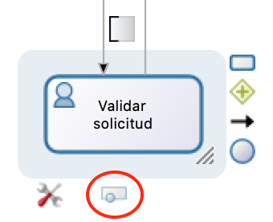
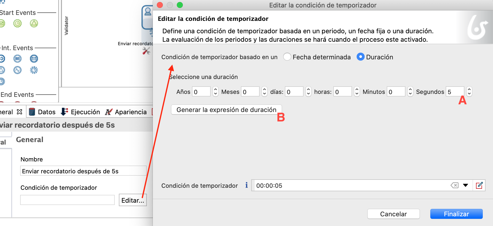
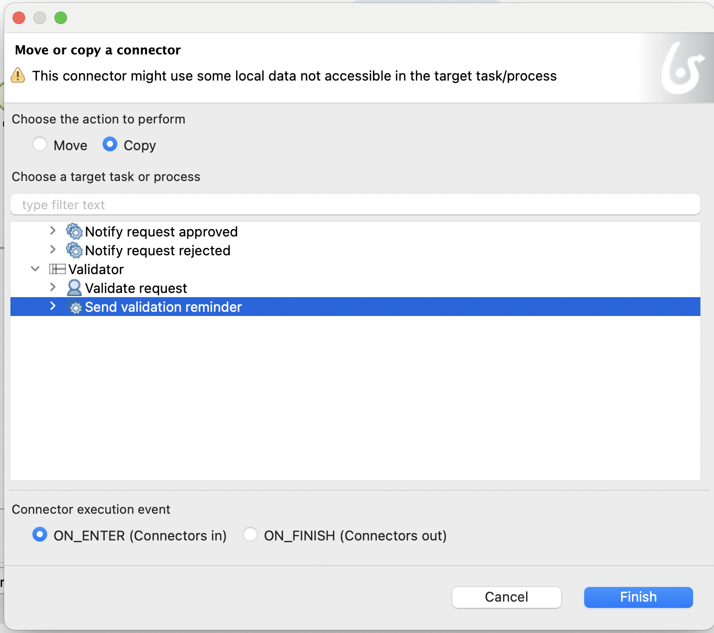

## Objetivo

El objetivo de este ejercicio es enriquecer la primera versión del diagrama del proceso de solicitud de vacaciones con un **evento de tiempo no interruptor** en la tarea de validación.

Este evento de tiempo enviará automáticamente un recordatorio al validador si no realiza la tarea a tiempo, sin interrumpir el proceso.

> ⚠ Es importante respetar estrictamente la sintaxis de los nombres técnicos (incluyendo mayúsculas, minúsculas y signos) proporcionados en las instrucciones.

## Instrucciones resumidas

1. Duplica el diagrama de proceso del ejercicio anterior para crear una versión 1.1.0.
1. Agrega un evento límite de tiempo (timer) no interruptor en la tarea *Validar solicitud*.
   La duración del temporizador es de **5 segundos** (para efectos prácticos del ejercicio).
1. Agrega una tarea de servicio llamada *Enviar recordatorio de validación* y un evento de fin llamado *Fin - Recordatorio enviado*.

## Instrucciones paso a paso

### Duplica el diagrama de proceso del ejercicio anterior para crear una versión 1.1.0.
1. En el explorador del proyecto, haz clic derecho en el diagrama y selecciona **Duplicar...**
1. Actualiza los números de versión de ambos: del proceso y de la *pool* (el diagrama) a *1.1.0*
1. Da clic en **OK**

### Agrega un evento límite de tiempo no interruptor en la tarea *Validar solicitud*
1. Haz clic en la tarea *Validar solicitud*.

1. Abajo, en medio de dicha tarea, da clic en el ícono **Agregar un evento límite**
  

1. Selecciona el **evento de tiempo no interruptor** en la lista. Se agregara automáticamente a la tarea.
  

1. Crea una tarea de servicio llamada *Enviar recordatorio de validación* después del evento de límite arrastrando y soltando la tarea del evento al carril.

1. Agrega un evento de fin llamado *Fin - recordatorio enviado* junto a la tarea de servicio recién añadida.
   
1. Configura el evento de tiempo:
   - Selecciona el evento de tiempo de límite
   - Ve a la pestaña **General / General**.
   - Agrega el nombre del evento de tiempo *Enviar recordatorio después de 5s*.
   - Declara la condición del evento haciendo clic en **Editar**.
   - En el editor, selecciona **Duración** para establecer la condición del temporizador y pon *5* en el campo **Segundos** (A)
   - Haz clic en **Generar expresión de duración** (B)
   - Haz clic en **Finalizar**
     
   - La condición del temporizador se genera automáticamente y debe aparecer en la pestaña **General**

<!---
1. Agrega un conector de correo electrónico en la tarea *Enviar recordatorio de validación*:
   - Selecciona la tarea *Notificar solicitud aprobada*.
   - Vete a la pestaña **Ejecución / Conectores entrada**.
   - Selecciona el conector de correo electrónico existente *enviarRequestApprovedEmail*.
   - Haz clic en **Mover/Copiar...**
   - En el editor, selecciona la acción a realizar **Copiar** y la tarea de servicio *Enviar Recordatorio de Validación*
   - Haz clic en **Finalizar**.  
      
     
1. Configura el conector de correo electrónico en la tarea *Enviar recordatorio de validación*:
   - Selecciona la tarea *Enviar recordatorio de validación*.
   - Vete a la pestaña **Ejecución / Conectores entrada**.
   - Selecciona el conector de correo electrónico y haz clic en **Editar**.
   - Actualiza el nombre a *enviarRecordatorioEmail*.
   - Haz clic en **Siguiente**.
   - No hay que cambiar los parámetros
   - Pasa a la página de configuración de *Destinatario del correo electrónico*.
   - Mantene *hr@acme.com* en el campo **De**.
   - Utiliza el icono del **lápiz** para editar la expresión del campo **Para**.
   - Nombre el script *getValidatorEmail*.
   - En el editor de scripts, introduce el siguiente script:
   
   <pre>
   def processApi = apiAccessor.getProcessAPI();
   def identityApi = apiAccessor.getIdentityAPI();

   //Get the TaskInstance
   def humanTaskInstance = processApi.getHumanTaskInstances(processInstanceId, "Validate request", 0, 1).get(0);

   //Get the user id assigned to the task review request
   def reviewRequestAssignedId = humanTaskInstance.getAssigneeId();

   //Get the review request email
   String reviewRequestAssignedEmail = "";
   
   if(reviewRequestAssignedId >0){
	  reviewRequestAssignedEmail = identityApi.getUserContactData(reviewRequestAssignedId, false).getEmail();
   }
   
   else{
	  reviewRequestAssignedEmail = "william.jobs@acme.com"
   }
   
   return reviewRequestAssignedEmail;</pre>

   - Pasa a la página siguiente
   - Pon como asunto *Una solicitud pendiente de aprobación*.
   - Haz clic en **Finalizar**.

1. Ejecuta el proceso para probarlo:
   - Asegúrate de que el servidor FakeSMTP sigue funcionando.
   - Haz clic en **Run** y crea un nuevo caso
   - Después de 5 segundos, verifica FakeSMTP. Se ha enviado un correo electrónico.
   --->

El conector para el envio de un correo electrónico cuando el temporizador expire será configurado más adelante.

[Siguiente ejercicio: Agregación de datos y especificación de contratos](03-data-contract.md)
