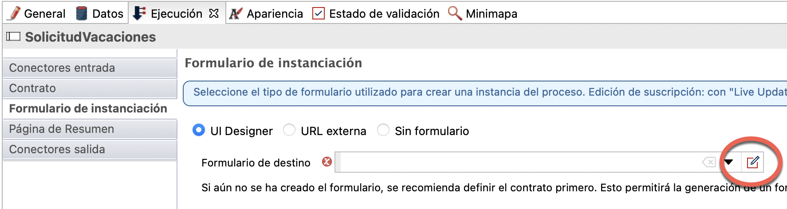
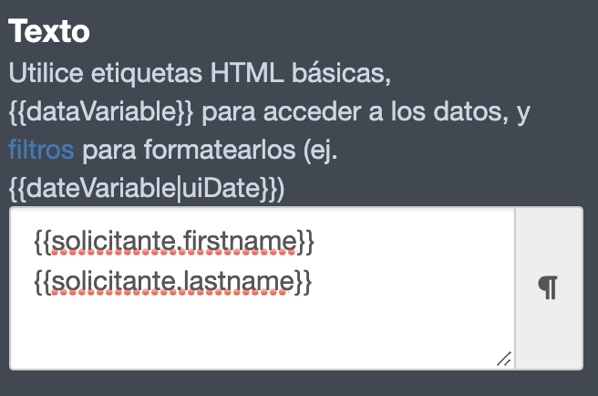

## Objetivo

El objetivo de este ejercicio es proporcionar formularios fáciles de usar y adecuados para la ejecución del proceso.

## Resumen de las instrucciones

Dupliqua el diagrama de proceso del ejercicio anterior para crear una versión *2.1.0*.

Crea los siguientes formularios:
- Un formulario de creación de instancias de proceso a nivel de pool que permite inicializar los atributos *fechaInicio* y *numeroDias* de la variable empresarial *solicitud*
- Se aprueba un formulario de pasos que permite mostrar la información del solicitante y los datos *fechaInicio* y *numeroDias* en modo de solo lectura y luego alimentar los datos *estaAprobado*

## Instrucciones paso a paso
1. Dupliqua el diagrama de proceso del ejercicio anterior para crear una versión *2.1.0*
1. Crea un formulario de instanciación:
   - Selecciona el pool de procesos
   - Navegua en la pestaña **Formulario de ejecución / instanciación**
   - Haz clic en el icono **Lápiz** en el campo **Formulario de destino**
   
    
   
   Esto va a abrir el UI Designer en tu navegador web con un nuevo formulario generado automáticamente a partir de la definición del contrato de instanciación.
   
   
1. Cambia el nombre del formulario:
   - Usa el campo de texto en la parte superior de la pantalla para cambiar el nombre del formulario de *newForm* a *ingresarSolicitudVacaciones* (este es un nombre técnico, por lo que debes omitir espacios, acentos y otros caracteres especiales)
   - Haz clic en el botón **Guardar**

1. Cambia el título del formulario:
   - Selecciona el widget *Solicitud* en la parte superior del formulario.
   - En la sección a la derecha de la pantalla, edita las siguientes propiedades:

   Propiedad | Valor
   --------- | ------
   Texto | *Ingrese una solicitud de vacaciones*
   Nivel de título | Nivel 2
   Alineación | centrado

1. Cambia el widget *Fecha Inicio* :
   - Selecciona el widget *Fecha de inicio* y edita las siguientes propiedades:

   Propiedad | Valor
   --------- | ------
   Etiqueta | Fecha de inicio
   Formato de fecha técnica | dd/MM/yyyy
   Placeholder de la fecha | Ingrese una fecha (dd/mm/yyyy)
   Etiqueta del botón Hoy: **Mostrar botón Hoy** | No

1. Cambia el widget *Numero Dias* :
   - Selecciona el widget *Numero Dias* y edite las siguientes propiedades:

   Propiedad | Valor
   --------- | ------
   Etiqueta | Número de días
   Placeholder | Número de días de vacaciones
   Valor mínimo (no debe confundirse con la propiedad **Longitud mínima**) | 1
      

1. Elimina los valores iniciales de los campos (esto permitirá mostrar los placeholders en la representación final):
   - En la parte inferior de la pantalla, debajo de la pestaña **Variables**, haz clic en el icono **Lápiz** ubicado a la derecha de la línea que contiene la variable *formInput*
   - Reemplaza el valor JSON con esto:
   ```json
   {
     "solicitudInput" : {
       "fechaInicio" : null,
       "numeroDias" : null
     }
   }
   ```

1. Cambia el widget *Submit* :
   - Selecciona el widget *Submit*
   - Cambia su etiqueta por *Enviar*

1. Comprueba el formulario:
   - Comprueba que el formulario se ve así en el editor:
   
    
   
   - Haz clic en el botón **Guardar** en la parte superior de la pantalla
   - Haz clic en el botón **Vista previa** en la parte superior de la pantalla
   - Comprueba que la vista previa se ve así:
    
     
   
   Ten en cuenta los siguientes puntos en la vista previa:
   - El widget con el error no es visible
   - Es posible probar la vista previa en diferentes dispositivos, desde teléfonos móviles hasta pantallas grandes.
   - El botón *Enviar* está deshabilitado de forma predeterminada (esto se debe a la validación proporcionada por el contenedor del formulario)
   - El botón *Enviar* se activa cuando el contenido del formulario es válido
 
    > **Nota:** no es posible enviar el formulario desde la vista previa, incluso cuando este último es válido.
 
1. Cierra la ventana de vista previa.
 
1. Crea un formulario para el paso *Validar solicitud*:
   - En Bonita Studio, selecciona el paso *Validar solicitud*
   - Navega en la pestaña **Ejecución / Formulario**
   - Haz clic en el icono **Lápiz** en el campo **Formulario de destino** para abrir un nuevo formulario en el UI Designer 
   - Responde **Sí** a la pregunta sobre cómo agregar widgets de solo lectura
   
   > **Nota:** el formulario se generó automáticamente a partir de la BDM y del contrato, y muestra datos de sólo lectura de la BDM que no son esperados por el contrato en esta etapa.

 
1. Cambia el nombre del formulario:
   - Desde el UI Designer, cambia el nombre del formulario a *validarSolicitudVacaciones* y guárdalo
 
1. Recupera información sobre el solicitante
   - Haz clic en el botón **Crear una nueva variable** para definir una variable con las siguientes propiedades:
   
    
   
1. Cambia el título del formulario
    - Selecciona el widget **Título** (Title) ubicado en la parte superior del formulario
    - Configura el widget de la siguiente manera:

   Propiedad | Valor
   --------- | ------
   Texto | Validar una solicitud de vacaciones
   Nivel de título | Nivel 2

1. Borra el widget *Solicitante ID* y coloqua un widget para presentar el nombre y apellido del solicitante:
    - Arrastra un widget **Texto**
    - Configura el widget de esta manera:

   

1. Agrega un widget para rechazar la solicitud:
    - Arrastra un widget **Botón** y agrégualo al contenedor del formulario (área delimitada por una línea gruesa de puntos)
    - Configura el widget de esta manera:

   Propiedad | Valor
   --------- | ------
   Ancho | 6
   Etiqueta | Rechazar
   Alineación | derecha
   Estilo | danger
   Datos enviados al hacer click  | `{"solicitudInput":{"estaAprobado":false}}`
   Valor de la respuesta fallida  | `formOutput._submitError`
   Dirección URL de destino en éxito | `/bonita`

1. Borra la casilla *Está aprobado* y el botón *Submit*

1. Añada un widget para aprobar la solicitud
    - Arrastra un widget **Botón** al área "6 columnas" a la derecha del botón *Rechazar*
    - Configura el widget de esta manera:

   Propiedad | Valor
   --------- | ------
   Etiqueta | Aprobar
   Estilo | success
   Datos enviados al hacer click | `{"solicitudInput":{"estaAprobado":true}}`
   Valor de la respuesta fallida  | `formOutput._submitError`
   Dirección URL de destino en éxito | `/bonita`


1. Comprueba el formulario :
   - Asegúrate de que el formulario se vea así:
      
       

1. Guarda el formulario:
   - Usa el botón **Guardar** en el centro superior de la pantalla para guardar el formulario

1. Prueba la ejecución del proceso:
   - Inicia la ejecución del proceso a través de Bonita Studio
   - Valida, a partir del historial de casos, que se ha seguido el camino correcto hasta el final del proceso

[Ejercicio siguiente: definición de los actores](04-actors.md)
