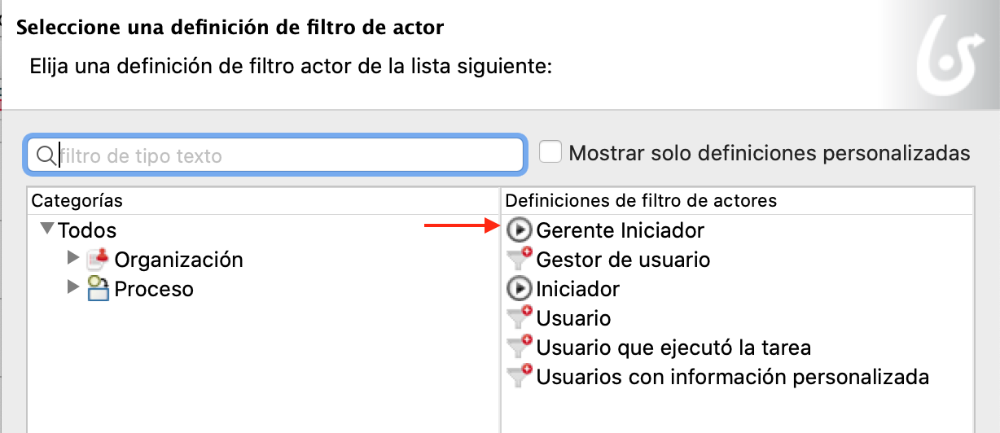

## Objetivo

El objetivo de este ejercicio es aportar una noción de colaboración al proceso existente mediante la distribución de las tareas entre dos actores: el solicitante y el validador.

## Resumen de las instrucciones

Duplique el diagrama de proceso del ejercicio anterior para crear una versión *3.0.0*.

Agregue una senda *Validator* al diagrama y mueva la tarea allí *Validar solicitud*.

Configure un filtro de actor del tipo **Gestor del iniciador de proceso** en la senda *Validator*.

## Instrucciones paso a paso

1. Duplique el diagrama de proceso del ejercicio anterior para crear una versión *3.0.0*

1. Agregue una senda *Validator* al diagrama:
    - Seleccione el elemento de senda de la paleta de elementos BPMN presentes en el lado izquierdo de Bonita Studio:
   
    
   
    - Haga clic en el pool de procesos para agregar la senda
    - Seleccione la senda
    - Navega en la pestaña **General / Senda**
    - Cambie el nombre a *Validator*
   
1. Cambie el nombre de la otra senda a *Solicitante*
   
1. Arrastre la tarea *Validar solicitud* en la senda *Validador*

1. Configure un filtro de actor del tipo **Gestor iniciador** en la senda *Validador*:
    - Seleccione la senda *Validador*
    - Navega en la pestaña **General / Actores**
    - Seleccione el actor *Empleado actor* del menú desplegable
    - Haga clic en el botón **Definir ...** asociado con el filtro de actor
    - Seleccione un tipo de filtro **Gestor iniciador**
    - Haga clic en **Siguiente**
    - Nombra el filtro *responsableIniciador*
    - Haga clic en **Finalizar**
    
    

1. Verifique que el diagrama se vea así:

    

1. Ejecute el proceso con los dos actores:
    - Inicie el proceso desde Studio (se usará el usuario Walter Bates)
    - Envíe el *Formulario de solicitud de vacaciones*. Si los actores están configurados correctamente, no se debe proponer la tarea *Validar solicitud de vacaciones*
    - Cierre sesión en el portal haciendo clic en el nombre de usuario en la esquina superior derecha y luego **Cerrar sesión**:
    
    
   
 1. Conéctese con el usuario *helen.kelly* y la contraseña *bpm*
 
    - Si el filtro de actor se ejecutó correctamente, la tarea *Validar solicitud de vacaciones* debería estar disponible en la lista de tareas
   
   [Ejercicio siguiente: configuración de un conector](05-connectors)
