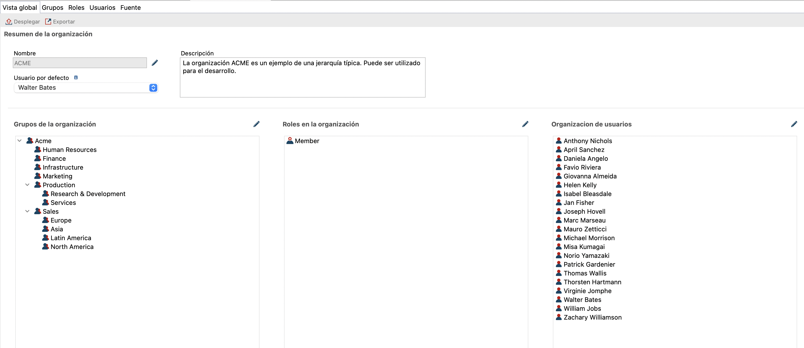

## Objetivo

El objetivo de este ejercicio es aportar una noción de colaboración al proceso existente mediante la distribución de las tareas entre dos actores: el solicitante y el validador.

## Resumen de las instrucciones

Dupliqua el diagrama de proceso del ejercicio anterior para crear una versión *4.0.0*.

Agrega un carril (lane) *Validator* al diagrama y mueve la tarea allí *Validar solicitud*.

Define un rol **Validador** en la organización y asignalo al carril *Validador*.

## Instrucciones paso a paso

1. Dupliqua el diagrama de proceso del ejercicio anterior para crear una versión *4.0.0*

1. Agrega un carril (lane) *Validator* al diagrama:
    - Selecciona el elemento de senda de la paleta de elementos BPMN presentes en el lado izquierdo de Bonita Studio:
   
   
    - Haz clic en el pool de procesos para agregar el carril
    - Selecciona el carril
    - Navega en la pestaña **General / Senda**
    - Cambia el nombre a *Validador*

1. Arrastra la tarea *Validar solicitud* en el carril *Validador*
   
1. Cambia el nombre del otro carril a *Solicitante*

1. Verifica que el diagrama se vea así:

    
   
1. Crea un rol *validador* en la organización :
   - En el explorador de proyectos, haz clic en **Organizaciones** y selecciona la organización de prueba *ACME.organization*.   
     El editor de la organización se abre, con una visión general de los *grupos*, *roles* y *usuarios*.
     
   - Haz clic en el lápiz para editar los roles.
   - Haz clic en **Agregar rol** (A) y edite (B) el nombre técnico del rol (haciendo clic en el lápiz) para especificar *validador*.
   - Añad" el nombre de visualización *Validador*.
     
     
1.Asigna este nuevo rol al usuario *Helen Kelly* que se encarga de validar las solicitudes de vacaciones de nuestro usuario por defecto *Walter Bates*.
   - Va a la pestaña**Usuario** y selecciona *Helen Kelly*.
   - En **Membresía**, cambia el rol de *miembro* a *validador*.
     
   - Despliegua la organización para aplicar los cambios haciendo clic en el icono **Desplegar**.
   
   >**Nota** Para ir más allá, también es posible definir un filtro de actores. Este método se describe en un siguiente ejercicio.

1. Definir actores en el proceso
   - En el diagrama, selecciona el carril *Validador*.
   - Navega hasta el tablero **General / Actor**
   - Haz clic en **Agregar**
   - En el campo **Nombre** añada *validador*. No marqua la casilla **Iniciador** porque el iniciador es el solicitante.
   - Haga clic en **Finalizar**.
   - Comprueba que el actor definido en la vía *Solicitante* es el actor por defecto *Actor empleado*.

1. Vincula la organización a los actores del proceso:
   - Haz clic en el icono *Configurar*  que asociará los actores con los roles correctos de la organización.
   - En el editor, selecciona **Mapeo de actores**. El actor empleado ya está asociado a un grupo, así que haga lo mismo con el actor **validador**.
   - Selecciona el actor **validador** (A) y luego haz clic en el botón **Roles** (B)
   - En la ventana, selecciona el rol de **validador**
     

1. Ejecuta el proceso con los dos actores:
    - Inicia el proceso desde Studio (se usará el usuario Walter Bates)
    - Envía el *Formulario de solicitud de vacaciones*. Si los actores están configurados correctamente, no se debe proponer la tarea *Validar solicitud de vacaciones*
    - Cierra sesión en el portal haciendo clic en el nombre de usuario en la esquina superior derecha y luego **Cerrar sesión**:
    
    
   
 1. Conéctate con el usuario *helen.kelly* y la contraseña *bpm*
 
    - Si los actores se han definido correctamente, la tarea *Validar solicitud de vacaciones* debería estar disponible en la lista de tareas
   
   [Ejercicio siguiente: configuración de un conector](05-connectors.md)
