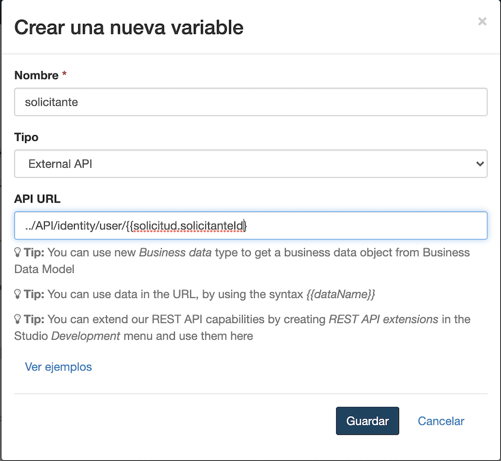

## Objetivo

El objetivo de este ejercicio es proporcionar formularios simples, fáciles de usar y adecuados para la ejecución del proceso.

## Instrucciones resumidas

1. Duplica el diagrama de proceso del ejercicio anterior para crear una versión *2.1.0*.

1. Crea un formulario de instanciación de proceso a nivel de la *pool* que permita inicializar los atributos *fechaInicio* y *numeroDias* de la variable de negocio *solicitud*
1. Crea un formulario para ejecutar la tarea de aprobacion en donde se muestre la información del solicitante y los datos *fechaInicio* y *numeroDias* en modo de solo lectura y permita la captura de *estaAprobado*

## Instrucciones paso a paso
1. Duplica el diagrama de proceso del ejercicio anterior para crear una versión *2.1.0*:
   - A partir de la versión *2.0.0, crea la versión *2.1.0* del diagrama y de la *pool*.
1. Crea un formulario de instanciación de proceso:
   - Selecciona la *pool* del proceso
   - en la zona de propiedades, navega a la pestaña **Ejecución / Formulario de instanciación**
   - Haz clic en el ícono **lápiz** asociado al campo **Formulario de destino**
   
   
   Esto va a abrir el UI Designer en tu navegador web con un nuevo formulario generado automáticamente a partir de la definición del contrato de instanciación.
   
   
   - Cambia el nombre del formulario:
      - Usa el campo de texto en la parte superior de la pantalla para cambiar el nombre de *newForm* a *ingresarSolicitudVacaciones*. al ser un nombre técnico, se deben omitir espacios, acentos y otros caracteres especiales.
      - Haz clic en el botón **Guardar**

   - Cambia el título del formulario, visible para el usuario:
      - Selecciona el widget **Title** con el valor *Solicitud* en la parte superior del formulario.
      - En la sección a la derecha de la pantalla, edita las siguientes propiedades:

      Propiedad | Valor
      --------- | ------
      Texto | *Ingrese una solicitud de vacaciones*
      Nivel de título | Nivel 2
      Alineación | centrado

   - Cambia el widget *Fecha Inicio* :
      - Selecciona el widget **Date Picker** con el valor *Fecha de inicio* y edita las siguientes propiedades:

      Propiedad | Valor
      --------- | ------
      Etiqueta | Fecha de inicio
      Formato de fecha técnica | dd/MM/yyyy
      Placeholder | Ingrese una fecha (dd/mm/aaaa)
      Etiqueta del botón Hoy: **Mostrar botón Hoy** | No

   - Cambia el widget *Numero Dias* :
      - Selecciona el widget **Input** *Numero Dias* y edita las siguientes propiedades:

      Propiedad | Valor
      --------- | ------
      Etiqueta | Número de días
      Placeholder | Número de días a solicitar
      Valor mínimo (no debe confundirse con la propiedad **Longitud mínima**) | 1

   - Cambia el widget *Submit* :
      - Selecciona el widget **Button** *Submit*
      - Cambia su etiqueta por *Enviar*

   - Verifica el formulario:
      - Comprueba que el formulario se ve así en el editor:
      
      
      - Haz clic en el botón **Guardar** en la parte superior de la pantalla
      - Haz clic en el botón **Vista previa** en la parte superior de la pantalla
      - Comprueba que la vista previa se ve así:
      
      
      Ten en cuenta los siguientes puntos en la vista previa:
      - El widget que muestra el error no es visible
      - Es posible probar la vista previa en diferentes dispositivos, desde teléfonos móviles hasta pantallas grandes.
      - El botón *Enviar* está deshabilitado de forma predeterminada (esto se debe a la validación proporcionada por el contenedor del formulario)
      - El botón *Enviar* se activa cuando el contenido del formulario es válido
   
      > **Nota:** no es posible enviar el formulario desde la vista previa, incluso cuando este último es válido.
   
   - Cierra la ventana de vista previa.
 
1. Crea un formulario para ejecutar la tarea *Validar solicitud*:
   - En Bonita Studio, selecciona la tarea *Validar solicitud*
   - En la zona de propiedades, navega a la pestaña **Ejecución / Formulario**
   - Haz clic en el ícono **lápiz** relacionado con el campo **Formulario de destino** para abrir un nuevo formulario en el UI Designer 
   - Responde **Sí** a la pregunta sobre cómo agregar widgets de solo lectura
   
   > **Nota:** el formulario se generó automáticamente a partir del modelo de datos de negocio (BDM) y del contrato, y muestra los datos que no son esperados por el contrato en esta etapa en modo solo lectura.

 
   - Cambia el nombre del formulario:
      - Desde el UI Designer, cambia el nombre del formulario a *validarSolicitudVacaciones* y guárdalo.
   
   - Recupera información sobre el solicitante
      - Haz clic en el botón **Crear una nueva variable** para definir una variable con las siguientes propiedades:
      
       
      > **Nota:** puedes utilizar los ejemplos que te permiten recuperar automáticamente los patrones de llamadas a la API. Aquí recuperaremos `identity API` porque estamos buscando información relacionada con un usuario.

   - Cambia el título del formulario
      - Selecciona el widget **Título** (Title) ubicado en la parte superior del formulario
      - Configura el widget de la siguiente manera:

      Propiedad | Valor
      --------- | ------
      Texto | Validar una solicitud de vacaciones
      Nivel de título | Nivel 2

   - Cambia el widget *Solicitante ID* para presentar el nombre y apellido del solicitante:
      - Cambia el valor del campo **Etiqueta** por *Solicitante*
      - Configura el widget de esta manera: `{{solicitante.firstname}} {{solicitante.lastname}}`

      

   - Cambia el botón *Submit*:
      - Selecciona el widget
      - Cambia la etiqueta para *Validar*
   
   - Comproba el formulario simple:
      - Asegurate que el formulario se vea así:
      
----------
*Opción para ir más lejos*
1. Agrega un widget para rechazar la solicitud:
    - Arrastra un widget **Botón** y agrégualo al contenedor del formulario (área delimitada por una línea gruesa de puntos)
    - Configura el widget de esta manera:

   Propiedad | Valor
   --------- | ------
   Ancho | 6
   Etiqueta | Rechazar
   Alineación | derecha
   Estilo | danger
   Datos enviados al hacer click  | `{"solicitudInput":{"estaAprobado":false}}`
   Valor de la respuesta fallida  | `formOutput._submitError`
   Dirección URL de destino en éxito | `/bonita`

1. Borra la casilla *Está aprobado* y el botón *Submit*

1. Añada un widget para aprobar la solicitud
 - Arrastra un widget **Botón** al área "6 columnas" a la derecha del botón *Rechazar*
 - Configura el widget de esta manera:

   Propiedad | Valor
   --------- | ------
   Etiqueta | Aprobar
   Estilo | success
   Datos enviados al hacer click | `{"solicitudInput":{"estaAprobado":true}}`
   Valor de la respuesta fallida  | `formOutput._submitError`
   Dirección URL de destino en éxito | `/bonita`

El formulario se vera así:
   
---------------

1. Guarda el formulario:
   - Usa el botón **Guardar** en el centro superior de la pantalla para guardar el formulario

1. Prueba la ejecución del proceso:
   - Inicia la ejecución del proceso a través de Bonita Studio
   - Valida, a partir del historial de casos, que se ha seguido el camino correcto hasta el final del proceso

[Ejercicio siguiente: configuración de los actores](05-actors.md)
