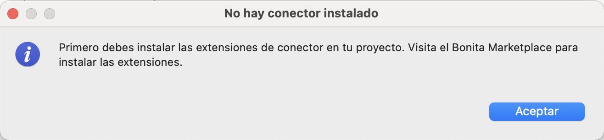
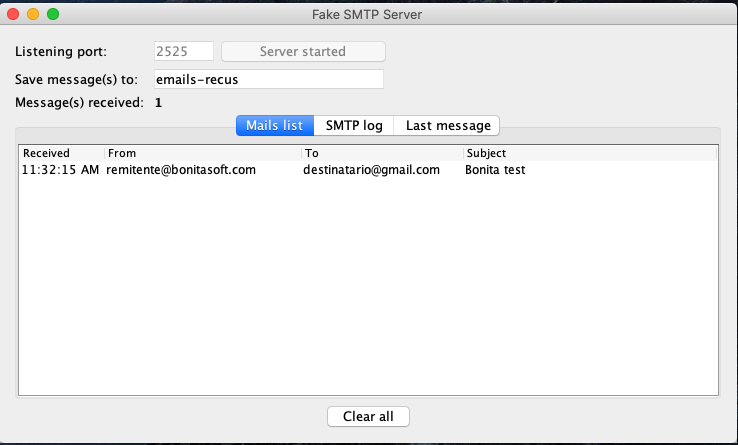
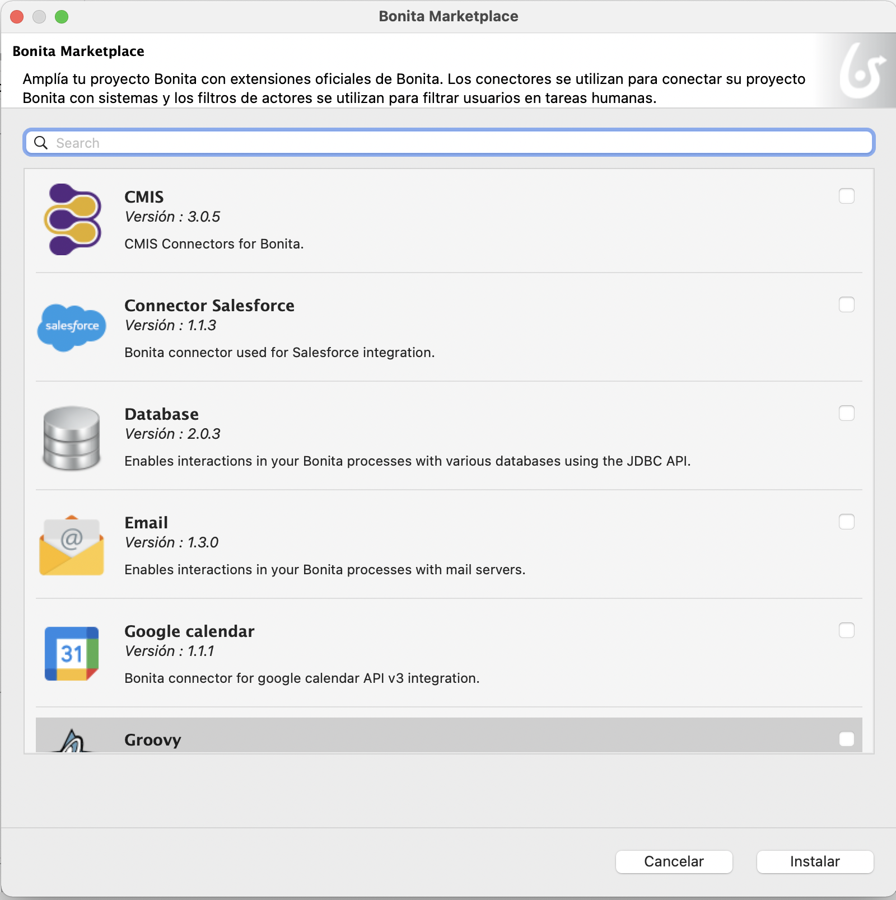
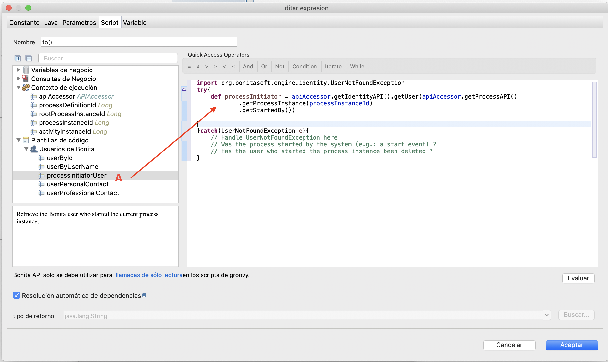
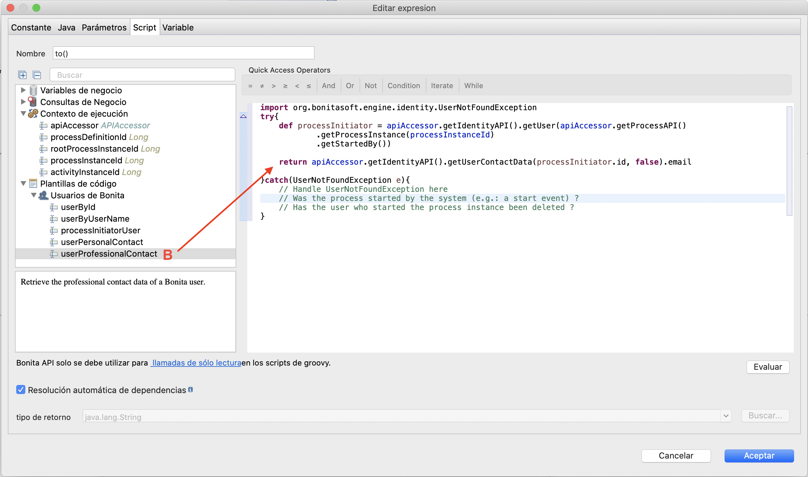

## Objetivo

El objetivo de este ejercicio es tratar una interacción entre el proceso y un sistema externo a través de un conector. Aquí estamos interesados en la notificación del resultado de la solicitud de licencia a través de un conector de correo electrónico.

> ⚠ Dependiendo de la configuración de su red, su firewall o la configuración de seguridad de su servidor de correo electrónico, es posible que no esté autorizado para enviar un correo electrónico desde Bonita.
> Para evitar estas limitaciones técnicas, este ejercicio se realizará con un software que simule un servidor de correo electrónico (FakeSMTP).

## Resumen de las instrucciones

Recupera y inicia el servidor [FakeSMTP](http://nilhcem.github.io/FakeSMTP/downloads/fakeSMTP-latest.zip).

Dupliqua el diagrama de proceso del ejercicio anterior para crear una versión *3.1.0*.

Agrega un conector para enviar correos electrónicos en tareas automáticas *Notificar aprobación* y *Notificar rechazo*. Estos enviarán un correo electrónico al solicitante con el estado de validación de su solicitud.

Hay que definir un script para recuperar el correo electrónico del solicitante en el conector.

## Instrucciones paso a paso

1. Implementación de FakeSMTP:
    - Recupera el binario de FakeSMTP de esta URL: [http://nilhcem.github.com/FakeSMTP/downloads/fakeSMTP-latest.zip](http://nilhcem.github.com/FakeSMTP/downloads/fakeSMTP-latest.zip)
    - Abre el archivo `fakeSMTP-latest.zip`
    - Inicia FakeSMTP haciendo doble clic en el archivo JAR o ejecutando el siguiente comando: `java -jar fakeSMTP-2.0.jar`
    - Una vez que se muestra la interfaz gráfica de FakeSMTP, configura el puerto de escucha en *2525* y haz clic en el botón **Iniciar el servidor**

1. Dupliqua el diagrama de proceso del ejercicio anterior para crear una versión *3.1.0*

1. Prueba el conector de envío de correo electrónico para obtener la configuración SMTP correcta:
    - Navega en el menú **Desarrollo / Conectores / Probar conector ...** en la barra superior de Bonita Studio
    - Selecciona un conector **Correo electrónico (SMTP)** del filtro o de la categoría **Mensajeria**
    - Haz clic en el botón **Siguiente**
    - Completa los siguientes parámetros de conexión:
   
    Propiedad | Valor
    --------- | ------
    Host SMTP | *localhost*
    Puerto SMTP | *2525* (el puerto especificado en FakeSMTP)
    SSL (en la pestaña **Seguridad**) | desmarcado
   
    - Haz clic en el botón **Siguiente**
    - Ingresa correos electrónicos (no necesariamente existentes) como destinatario y remitente
    - Haz clic en el botón **Siguiente**
    - Ingresa *Bonita test* como asunto
    - Haz clic en el botón **Prueba**
    - Acepta sin verificar dependencia
    - Debería aparecer un mensaje similar al siguiente, haz clic en el botón **Aceptar**:
   
   
   
    - Asegúrate de que FakeSMTP reciba el correo electrónico como se ilustra abajo:
   
   
   
    - Una vez que se valida la configuración, haz clic en 
    - Nombre la configuración *configEmail* y guárdela
    - Cierra la interfaz de prueba del conector
   
1. Agrega un conector para enviar un correo electrónico en la tarea *Notificar aprobación*:
    - Selecciona la tarea *Notificar aprobación*
    - Navega en la pestaña **Ejecución / Conectores entrada**
    - Haz clic en **Agregar \ ...**
    - Selecciona un conector de tipo **Correo electrónico**
    - Haz clic en el botón **Siguiente**
    - Especifica *enviarCorreoAprobacion* como nombre
    - Vete a la página siguiente
    - No hay que rellenar los parámetros de la página
    - Haz clic en 
    - Selecciona la configuración *configEmail*
    - Vete a la página de configuración del destinatario
    - Ingresa *rh@acme.com* como dirección de correo electrónico en el campo del remitente **De**
    - Usa el ícono **lápiz** para editar la expresión en el campo del destinatario **A**
    - En el editor de scripts, selecciona *processInitiatorUser* en el menú **Plantillas de codigo/Usuarios de Bonita**.
    - Arrastralo en la pestaña de derecha. Se crea automaticamente el script para recuperar los detalles del iniciador del proceso
    
    
    - Selecciona *userProfessionalContaect* en el mismo menú y arrastralo en la pestaña, entre `.getStartedBy` y `}catch`
    - Para poder recuperar el correo electronico del iniciador del proceso, reemplaza *userId* por *processInitiator.id*
    - Tras `(processInitiator.id, false)` añade "." y selecciona *email: string* en la lista
    - Cambia `def proContactData =` por `return`
    
    
    
    - Haz clic en el botón **Aceptar** para cerrar el editor de scripts
    - Vete a la página siguiente
    - Especifica *Solicitud de vacaciones aprobada* como asunto
    - Haz clic en **Finalizar**
   
1. Agrega un conector para enviar correo electrónico a la tarea *Notificar rechazo*:
    - Repite el paso anterior nombrando el conector *enviarCorreoRechazo* y especificando *Solicitud de vacaciones rechazada* como asunto
   
   Alternativamente, puedes usar la funcionalidad que te permite copiar un conector configurado en una tarea a otra tarea.
   
1. Prueba el proceso:
    - Ejecuta el proceso dos veces para probar las diferentes rutas y asegurate de que FakeSMTP envíe e intercepte los correos electrónicos

[Ejercicio siguiente: creación de aplicaciones](06-applications.md)
