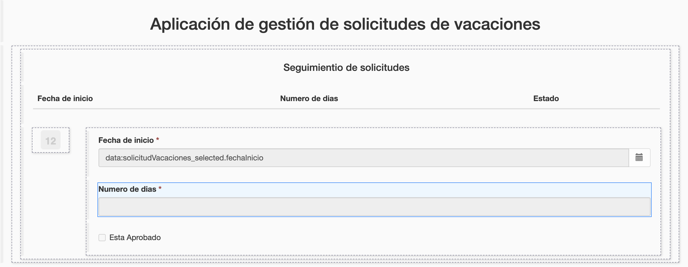

## Objetivo

El objetivo de este ejercicio es proporcionar a los usuarios una aplicación que permita rastrear y crear solicitudes de vacaciones.

## Resumen de las instrucciones

Abre el UI Designer y crea una nueva **Página de aplicación** llamada *SeguimientoDeSolicitud* que permite el seguimiento de las solicitudes de vacaciones iniciadas por el usuario conectado.

Esta página contiene un contenedor múltiple que enumera las solicitudes de vacaciones abiertas. Para cada solicitud, se muestran la fecha de inicio, el número de días y el estado.

Cree una nueva aplicación y agregue la página *SeguimientoDeSolicitud*.

Acceda a la aplicación recién creada utilizando la URL única generada.

*Opcional: agregue un widget de fecha y un widget de tipo input para recopilar la información necesaria para crear una nueva solicitud de vacaciones. Luego agregue y configure un botón para enviar la nueva solicitud.*

## Instrucciones paso a paso

1. Crea una página de aplicación:
    - En el Studio, haz clic en el botón **UI Designer**
    - Haz clic en el botón **Crear**
    - Selecciona **Página de aplicación**
    - Ingresa el nombre *SeguimientoDeSolicitudes*
    - Haz clic en **Crear**
   
   
   
    - La vista de diseño ahora debería mostrarse  

1. Agrega un título a tu página:
    - Arrastra el widget **Título** (A) desde la paleta y colócalo en la parte superior de la página (B)
    - Selecciona el widget
    - En el panel derecho, ingresa *Aplicación de gestión de solicitudes de vacaciones* en el campo **Texto**
    - Selecciona la opción **centrado** para el parámetro **Alineación**  
   
   

1. Agrega otro título a tu página debajo del título principal:
    - Nombralo *Seguimiento de solicitudes*
    - Selecciona la opción **Nivel 4** para el parámetro **Nivel de título**
    - Selecciona la opción **centrado** para el parámetro **Alineación**  

1. Crea una variable para almacenar información de sesión:
    - Haz clic en **Crear una nueva variable**
    - Nombra la *sessionInfo*
    - Elije el tipo **external API**
    - Añade en el campo **API URL**: `../API/system/session/unusedId`  
   
   

1. Crea una variable para listar las solicitudes de vacaciones:
    - Haz clic en el ícono **Modelo de datos**
    - Arrastra y suelta *SolicitudVacaciones* en la página
    - Mantenga el nombre predeterminado: *solicitudVacaciones*
    - En la sección **Consultas de "Buscar por (Find By)" en un atributo**, selecciona *solicitanteId*
    - En la sección **Filtros de la consulta findBySolicitanteId** ingresa lo siguiente:

    
       
    - Haz clic en el botón **Guardar**
    
    Se genera automáticamente un contenedor múltiple con una tabla que contiene los atributos del objeto SolicitudVacaciones.

    

1. Borrar el sub-titulo *SolicitudVacaciones* del contenedor y las etiquetas inutiles:
    - Selecciona el widget **Table**
    - En el panel de configuración de la derecha, en el campo **Cabeceras**, borra *Solicitante Id, *
    - Reemplaza *Fecha Inicio* con *Fecha de inicio*, *Numero Dias* con *Número de días* y *EstaAprobado* con *Estado*
1. Declara una nueva expresión de JavaScript para formatear la lista:
    - Haz clic en **Crear una nueva variable**
    - Nombra el *agregarEtiquetaEstadoSolicitud*
    - Elije el tipo **JavaScript expression**
    - Reemplaza el valor existente con el siguiente script:

    ```javascript
   if($data.hasOwnProperty('solicitudVacaciones') && $data.solicitudVacaciones) {
    for (let solicitud of $data.solicitudVacaciones) {
      if(solicitud.estaAprobado)  {
        solicitud.estaAprobadoEtiqueta = "Aprobada";
      } else if(solicitud.estaAprobado === false) {
        solicitud.estaAprobadoEtiqueta = "Rechazada";
      } else {
        solicitud.estaAprobadoEtiqueta = "En curso";
      }
    }
   }
   
   return $data.solicitudVacaciones;
    ```
   
1. Muestra la información en las columnas de la tabla de una manera más clara:
    - En el panel de la derecha, en el campo **Claves de columna**, elimina *solicitanteId*
    - En el mismo campo, cambia *estaAprobado* por *estaAprobadoEtiqueta*
    - Borra el widget Input *SolicitanteId* en el contenedor de detalles porque esta información no es útil.

1. Agrega 4 widgets al contenedor:
    - Un widget **Input** con las siguientes opciones:
   
     Propiedad | Valpr
     --------- | ------
     Ancho     | *3*
     Sólo lectura | **Sí**
     Etiqueta | *Num*
     Valor | `$index + 1`

   - Un widget **Date picker** con las siguientes opciones:
   
     Propiedad | Valor
     --------- | ------
     Ancho | *3*
     Sólo lectura | **Sí**
     Etiqueta | *Fecha de inicio*
     Valor | `$item.fechaInicio`
     Formato de fecha técnica | *dd/MM/yyyy*
     Mostrar botón Hoy | **No**

   - Un widget **Input** con las siguientes opciones:
   
     Propiedad | Valor
     --------- | ------
     Ancho | *3*
     Sólo lectura | **Sí**
     Etiqueta | *Numero de días*
     Valor | `$item.numeroDias`

   - Un widget **Input** con las siguientes opciones:
   
     Propiedad | Valor
     --------- | ------
     Ancho | *3*
     Sólo lectura | **Sí**
     Etiqueta | *Estado*
     Valor | `$item.estaAprobadoEtiqueta`

   - Guarda la página
   - La página debería verse así:
   
   
   
   - Puedes obtener una vista previa de la página en cualquier momento haciendo clic en **Vista previa**
   
   > Consejo: si está conectado al portal en el mismo navegador, se mostrarán las solicitudes de vacaciones reales.
  
1. Agrega un nuevo contenedor de formulario:
    - Arrastra un contenedor de formulario (form container) desde la paleta y colócalo entre los dos títulos

1. Crea una nueva variable para almacenar información relacionada con la solicitud de licencia:
    - Haz clic en **Crear en una nueva variable**
    - Nombra la variable *nuevaSolicitudVacaciones*
    - Elije el tipo **Javascript expression**
    - En el campo de texto **Valor**, escribe el siguiente script:
   ```
   var solicitud =  { 
     solicitudInput : {
       fechaInicio : null,
       numeroDias : null,
       solicitanteId : $data.sessionInfo.user_id
     }
   } ;
   
   return solicitud;
   ```

1. Crea una nueva variable para almacenar información relacionada con el proceso:
    - Haz clic en **Crear una nueva variable**
    - Nombra la variable *informacionDefinicionProceso*
    - Elije el tipo **API externa**   
    - En el campo **API URL**, escribe: 
    `../API/bpm/process?p=0&c=100&o=version%20DESC&f=name=SolicitudVacaciones`

1. Agrega dos widgets en el contenedor del formulario:
     - Un widget **Date picker** con las siguientes opciones:
        
        Propiedad | Valor
        --------- | ------
        Ancho | *6*
         Etiqueta | *Fecha de inicio*
         Valor | `nuevaSolicitudVacaciones.solicitudInput.fechaInicio`
       
    - Un widget **Input** con las siguientes opciones:
   
        Propiedad | Valor
        --------- | ------
        Ancho | *6*
        Etiqueta | *Número de días*
        Valor | `nuevaSolicitudVacaciones.solicitudInput.numeroDias`
        
1. Agrega un botón para enviar el formulario:
    - Arrastra el widget **Botón** desde la paleta y colócalo en el contenedor del formulario debajo de los dos widgets
    - Ingresa *Crear una nueva solicitud* en el campo **Etiqueta**
    - Selecciona **POST** de la lista desplegable **Acción**
    - Haz clic en **fx** para cambiar el modo del campo **Datos enviados al hacer clic** y selecciona *nuevaSolicitudVacaciones*
    - En el campo **URL para llamar**, escribe: `../API/bpm/process/{{informacionDefinicionProceso[0].id}}/instantiation`
    - En el campo **URL de destino si tiene éxito**, escribe: `/bonita/apps/solicitud-vacaciones` (de momento no se puede ir a la página porque hay que crear la aplicación de destino)
    - Selecciona la opción **centrado** para el parámetro **Alineación**
    - Selecciona la opción **primary** para el parámetro **Estílo** 
    - Guarda los cambios. La página ahora debería verse así:
   
   
   
    - La vista previa de la página te permite verificar que funciona correctamente

    Ahora vamos a desplegar la aplicación en el portal desde Bonita Studio.

1. Añade un nuevo descriptor de aplicación:
    - En Bonita Studio, en el **Explorador de proyectos** a la izquierda de la ventana, despliega **Páginas/Formularios/Layouts** para verificar la presencia de todas las páginas y formularios
    - En el menú **Desarrollo/Descriptores de aplicaciones**, haz clic en **Nueva**. Un fichero .xml se crea automaticamente.
    - Haz clic en 
    - Ingresa *solicitud-vacaciones* en el campo **Token de la aplicación**
    - Ingresa *Aplicación de solicitudes de vacaciones* en el campo **Título dinámico**
    - Haz clic en **Añadir**
    
    
    
1. Crea una nueva aplicación
    - En el menú de navegación, haz clic en **Añadir menú de una página** (A)
    - Ingresa *Seguimiento de las solicitudes de vacaciones* en el campo **Menú**
    - Selecciona la página *custompage_SeguimientoDeSolicitud* en el campo **Página de aplicación** (B)
    - Ingresa *lista-solicitudes* en el campo **Token** (C).
    
       
    
1. Define la página *Aplicación de solicitudes de vacaciones* como página de inicio de la aplicación: 
    - Selecciona el token *lista-solicitudes* en el menú **Página de inicio**
    - Haz clic en el enlace para probar la aplicación (A)
    - Una ventana se abre para confirmar el despliegue. Haz clic en el botón **Desplegar**
  
   
   
 Vas a poder acceder a la aplicación en el Portal directamente

   
   


**¡Ya esta!**
