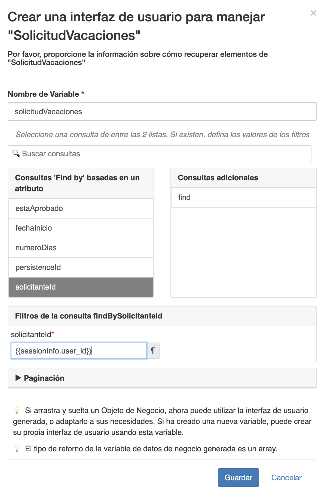

## Objetivo

El objetivo de este ejercicio es proporcionar a los usuarios una aplicación que permita rastrear y crear solicitudes de vacaciones.

## Resumen de las instrucciones

Abra el UI Designer y cree una nueva **Página de aplicación** llamada *SeguimientoDeSolicitud* que permite el seguimiento de las solicitudes de vacaciones iniciadas por el usuario conectado.

Esta página contiene un contenedor múltiple que enumera las solicitudes de vacaciones abiertas. Para cada solicitud, se muestran la fecha de inicio, el número de días y el estado.

Implemente la página de la aplicación utilizando el botón **Desplegar** en Bonita Studio.

Cree una nueva aplicación y agregue la página *SeguimientoDeSolicitud*.

Acceda a la aplicación recién creada utilizando la URL única generada.

*Opcional: agregue un widget de fecha y un widget de tipo input para recopilar la información necesaria para crear una nueva solicitud de vacaciones. Luego agregue y configure un botón para enviar la nueva solicitud.*

## Instrucciones paso a paso

1. Cree una página de aplicación:
    - En el Studio, haga clic en el botón **UI Designer**
    - Haga clic en el botón **Crear**
    - Seleccione **Página de aplicación**
    - Ingrese el nombre *SeguimientoDeSolicitudes*
    - Haga clic en **Crear**
   
   
   
    - La vista de diseño ahora debería mostrarse  

1. Agregue un título a su página:
    - Arrastre el widget **Título** (A) desde la paleta y colóquelo en la parte superior de la página (B)
    - Seleccione el widget
    - En el panel derecho, ingrese *Aplicación de gestión de solicitudes de vacaciones* en el campo **Texto**
    - Seleccione la opción **centrado** para el parámetro **Alineación**  
   
   

1. Agregue otro título a su página debajo del título principal:
    - Nombrelo *Seguimiento de solicitudes*
    - Seleccione la opción **Nivel 4** para el parámetro **Nivel de título**
    - Seleccione la opción **centrado** para el parámetro **Alineación**  

1. Cree una variable para almacenar información de sesión:
    - Haga clic en **Crear una nueva variable**
    - Nombre la *sessionInfo*
    - Elija el tipo **external API**
    - Añade en el campo **API URL**: `../API/system/session/unusedId`  
   
   

1. Cree una variable para listar las solicitudes de vacaciones:
    - Haga clic en el ícono **Modelo de datos**
    - Arrastra y suelta *SolicitudVacaciones* en la página
    - Mantenga el nombre predeterminado: *solicitudVacaciones*
    - En la sección **Consultas de "Buscar por (Find By)" en un atributo**, seleccione *solicitanteID*
    - En la sección **"solicitanteID" valor** ingrese: `{{sessionInfo.user_id}}`
    - Haga clic en el botón **Guardar**

    
    
1. Declare una nueva expresión de JavaScript para formatear la lista:
    - Haga clic en **Crear una nueva variable**
    - Nombre el *agregarEtiquetaEstadoSolicitud*
    - Elija el tipo **JavaScript expression**
    - Reemplace el valor existente con el siguiente script:

    ```javascript
   if($data.hasOwnProperty('solicitudVacaciones') && $data.solicitudVacaciones) {
    for (let solicitud of $data.solicitudVacaciones) {
      if(solicitud.estaAprobado)  {
        solicitud.estaAprobadoEtiqueta = "Aprobada";
      } else if(solicitud.estaAprobado === false) {
        solicitud.estaAprobadoEtiqueta = "Rechazada";
      } else {
        solicitud.estaAprobadoEtiqueta = "En curso";
      }
    }
   }
   
   return $data.solicitudVacaciones;
    ```
   
1. Cree un contenedor múltiple:
    - Arrastre el widget **Contenedor (Container)** desde la paleta y colóquelo debajo del título *Seguimiento de solicitudes*
    - Seleccione el contenedor
    - En el panel derecho, ingrese (o seleccione) *solicitudVacaciones* en el campo **Colecciones**

1. Agregue 4 widgets al contenedor:
    - Un widget **Input** con las siguientes opciones:
   
     Propiedad | Valpr
     --------- | ------
     Ancho     | *3*
     Sólo lectura | **Sí**
     Etiqueta | *Num*
     Valor | `$index + 1`

   - Un widget **Date picker** con las siguientes opciones:
   
     Propiedad | Valor
     --------- | ------
     Ancho | *3*
     Sólo lectura | **Sí**
     Etiqueta | *Fecha de inicio*
     Valor | `$item.fechaInicio`
     Formato de fecha técnica | *dd/MM/yyyy*
     Mostrar botón Hoy | **No**

   - Un widget **Input** con las siguientes opciones:
   
     Propiedad | Valor
     --------- | ------
     Ancho | *3*
     Sólo lectura | **Sí**
     Etiqueta | *Numero de días*
     Valor | `$item.numeroDias`

   - Un widget **Input** con las siguientes opciones:
   
     Propiedad | Valor
     --------- | ------
     Ancho | *3*
     Sólo lectura | **Sí**
     Etiqueta | *Estado*
     Valor | `$item.estaAprobadaEtiqueta`

   - Guardar la página
   - La página debería verse así:
   
   
   
   - Puede obtener una vista previa de la página en cualquier momento haciendo clic en **Vista previa**
   
   > Consejo: si está conectado al portal en el mismo navegador, se mostrarán las solicitudes de vacaciones reales.
  
1. Implemente la página en el portal:
    - En el Estudio, en el **Explorador de proyectos** a la izquierda de la ventana, despliega **Páginas/Formularios/Layouts**
    - Seleccione la página *Seguimiento de solicitudes*
    - Haga clic derecho y elige **Despleguar**
    - Haga clic en el botón **Aceptar**
  
1. Cree una nueva aplicación:
    - En el portal, cambie a la vista **Administrador**
    - Navegue al menú **Aplicaciones**
    - Haga clic en el botón **Nuevo (New)**
    - Ingrese *Appplicación de solicitud de vacaciones* en el campo **Nombre para mostrar (Display name)** (A)
    - Ingrese *solicitud-vacaciones* en el campo **URL** (B)
    - Deje los valores predeterminados en los campos **Versión** (C) y **Perfiles (Profile)** (D)
   
   
   
    - Haga clic en el botón **Crear** para crear la aplicación
    - Haga clic en **...** para acceder a la pantalla de configuración
    - Vaya a la sección **Páginas (Pages)**, ubicada en la parte inferior de la pantalla
    - Haga clic en el botón **Añadir (Add)**
    - Seleccione la página *custompage_SeguimientoDeSolicitudes*
    - Ingrese *estado* en el campo **URL**
    - Haga clic en el botón **Añadir**
    - Defina la página *SeguimientoDeSolicitudes* como su página de inicio haciendo clic en el icono **casa** 
    - Una vez hecho esto, haga clic en el ícono **papelera**  para eliminar la página predeterminada
    - Verifique que la página de configuración se vea así:
   
   
   
   - Haga clic en el enlace *../apps/solicitud-vacaciones* para acceder a la aplicación:
   
   

1. Agregue un nuevo contenedor de formulario:
    - Regrese al diseñador de la interfaz de usuario (UI Designer) para editar la página de administración de solicitud de vacaciones
    - Arrastre un contenedor de formulario (form container) desde la paleta y colóquelo entre los dos títulos

1. Cree una nueva variable para almacenar información relacionada con la solicitud de licencia:
    - Haga clic en **Crear en una nueva variable**
    - Nombra la variable *nuevaSolicitudVacaciones*
    - Elija el tipo **JSON**
    - En el campo de texto **Valor**, escriba el siguiente script:
   ```json
   {
     "solicitudInput" : {
       "fechaInicio" : null,
       "numeroDias" : null
     }
   }
   ```

1. Cree una nueva variable para almacenar información relacionada con el proceso:
    - Haga clic en **Crear una nueva variable**
    - Nombra la variable *informacionDefinicionProceso*
    - Elija el tipo **API externa**   
    - En el campo **API URL**, escriba: 
    `../API/bpm/process? P=0 & c=100 & o=version%20DESC & f=name=SolicitudVacaciones`

1. Agregue dos widgets en el contenedor del formulario:
    - Un widget **Date picker** con las siguientes opciones:
        
        Propiedad | Valor
        --------- | ------
        Ancho | *6*
         Etiqueta | *Fecha de inicio*
         Valor | `nuevaSolicitudVacaciones.solicitudInput.fechaInicio`
       
    - Un widget **Input** con las siguientes opciones:
   
        Propiedad | Valor
        --------- | ------
        Ancho | *6*
        Etiqueta | *Número de días*
        Valor | `nuevaSolicitudVacaciones.solicitudInput.numeroDias`
        

1. Agregue un botón para enviar el formulario:
    - Arrastre el widget **Botón** desde la paleta y colóquelo en el contenedor del formulario debajo de los dos widgets
    - Ingrese *Crear una nueva solicitud* en el campo **Etiqueta**
    - Seleccione **POST** de la lista desplegable **Acción**
    - Haga clic en **fx** para cambiar el modo del campo **Datos enviados al hacer clic** y selecciona *nuevaSolicitudVacaciones*
    - En el campo **URL para llamar**, escriba: `../API/bpm/process/{{informacionDefinicionProceso[0].id}}/instantiation`
    - En el campo **URL de destino si tiene éxito**, escriba: `/bonita/apps/solicitud-vacaciones`
    - Seleccione la opción **centrado** para el parámetro **Alineación**
    - Seleccione la opción **primary** para el parámetro **Estílo** 
    - Guardar cambios. La página ahora debería verse así:
   
   
   
    - La vista previa de la página le permite verificar que funciona correctamente
  
1. Actualice la página en el portal:
     - Repita la operación de implementación
     - Actualice la aplicación, los cambios deben estar visibles

**¡Ya esta!**