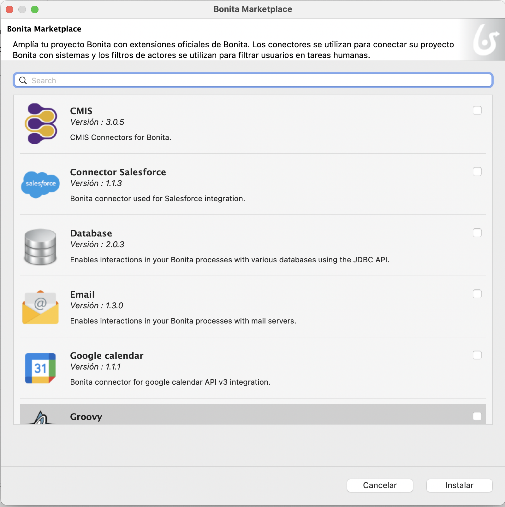

## Objetivo

El objetivo de este ejercicio es agregar puntos de extensión al proyecto Bonita, a través de un filtro de actor y de un conector de correo electrónico (email).

- El filtro de actor *Gestor iniciador* será configurado para buscar dinámicamente en la organización el repsonsable del solicitante.
- El conector de correo electrónico permitirá enviar una notificación del resultado de la solicitud al solicitante.

> ⚠ Dependiendo de la configuración de su red, su *firewall* o la configuración de seguridad de su servidor de correo electrónico, es posible que no esté autorizado para enviar un correo electrónico desde Bonita.
> Para evitar estas limitaciones técnicas, este ejercicio se realizará con un software que simule un servidor de correo electrónico (FakeSMTP).

## Instrucciones resumidas
1. Duplica el diagrama de proceso del ejercicio anterior para crear una versión *3.1.0*
1. Configura un filtro de actor del tipo *Gestor iniciador*  en la senda *Validador*
1. Agrega un conector para enviar correos electrónicos en las tareas automáticas *Notificar aprobación* y *Notificar rechazo*.
 - Recupera y inicia el servidor [FakeSMTP](http://nilhcem.github.io/FakeSMTP/downloads/fakeSMTP-latest.zip).
 - El suguiente código será utilizado para recuperar la dirección de correo del solicitante:

   ```groovy
   BonitaUsers.getProcessInstanceInitiatorProfessionalContactInfo(apiAccessor,processInstanceId).email
   ```

## Instrucciones paso a paso
### Duplica el diagrama de proceso del ejercicio anterior para crear una versión *3.1.0*

### Configura un filtro de actor del tipo *Gestor iniciador*  en la senda *Validador*

1. Selecciona la senda *Validador*

1. Navega a la pestaña **General / Actores**

1. Selecciona el actor *Empleado actor* del menú desplegable para reemplazar el actor *validador*

1. Un mensaje te informará de que es necesario instalar primero un filtro de actores. Haz clic en **Aceptar**.
    


1. En el Bonita MarketPlace, haz clic en *Administrador de iniciadores* y en **Instaler**
      
    La definición del filtro es ahora parte del proyecto.

1. En la ventana de configuración del conector en la senda, selecciona la definición del filtro **Gestor iniciador**

1. Haz clic en **Siguiente**

1. Nombra el filtro *responsableIniciador*

1. Haz clic en **Finalizar**


### Agrega un conector para enviar correos electrónicos en las tareas automáticas *Notificar aprobación* y *Notificar rechazo*

1. Recupera el binario e inicia el servidor FakeSMTP de esta URL: [http://nilhcem.github.com/FakeSMTP/downloads/fakeSMTP-latest.zip](http://nilhcem.github.com/FakeSMTP/downloads/fakeSMTP-latest.zip)
    - Descomprimer el archivo `fakeSMTP-latest.zip`
    - Inicia FakeSMTP haciendo doble clic en el archivo JAR o ejecutando el siguiente comando: `java -jar fakeSMTP-2.0.jar`
    - Una vez que se muestra la interfaz gráfica de FakeSMTP, configura el puerto de escucha en *2525* y haz clic en el botón **Iniciar el servidor**

1. Abre el diagrama de proceso versión *3.1.0*

1. Selecciona la tarea *Notificar aprobación*

1. Navega en la pestaña **Ejecución / Conectores entrada**
1. Haz clic en **Agregar...**
    Una advertencia propone instalar un conector desde el Bonita Marketplace. 
     
     
     >**Nota** : Las extensiones pueden recuperarse del Bonita MarketPlace o de directorios remotos privados o públicos. Si desea ir más allá, el desarrollo y la gestión de estas extensiones se tratan en un ejercicio posterior.

1. Haz clic en **Aceptar** para acceder al MarketPlace y selecciona el conector **Email** de la lista.  
     

1. Haz clic en **Instalar**.

1. En la ventana de configuración de la tarea *Notificar aprobación*, selecciona la definición del conector **Correo electrónico**.

1. Haz clic en el botón **Siguiente**.

1. Especifica *enviarCorreoAprobacion* como nombre
1. Haz clic en el botón **Siguiente**.
1. Completa los siguientes parámetros de conexión:
   
    Propiedad | Valor
    --------- | ------
    Host SMTP | *localhost*
    Puerto SMTP | *2525* (el puerto especificado en FakeSMTP)
    SSL (en la pestaña *Seguridad*) | desmarcado
   
1. Haz clic en el botón **Siguiente**

1. Ingresa *rh@acme.com* como dirección de correo electrónico en el campo del remitente **De**

1. Usa el ícono **lápiz** para editar la expresión en el campo del destinatario **A**

1. En el editor de scripts, selecciona *processInitiatorUser* en el menú **Plantillas de codigo/Usuarios de Bonita**.

1. Arrástralo al editor de script. Un script se agrega automaticamente para recuperar los detalles del iniciador del proceso
    

1. Selecciona *userProfessionalContact* en el mismo menú **Plantillas de codigo/Usuarios de Bonita** y arrástralo al editor, entre `.getStartedBy` y `}catch(UserNotFoundException e){`
    - Para poder recuperar el correo electronico del iniciador del proceso, reemplaza *userId* por `processInitiator.id`
    - Añade "." y selecciona *email: string* en la lista
    - Cambia `def proContactData =` por `return`
    
    
    
    - Haz clic en el botón **Aceptar** para cerrar el editor de scripts
    - Haz clic en el botón **Siguiente**
    - Especifica *Solicitud de vacaciones aprobada* como asunto
    - Haz clic en **Finalizar**
<!--
    - Debería aparecer un mensaje similar al siguiente, haz clic en el botón **Aceptar**:
   
   
    - Asegúrate de que FakeSMTP reciba el correo electrónico como se ilustra abajo:
   
-->

1. Repite el paso anterior nombrando el conector *enviarCorreoRechazo* y especificando *Solicitud de vacaciones rechazada* como asunto
   
   Alternativamente, puedes usar la funcionalidad que te permite copiar un conector configurado en una tarea a otra tarea.
   
## Prueba el proyecto

1. Lanza el proyecto a partir del Studio (el usuario *Walter Bates* sera utilizado)

1. Envía el formulario de *Solicitud de vacaciones*. Los actores siendo correctamente configurados, la tarea *Validación de solicitud de vacaciones* no será propuesta a Walter Bates.

1. En la barra superior a la izquierda, haz clic en **Walter Bates**, y después en **Cerrar sesión**:
  

1. Conéctate con el usuario *"helen.kelly"* y la contraseña *"bpm"*

1. El filtro de actor se ha ejecutado correctamente, la tarea *Validación de solicitud de vacaciones* aparece en la lista de tareas a ejecutar.

1. Ejecuta el proceso dos veces para probar las diferentes rutas y asegúrate de que FakeSMTP envíe e intercepte los correos electrónicos

[Ejercicio siguiente: creación de aplicaciones](07-applications.md)
