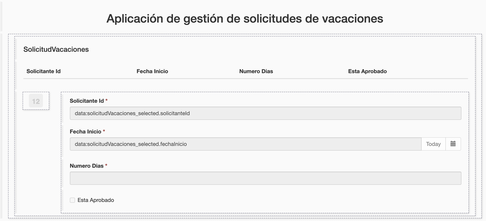
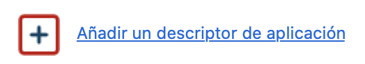

## Objetivo

El objetivo de este ejercicio es proporcionar a los usuarios una aplicación que permita rastrear y crear solicitudes de vacaciones.

## Instrucciones resumidas

1. Crea una nueva página en la aplicación y nómbrala *SeguimientoDeSolicitud*, que permitirá rastrear kas solicitudes creadas por el usuario conectado.
    Esta página contiene un contenedor múltiple que enumera las solicitudes de vacaciones abiertas. Para cada solicitud, se muestran la fecha de inicio, el número de días y el estado de aprobación.

1. Agrega un nuevo contenedor *form container* para crear una nueva solicitud.
    Este formulario contiene un widget *Fecha* y un widget *Input* para recolectar la información necesaria para la nueva solicitud.

1. Crea un descriptor de aplicación y agrega la nueva **Página de aplicación** llamada *SeguimientoDeSolicitud*

1. Despliega la aplicación y accede a ella utilizando la URL única generada.

## Instrucciones paso a paso

### Crea una nueva página en la aplicación y nómbrala *SeguimientoDeSolicitud*

1. En tu navegador, vuelev al UI Designer
    Si la ventana ha sido cerrada, vuele al Studio y haz clic en el botón **UI Designer**

1. Haz clic en el botón **Crear**

1. Selecciona **Página de aplicación** como tipo

1. Ingresa el nombre *SeguimientoDeSolicitudes*

1. Haz clic en **Crear**
   
   
   
    La vista de diseñador ahora debería mostrarse  

1. Agrega un título a tu página:
    - Arrastra el widget **Título** (A) desde la paleta y colócalo en la parte superior de la página (B)
    - Selecciona el widget
    - En el panel derecho, ingresa *Aplicación de gestión de solicitudes de vacaciones* en el campo **Texto**
    - Selecciona la opción **centrado** para el parámetro **Alineación**  
   
   

 1. Crea una variable para guardar la información de la sesión:
   - Abajo en donde se listan las variables, haz clic en **Crear una nueva variable**
   - Nómbrala *"sessionInfo"*
   - Elige como tipo **External API**
   - En el campo **API URL**, introduce `../API/system/session/unusedId`
   - Haz clic en **Guardar**
   
1. Crea una variable para listar las solicitudes de vacaciones:
    - Haz clic en el ícono **Modelo de datos**
    
    - Arrastra y suelta *SolicitudVacaciones* en la página, debajo del título
    - Deja el nombre predeterminado: *solicitudVacaciones*
    - En la sección **Consultas de "Buscar (Find)" en un atributo**, selecciona *solicitanteId*
    - En la sección *Filtrar la búsqueda finByIdDemandeur* utiliza la variable: `{{sessionInfo.user_id}}`
    - Haz clic en el botón **Guardar**
    
    Se genera automáticamente un contenedor múltiple con una tabla que contiene los atributos del objeto SolicitudVacaciones.
    
    

1. Modifica las propiedades de los widgets en el contenedor:
    - Selecciona el widget subtítulo *SolicitudVacaciones* y nómbralo *Seguimientio de solicitudes*
   - Selecciona la opción **Nivel 4** para el parámetro **Nivel del título**.
   - Selecciona la opción **centrado** para el parámetro **alineación**. 
   - Selecciona el widget Tabla, en el panel de la derecha, en el campo **Cabeceras**, borra *Solicitante Id*
   - Sustituye *Fecha Inicio* por *Fecha de inicio* y *Número Dias* por *Número de días*.


 1. Declara una nueva expresión JavaScript para formatear la columna "Estátus" de la lista:
   - Haz clic en **Crear una nueva variable**
   - Nómbrala *"agregarEstatusSolicitudVacaciones"*
   - Elige como tipo **JavaScript expression**
   - Reemplaza el valor existente por el siguiente script:
   ```javascript
   if($data.hasOwnProperty('solicitudVacaciones') && $data.solicitudVacaciones) {
     for (let solicitud of $data.solicitudVacaciones) {
       if(solicitud.esAprobada)  {
         demande.esAprobadaEtiqueta = "Aprobada";
       } else if(solicitud.esAprobada === false) {
         demande.esAprobadaEtiqueta = "Rechazada";
       } else {
         demande.esAprobadaEtiqueta = "En curso";
       }
     }
   }

   return $data.solicitudVacaciones;
   ```
   
1. Muestra la información en las columnas de la tabla de una manera más clara:
    - En el panel de la derecha, en el campo **Claves de columna**, elimina *solicitanteId*
    - En el mismo campo, reemplaza *esAprobada* por *esAprobadaEtiqueta*, creada en la variable JavaScript
    - Borra el widget Input *SolicitanteId* en el contenedor de detalles porque esta información no es útil.

1. Selecciona el widget *Fecha Inicio* y cambia las siguientes propiedades:
   
      Propiedad | Valor
      --------- | ------
      Etiqueta | Fecha de inicio
      Formato técnico de la fecha | dd/MM/yyyy
      Placeholder | dd/mm/aaaa
      Mostrar el botón de hoy | no
      
1. Selecciona el widget *Número de días* y cambia las siguientes propiedades :

      Propiedad | Valor
      --------- | ------
      Etiqueta | Número de días
      Placeholder | Número de días de vacaciones
      Valor mínimo | 1

   - Guarda la página
   - La página debería verse así:
   
   
   
   - Puedes obtener una vista previa de la página en cualquier momento haciendo clic en **Vista previa**
   
   > Consejo: si estás conectado al portal en el mismo navegador, se mostrarán las solicitudes de vacaciones reales.

1. Agrega un nuevo widget de tipo **Link**:
   - Arrastra un widget de tipo **Link** desde la paleta y colócalo entre los dos títulos
   - En el campo **Texto** introduce *Crear una nueva solicitud*.
   - En el campo **Tipo**, selecciona **Formulario de instanciación del proceso**
   - En el campo **Nombre del proceso** agrega *SolicitudVacaciones*.
   - En el campo **Versión del proceso** agrega el número de la versión *6.0.0*
   - En el campo **Alineación** selecciona **centrado**
   - En el campo **Estilo** selecciona **Primario**
   - Guarda la página
    
   Ahora vamos a desplegar la aplicación en el portal desde Bonita Studio.

1. Agrega un nuevo descriptor de aplicación:
    - En Bonita Studio, en el **Explorador de proyectos** a la izquierda de la ventana, despliega **Páginas/Formularios/Layouts** para verificar la presencia de todas las páginas y formularios
    - En el menú  selecciona **Descriptor de aplicación**, haz clic en **Nueva**. Un fichero .xml se crea automaticamente.
    - Haz clic en 
    - Ingresa *solicitud-vacaciones* en el campo **Token de la aplicación**
    - Ingresa *Aplicación de solicitudes de vacaciones* en el campo **Título dinámico**
    - Haz clic en **Añadir**
    
    
    
1. Crea una nueva aplicación
    - En el menú de navegación, haz clic en **Añadir menú de una página** (A)
    - Ingresa *Seguimiento de las solicitudes de vacaciones* en el campo **Menú**
    - Selecciona la página *custompage_SeguimientoDeSolicitud* en el campo **Página de aplicación** (B)
    - Ingresa *solicitud-vacaciones* en el campo **Token** (C).
    
       
    
1. Define la página *Aplicación de solicitudes de vacaciones* como página de inicio de la aplicación: 
    - Selecciona el token *solicitud-vacaciones* en el menú **Página de inicio**
    - Haz clic en el enlace para probar la aplicación (A)
    - Una ventana se abre para confirmar el despliegue. Haz clic en el botón **Desplegar**
   
 Vas a poder acceder a la aplicación en el navegador directamente

   
   

Próximo ejercicio: [Agregar un fragmento](08-fragment.md)

