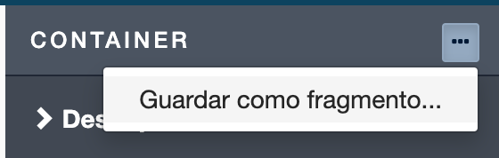
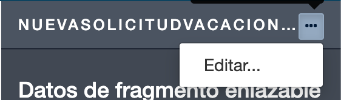
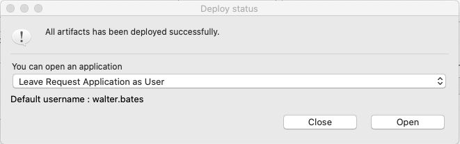

## Objetivo

El objetivo de este ejercicio es enriquecer la aplicación para que los usuarios creen y gestionen sus solicitudes de vacaciones agregando un fragmento a la página *SeguimientoDeSolicitud*.

## Instrucciones resumidas

1. En el formulario *ingresarSolicitudVacaciones*, crea un fragmento con los widgets *DatePicker* et *Input* para recolectar la información al llenar una nueva solicitud.
1. Utiliza este fragmento en la página y vincula sus datos.
1. Despliega nuevamente la página de la aplicación utilizando el botón **Deploy** del descriptor de la aplicación en Bonita Studio.

## Instrucciones paso a paso

### En el formulario *ingresarSolicitudVacaciones*, crea un fragmento

1. Abre el formulario
   - Vuelve a la página de inicio de UI Designer
   - Selecciona el formulario *ingresarSolicitudVacaciones* en la pestaña **Fomularios** y haz clic para abrirlo

1. Crea un fragmento a partir del formulario *ingresarSolicitudVacaciones*
   - Selecciona el contenedor con los 2 widgets *Fecha de ínicio* y *Número de días*
   - En el panel derecho, haz clic en **...** y selecciona **Guardar como fragmento**.  
     

   - Nómbralo *nuevaSolicitudVacacionesFragmento*.
   - Haz clic en **Guardar**. Aparece una nueva pestaña de menú en la parte izquierda del UI Designer.  
     
   - Guarda el formulario y vuelve a la página de inicio de UI Designer

1. Configura el fragmento: 
   - Selecciona el fragmento y haz clic en **Editar...** para configurar los datos del fragmento  
     
   - Haz clic en **Crear una nueva variable**
   - Nómbrala *dataExt*.
   - Haz clic en **Sí** para exponer los datos del fragmento a la página y **Guardar** la variable
   - Selecciona el widget *DatePicker*.
   - En el campo *Valor* sustituye *formInput* por *dataExt*
   - Selecciona el widget *Input* y sustituye formInput por *dataExt* en el campo *Value*
   - Haz clic en **Guardar**.

### Utiliza este fragmento en la página y vincula sus datos

1. Utiliza este fragmento en la página
   - Vuelve a la página *SeguimientoDeSolicitud*
   - Borra los campos *Date Picker* e *Input*
   - Arrastra y suelta el *nuevaSolicitudVacacionesFragmento* del menú de la izquierda al contenedor del formulario.

1.  Vincula los datos del fragmento con los datos de la página:
   - Vuelva a la página de la aplicación *SeguimientoDeSolicitud*.
   - En el panel de configuración, en *Datos de fragmento enlazable* agrega la variable *nuevaSolicitudVacaciones*
   - Guarda los cambios.
   - Haz clic en **Vista previa**
      La página ahora debería verse así:
      

1. Crea una nueva variable para almacenar información relacionada con el proceso:
   - Haz clic en **Crear una nueva variable**
   - Nombra la variable *informacionDefinicionProceso*
   - Elije el tipo **API externa**
   - En el campo **API URL**, escribe:
     `../API/bpm/process?p=0&c=10&f=name=SolicitudVacaciones&o=version%20desc`
     
1. Agrega un botón para enviar el formulario:
   - Arrastra el widget **Botón** desde la paleta y colócalo en el contenedor del formulario debajo de los dos widgets
   - Ingresa *Crear una nueva solicitud* en el campo **Etiqueta**
   - Selecciona **POST** de la lista desplegable **Acción**
   - Haz clic en **fx** para cambiar el modo del campo **Datos enviados al hacer clic** y selecciona *nuevaSolicitudVacaciones*
   - En el campo **URL para llamar**, escribe: `../API/bpm/process/{{informacionDefinicionProceso[0].id}}/instantiation`
   - En el campo **URL de destino si tiene éxito**, escribe: `/bonita/apps/solicitud-vacaciones` (de momento no se puede ir a la página porque hay que crear la aplicación de destino)
   - Selecciona la opción **centrado** para el parámetro **Alineación**
   - Selecciona la opción **primary** para el parámetro **Estílo**
   - Guarda los cambios. La página ahora debería verse así:

   

   - La vista previa de la página te permite verificar que funciona correctamente
     

### Despliega nuevamente la página de la aplicación utilizando el botón **Deploy** del descriptor de la aplicación en Bonita Studio.

1. Desde Bonita Studio, haz clic en el botón **Desplegar**
   Se abre una ventana de despliegue.

1. Haz clic en *Desplegar* (B) 
   
   

1. Para abrir la aplicación, selecciona *Aplicación de solicitud de vacaciones como usuario*.
1. Haz clic en *Abrir*.
   
    

La aplicación debería tener este aspecto una vez desplegada: 
   
      

¡Y ya está! ;)