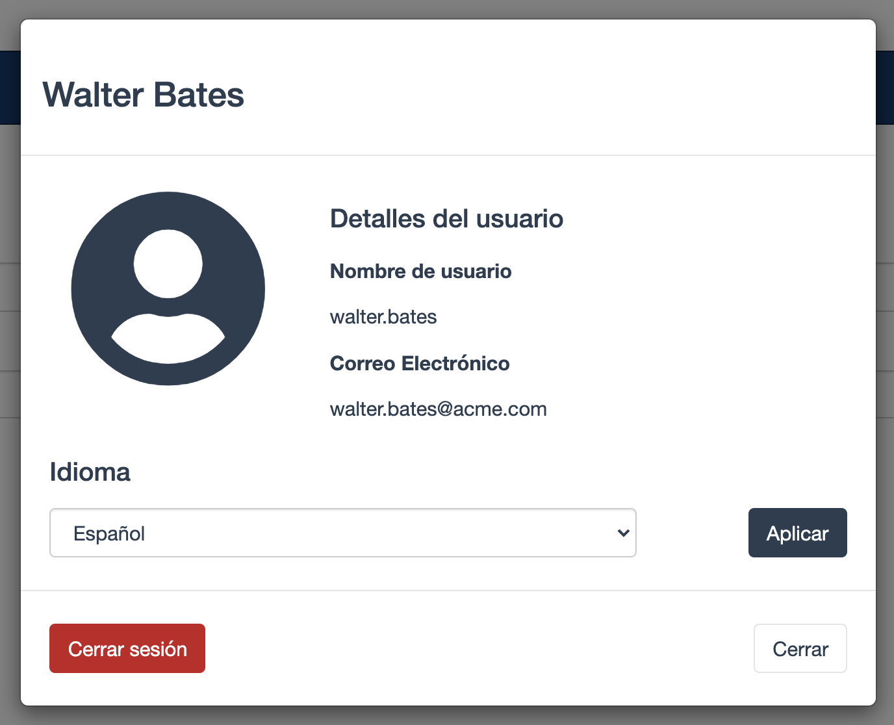

## Objetivo

El objetivo de este ejercicio es mejorar la colaboración entre actores añadiendo un filtro de actores al carril del validador.

## Resumen de las instrucciones

Dupliqua el diagrama de proceso del ejercicio anterior para crear una versión *9.0.0*.

Sustituye el actor **validador** actual por un filtro de actores de tipo **gestor de iniciadores** en el carril *Validador*.

## Instrucciones paso a paso

1. Dupliqua el diagrama de proceso del ejercicio anterior para crear una versión *9.0.0*.

1. Configura un filtro de actor del tipo **Gestor iniciador** en la senda *Validador*:
    - Selecciona la senda *Validador*
    - Navega en la pestaña **General / Actores**
    - Selecciona el actor *Empleado actor* del menú desplegable para reemplazar el actor *validador*
      Un mensaje te informará de que es necesario instalar primero un filtro de actores. Haz clic en **Aceptar**. El Bonita MarketPlace se abrirá automáticamente
      
    - Selecciona el filtro *Administrador de iniciadores*.
    - Haz clic en **Instalar**.
    - Selecciona la definición del filtro **Gestor iniciador**
    - Haz clic en **Siguiente**
    - Nombra el filtro *responsableIniciador*
    - Haz clic en **Finalizar**

1. Ejecuta el proceso con los dos actores:
   - Inicia el proceso desde Studio (se usará el usuario Walter Bates)
   - Envía el *Formulario de solicitud de vacaciones*. Si los actores están configurados correctamente, no se debe proponer la tarea *Validar solicitud de vacaciones*
   - Cierra sesión en el portal haciendo clic en el nombre de usuario en la esquina superior derecha y luego **Cerrar sesión**:
   
   - Conéctate con el usuario *helen.kelly* y la contraseña *bpm*

   Si el filtro de actor se ejecutó correctamente, la tarea *Validar solicitud de vacaciones* debería estar disponible en la lista de tareas

[Último ejercicio: enriquecer una aplicación con un fragmento](10-fragment.md)
