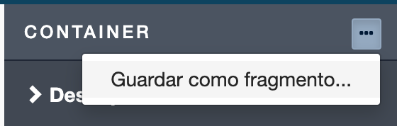
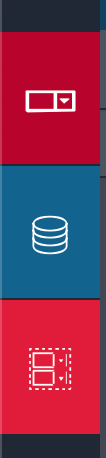
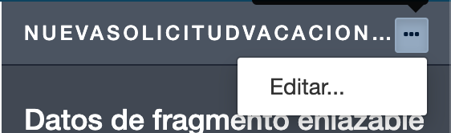

## Objetivo

El objetivo de este ejercicio es enriquecer la aplicación para que los usuarios creen y gestionen sus solicitudes de vacaciones agregando un fragmento a la página *SeguimientoDeSolicitud*.

## Resumen de las instrucciones

Abre el UI Designer y vete a la página de la aplicación llamada *SeguimientoDeSolicitud*.

Esta página ya contiene un "contenedor múltiple" que enumera las solicitudes de baja en curso. Vamos a configurar este contenedor para enriquecerlo. Para cada solicitud se mostrará un estado claro.

Tambien vamos a configurar un contenedor de fragmentos para poder enviar una nueva solicitud.
Para eso, vas a crear un fragmento que contenga un widget de fecha y un widget de entrada para recoger la información de las nuevas solicitudes de vacaciones en la página. Utiliza este fragmento en la página y vincula sus datos.
A continuación, agrega un botón para iniciar una nueva solicitud de vacaciones.

Hay que desplegar otra vez la página de la aplicación utilizando el botón **Deploy** del descriptor de la aplicación en Bonita Studio.

## Instrucciones paso a paso

1. Abre la página *SeguimientoDeSolicitud* en el UI Designer:
   - En el Studio, haz clic en el botón **UI Designer**
   - Selecciona la página ya creada *SeguimientoDeSolicitud*. Se abre el editor del UI Designer.
   - Borra el widget **Link** 
   
1. Crea una variable para almacenar información de sesión:
   - Haz clic en **Crear una nueva variable**
   - Nombra la *sessionInfo*
   - Elije el tipo **external API**
   - Añade en el campo **API URL**: `../API/system/session/unusedId`

   

1. Declara una nueva expresión de JavaScript para formatear la lista:
   - Haz clic en **Crear una nueva variable**
   - Nombra el *agregarEtiquetaEstadoSolicitud*
   - Elije el tipo **JavaScript expression**
   - Reemplaza el valor existente con el siguiente script:

    ```javascript
   if($data.hasOwnProperty('solicitudVacaciones') && $data.solicitudVacaciones) {
    for (let solicitud of $data.solicitudVacaciones) {
      if(solicitud.estaAprobado)  {
        solicitud.estaAprobadoEtiqueta = "Aprobada";
      } else if(solicitud.estaAprobado === false) {
        solicitud.estaAprobadoEtiqueta = "Rechazada";
      } else {
        solicitud.estaAprobadoEtiqueta = "En curso";
      }
    }
   }
   
   return $data.solicitudVacaciones;
    ```
1. Muestra la información en las columnas de la tabla de una manera más clara:
   - En el panel de la derecha, en el campo **Cabeceras**  , cambia Esta Aprobado por *Estado* 
   - En el campo **Claves de columna**,cambia estaAprobado por *estaAprobadoEtiqueta*

1. Añade un nuevo contenedor de formularios:
   - Arrastra un contenedor de formulario desde la paleta y colóquelo entre los dos títulos

1. Cree una nueva variable para almacenar los valores de la nueva solicitud de permiso:
   - Haga clic en **Crear una nueva variable**
   - Nómbrala *nuevaSolicitudDeVacaciones*.
   - Elige el tipo **JSON**.
   - Haga clic en **Guardar**.

1. Crea un fragmento del formulario *ingresarSolicitudVacaciones* que se reutilizará en la página:
   - Vuelve a la página de inicio de UI Designer
   - Selecciona el formulario *ingresarSolicitudVacaciones* en la pestaña **Fomularios** y haz clic para abrirlo
   - En el formulario *ingresarSolicitudVacaciones*, selecciona el contenedor con los 2 widgets *Fecha de ínicio* y *Número de días*
   - En el panel derecho, haz clic en **...** y selecciona **Guardar como fragmento**.  
     
   - Nómbralo *nuevaSolicitudVacacionesFragmento*.
   - Haz clic en **Guardar**. Aparece una nueva pestaña de menú en la parte izquierda del UI Designer.  
     
   - Guarda el formulario y vuelve a la página de inicio de UI Designer

1. Agrega el fragmento en el contenedor del formulario y configúralo:
   - Vuelve a la página *SeguimientoDeSolicitud*
   - Arrastra y suelta el *nuevaSolicitudVacacionesFragmento* del menú de la izquierda al contenedor del formulario.
   - Selecciona el fragmento y haz clic en **Editar...** para configurar los datos del fragmento  
     
   - Haz clic en **Crear una nueva variable**
   - Nómbrala *dataExt*.
   - Haz clic en **Sí** para exponer los datos del fragmento a la página y **Guardar** la variable
   - Selecciona el widget *DatePicker*.
   - En el campo *Valor* sustituye *formInput* por *dataExt*
   - Selecciona el widget *Input* y sustituye formInput por *dataExt* en el campo *Value*
   - Haz clic en **Guardar**.

1.  Vincula los datos del fragmento con los datos de la página:
   - Vuelva a la página de la aplicación *SeguimientoDeSolicitud*.
   - En el panel de configuración, en *Datos de fragmento enlazable* agrega la variable *nuevaSolicitudVacaciones*

1. Crea una nueva variable para almacenar información relacionada con el proceso:
   - Haz clic en **Crear una nueva variable**
   - Nombra la variable *informacionDefinicionProceso*
   - Elije el tipo **API externa**
   - En el campo **API URL**, escribe:
     `../API/bpm/process?p=0&c=10&f=name=SolicitudVacaciones&o=version%20desc`
     
1. Agrega un botón para enviar el formulario:
   - Arrastra el widget **Botón** desde la paleta y colócalo en el contenedor del formulario debajo de los dos widgets
   - Ingresa *Crear una nueva solicitud* en el campo **Etiqueta**
   - Selecciona **POST** de la lista desplegable **Acción**
   - Haz clic en **fx** para cambiar el modo del campo **Datos enviados al hacer clic** y selecciona *nuevaSolicitudVacaciones*
   - En el campo **URL para llamar**, escribe: `../API/bpm/process/{{informacionDefinicionProceso[0].id}}/instantiation`
   - En el campo **URL de destino si tiene éxito**, escribe: `/bonita/apps/solicitud-vacaciones` (de momento no se puede ir a la página porque hay que crear la aplicación de destino)
   - Selecciona la opción **centrado** para el parámetro **Alineación**
   - Selecciona la opción **primary** para el parámetro **Estílo**
   - Guarda los cambios. La página ahora debería verse así:

   

   - La vista previa de la página te permite verificar que funciona correctamente
     
> Consejo: si está conectado al Portal en el mismo navegador, se mostrará la solicitud de baja actual.

1. Despliegue de nuevo la aplicación desde Bonita Studio:
   - Haz clic en el botón **Desplegar**
   - Se abre una ventana de despliegue. Haz clic en *Desplegar* (B) 
   
   

   - Para abrir la aplicación, selecciona *Aplicación de solicitud de vacaciones como usuario*.
   - Haz clic en *Abrir*.
   
    

La aplicación debería tener este aspecto una vez desplegada: 
   
      

¡Y ya está!