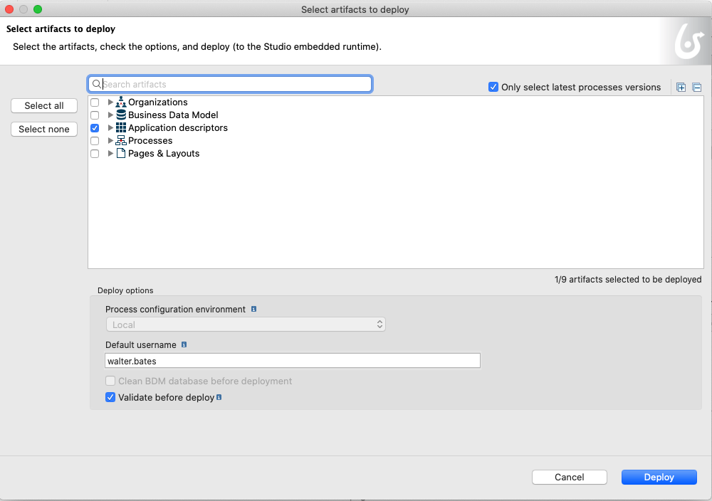
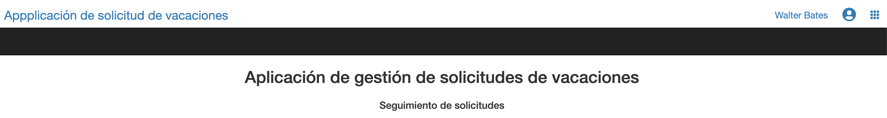

## Goal

The goal of this exercise is to enrich the application for users to create and manage their leave requests by adding a fragment.

## Instructions overview

Open the UI Designer and go to the Application page named *LeaveRequestStatus*.

This page already contains a "multiple container" that list the on-going leave requests. We are going to configure this container to enrich it. For each request a clear status will be displayed.

Create a fragment containing a date widget and an input widget to collect new leave request information in the page. Use this fragment in the page and bind its data.
Then add a submit button to start a new leave request.

Redeploy the application page using the **Deploy** button from the application descriptor in Bonita Studio.

Access the application using the generated URL.


## Step by step instructions

1. Go to the page *LeaveRequestStatus*:
   - In the Studio, click on the **UI Designer** button
   - Select *LeaveRequestStatus* page in the **Pages** tab
   - You should now be on the designer page
   
1. Create a variable to store the session information:
   - Click on **Create a new variable**
   - Name it *sessionInfo*
   - Choose **External API** for the type
   - In the field API URL, enter: `../API/system/session/unusedId`
   
   

1. Modify the label *Is Approved* of the widget **Table**:
    - Select the widget **Table**
    - In the right panel, in the **Headers** field, delete *RequestorId*.
    - Replace *Is Approved* with *Status*.

1. Declare a new JavaScript expression to format the column *Status* of the list:
   - Click on **Create a new variable**
   - Name it *updateLeaveRequestStatus*
   - Choose **JavaScript expression** type
   - Replace the existing value with the following script:
   ```javascript
   if($data.hasOwnProperty('leaveRequest') && $data.leaveRequest) {
     for (let line of $data.leaveRequest) {
       if (line.isApproved === null) {
         line.isApprovedLabel = "In progress";
       } else if (line.isApproved) {
         line.isApprovedLabel = "Approved";
       } else {
         line.isApprovedLabel = "Rejected";
       }
     }
   }
   
   return $data.leaveRequest;
   ```

1. Display the information in the columns of the table more clearly :
    - In the right panel, in the field **Column keys** replace *isApproved* with *isApprovedLabel*.
    
1. Select the **Date picker** widget called *Leave Start* and edit the following properties:
   
     Property | Value
     -------- | -----
     Read-Only | **Yes**
     Label | *Start date*
     Show Today button | **No**

1. Select the **Input** widget called *Day Count* and edit the following properties:
   
     Property | Value
     -------- | -----
     Read-Only | **Yes**
     Label | *Number of days*

   - Save the page
   - The container should look like this:
   
   
   
   - You can preview the page at anytime by clicking on **Preview** button
   
   > Tip: if you are logged in the Portal in the same browser, the current leave request will be displayed.

1. Add a new form container:
   - Go back to edit your page in the UI Designer
   - Drag a form container from the palette and place it between the two titles

1. Create a new variable to store the new leave request values:
   - Click on **Create a new variable**
   - Name it *newLeaveRequest*
   - Choose **JSON** type
   - Click **Save**

1. Create a fragment from the *FillLeaveRequest* form that will be reused in the page:
   - Go back to UI Designer home page
   - Select *LeaveRequestStatus* page in the **Pages** tab and click to open it
   - On the *fillLeaveRequest* form, select the container with the 2 widgets *Leave Start* and *DayCount*
   - In the right panel, click on **...** and select **Save as fragment**  
     
   - Name it *NewLeaveRequestFragment*
   - Click on **Save**. A new menu tab appears at the left side of UI Designer.  
     
   - Save the form and go back to UI Designer home page  
   
1. Add the fragment in the form container and configure it:
   - Drag and drop the *NewLeaveRequestFragment* from the left menu to the form container.
   - Select the fragment and click on **Edit...** to configure the fragment's data  
     
   - Click on **Create a new variable**
   - Name it *dataExt*
   - Click on **Yes** to expose the fragment data to the page and **Save** the variable
   - Select the *DatePicker* widget 
   - In the field *Value* replace *formInput* by *dataExt*
   - Select the *Input* widget and replace formInput by *dataExt* in the field *Value*
   - Click on **Save**

1.  Bind the fragment data with the page data:
   - Go back to the *LeaveRequestStatus* application page
   - In the configuration panel, in *Bindable fragment data* add the variable *newLeaveRequest*
   
1. Create a new variable to store the process information:
   - Click on **Create a new variable**
   - Name it *processDefinitionInfo*
   - Choose **External API** type
   - In the field API URL, enter: `../API/bpm/process?p=0&c=100&o=version%20DESC&f=name=LeaveRequest`

1. Add a submit button in the form container:
   - Drag the **Button** widget from the palette and place it in the form container below the two widgets
   - Enter *Create a new request* in the field **Label**
   - Set **Alignment** as *Center*
   - Set **Style** as *Primary*
   - Select **POST** in the **Action** drop-down list
   - Click on **fx** to switch the **Data sent on click** field mode and then enter *newLeaveRequest*
   - In the field **URL to call**, enter: `../API/bpm/process/{{processDefinitionInfo[0].id}}/instantiation`
   - In the field **Target URL on success**, enter: `/bonita/apps/leave-request`
   - Save the page
   - Click on **Preview**
   - The page should look like that:
   
   
   You can click on Preview to verify the page is displayed correctly.
   
1. Deploy again the application from Bonita Studio:
   - Click on button **Deploy**
   - A deployment window opens. Click on *Deploy* (B) 
   
   
   
   - To open the application, select *Leave requests application as User*.
   - Click on *Open*.
   
    
    
 The application should look like this once deployed :
 
   
      

And that's it!
