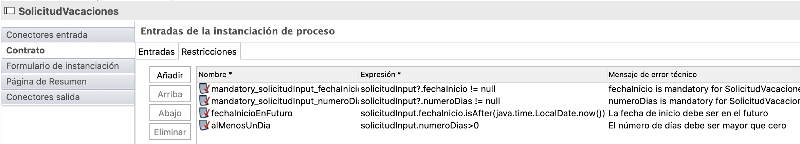

## Objetivo

El objetivo de este ejercicio es seguir con la implantación del proceso de solicitud de vacaciones mediante la especificación de restricciones al contrato para la instanciación del caso.

> ⚠ Es obligatorio respetar estrictamente las mayúsculas y minúsculas y la sintaxis de los nombres técnicos indicados en las instrucciones.

## Resumen de las instrucciones

Duplica el diagrama de proceso del ejercicio anterior para crear una versión 8.0.0.

Agrega las siguientes restricciones en el contrato de instanciación:

- *fechaInicio* debe estar en el futuro
- *numeroDias* debe ser estrictamente mayor que cero

## Instrucciones paso a paso

1. Duplica el diagrama de proceso del ejercicio anterior para crear una versión 8.0.0.

1. Establece las restricciones del contrato de instanciación del caso:
   - Selecciona el pool del proceso
   - Navega en la pestaña **Ejecución / Contrato** y selecciona la pestaña **Restricciones**
   - Agrega la siguiente restricción:
  
    Propiedad | Valor
    --------- | ------
    Nombre    | fechaInicioEnFuturo
    Expresión | `solicitudInput.fechaInicio.isAfter(java.time.LocalDate.now())`
    Mensaje de error| La fecha de inicio debe ser en el futuro

   - Agrega una segunda restricción:
  
    Propiedad | Valor
    -------- | ------
    Nombre | alMenosUnDía
    Expresión | `solicitudInput.numeroDias>0`
    Mensaje de error | El número de días debe ser mayor que cero.

   

> **Nota**: Al inicializar el contrato se han creado automáticamente dos restricciones, ya que los atributos seleccionados en el contrato son obligatorios

1. Guarda el proceso:
    - Haz clic en el botón **Guardar** en la barra de menú superior de Bonita Studio
1. Ejecuta el proceso y prueba las restricciones de los contratos:
    - Inicia el proceso y completa los formularios generados automáticamente

[Siguiente ejercicio: agregar un filtro de actor](09-actor-filter.md)
