## Objectif

L'objectif de cet exercice est de créer une première version "basique" du diagramme de processus de demande de congés.

A ce stade, le processus est exécutable mais ne présente pas encore d'intérêt métier car il ne dispose pas de formulaires ni de données.
Nous le compléterons dans les exercices suivants.

Note : la validation des diagrammes dans le Studio Bonita doit être déclenchée manuellement. Si vous corrigez une erreur ou un message d'avertissement vous devez aller dans l'onglet **Statut de validation** et cliquer sur le bouton **Rafraîchir** ou aller dans le menu **Fichier** et cliquer sur le bouton **Valider**.

## Instructions résumées

Afin de réaliser l'exercice, créer un diagramme *DiagrammeDemandeConges* contenant un processus *DemandeConges* en version *1.0.0*.

Le pool du processus devra contenir les éléments BPMN suivants :
* Un événement de début *Saisir demande*
* Une tâche humaine *Valider demande*
* Une porte exclusive *Demande approuvée ?*
* Une tâche automatique *Notifier approbation*
* Une condition toujours vraie (`true`) sur la transition connectant la porte exclusive à la tâche de notification d'approbation
* Une tâche automatique *Notifier refus*
* Une transition par défaut connectant la porte exclusive à la tâche de notification de refus
* Un événement de fin *Fin - Demande acceptée*
* Un événement de fin *Fin - Demande rejetée*

## Instructions pas à pas
1. Démarrer le Studio Bonita
1. Sur la page d'accueil du Studio, cliquer sur **Nouveau projet** dans le menu Concevoir
1. Entrer le nom du projet *"DemandeConges"* et cliquer sur **Créer**

> Note : Vous avez la possibilité de choisir dès la création du projet les extensions à intégrer. Cela peut être utile dans le cas d'un projet réel, mais dans notre exemple nous aborderons les extensions plus tard.
   
1. Créer un nouveau diagramme de processus 
   - Soit depuis la vue générale du projet, en cliquant sur **Créer** dans la section *Diagramme de processus*
     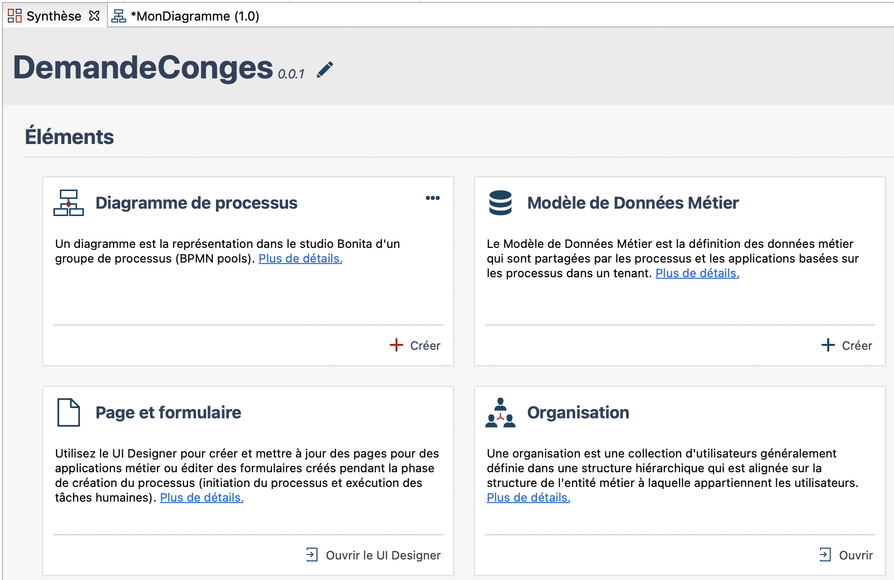
   - Soit depuis le menu
    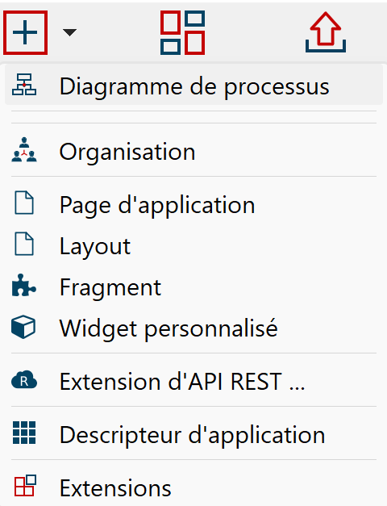
     
1. Spécifier le nom du diagramme et celui du processus :
   - Cliquer à droite sur le nom du diagramme *MonDiagramme-1.0.proc* dans l'explorateur, **Renommer**
   - Entrer *DiagrammeDemandeConges* pour le nom du diagramme et *DemandeConges* pour celui du pool et *1.0.0* pour la version du diagramme et du pool  
   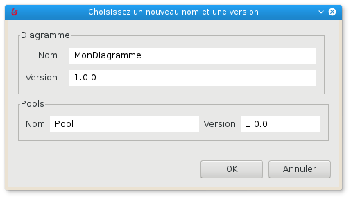
1. Renommer l'événement de démarrage en *Saisir demande* :
   - Sélectionner l'événement de démarrage présent dans le diagramme
   - Naviguer dans l'onglet **Général / Général** puis entrer le nouveau nom
1. Renommer la tâche humaine en *Valider demande*
1. Ajouter une porte exclusive *Demande approuvée ?* à la suite de la tâche *Valider demande* :
   - Sélectionner la tâche *Valider demande*, effectuer un glisser-déplacer à partir de l'icône contextuel de porte logique  
   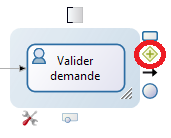
   - Une fois la porte créée, utiliser l'icône contextuel **boîte à outils** (1) pour changer son type en **Exclusif** (2)  
   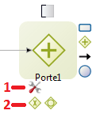
   - Renommer la porte en *Demande approuvée ?*
1. Créer une tâche automatique *Notifier approbation* à partir de la porte logique :
   - Sélectionner la porte logique, effectuer un glisser-déplacer à partir de l'icône contextuel de tâches (A)  
   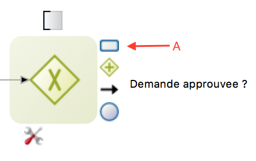
   - Une fois la tâche automatique créée, la renommer
1. Créer une tâche automatique *Notifier refus* à partir de la porte logique
1. Ajouter un événement de terminaison *Fin - Demande approuvée* à la suite de la tâche automatique *Notifier approbation* :
   - Sélectionner la tâche automatique *Notifier approbation*
   - Effectuer un glisser-déplacer à partir de l'icône contextuel d'événements (A) et sélectionner l'événement de fin (B)  
   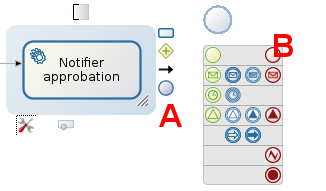
   - Une fois l'événement crée, renommer le
1. Ajouter un événement de terminaison *Fin - Demande refusée* à la suite de la tâche automatique *Notifier refus*
1. Nommer les 2 transitions entre la porte logique et les étapes automatiques :
   - Sélectionner la transition.
   - Naviguer dans l'onglet **Général / Général** puis entrer le nom
   - La transition menant à l'étape *Notifier approbation* se nommera *Oui* et l'autre *Non*
1. Configurer la condition sur la transition *Oui* pour que le flot suive cette branche :
   - Sélectionner la transition
   - Entrer la valeur `true` dans le champ **Condition** (**General / General** tab). Si vous ne voyez pas le champ **Condition** c'est probablement parce que vous avez ajouté une porte logique parallèle au lieu d'une exclusive  
   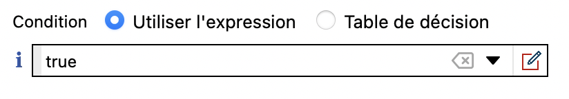
1. Configurer la transition *Non* en tant que flux par défaut :
   - Sélectionner la transition *Non*
   - Cocher la case **Flux par défaut**
1. Actualiser la validation du diagramme :
   - Naviguer dans l'onglet **Statut de validation**
   - Cliquer sur le bouton **Rafraîchir**
   - Ignorer les 3 avertissements concernant les formulaires
1. Vérifier que le diagramme ressemble à ceci :  
   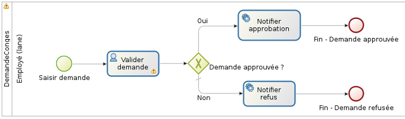
1. Enregistrer le processus :
   - Cliquer sur le bouton **Enregistrer** de la barre de menu supérieur du Studio
1. Exécuter le processus pour le tester :
   - Sélectionner le pool du processus (la forme rectangulaire qui contiens les tâches et événements)
   - Cliquer sur le bouton 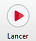 de la barre de menu supérieur du Studio (si le bouton est désactivé, assurez vous que le pool est bien sélectionné)
   - Votre navigateur devrait s'ouvrir et présenter un formulaire d'instanciation automatiquement généré
   - Soumettre le formulaire
   - Vous devriez être redirigé vers la boîte de réception de tâches de l'application utilisateur Bonita
   - Sélectionner la tâche *Valider demande*
   - Cliquer sur **Prendre** en haut à droite de l'écran  
   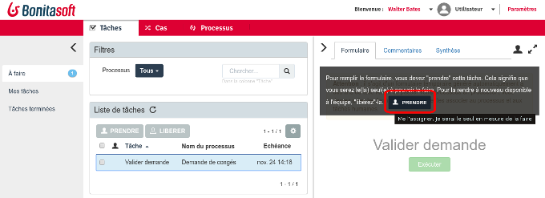
   - Soumettre le formulaire de l'étape *Valider demande* en cliquant sur le bouton **Exécuter** pour terminer le cas

[Exercice suivant : création de données et définition de contrats](02-data-contract.md)
