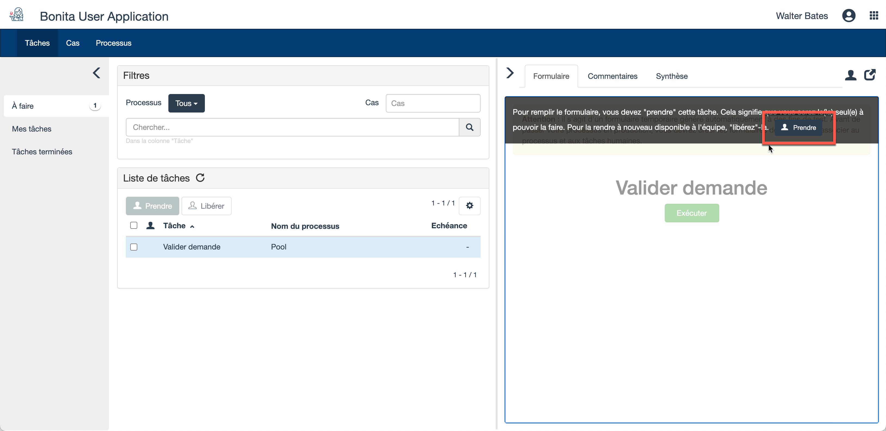

## Objectif

L'objectif de cet exercice est de créer une première version, simple, de la définition du processus de demande de congés.

A ce stade, le processus sera exécutable mais ne présentera pas encore "d'intérêt métier", car il ne disposera pas de données ni d'interfaces utilisateurs.
Nous le compléterons dans les exercices suivants.

Note : la validation des diagrammes dans Bonita Studio doit être déclenchée manuellement : après avoir corrigé une erreur ou un avertissement, allez dans la zone de propriétés en bas du studio, puis dans l'onglet *Statut de validation* et cliquez sur le bouton **Rafraîchir**, ou allez dans le menu *Fichier* en haut du  studio et cliquez sur l'option **Valider**.

## Instructions simples

1. Créer un diagramme *"DiagrammeDemandeConges"* contenant un pool *"DemandeConges"* en version *"1.0.0"*.

1. Insérer dans la défintion du processus les éléments BPMN suivants :
* Un événement de début *"Saisir demande"*
* Une tâche humaine *"Valider demande"*
* Une porte exclusive *"Demande approuvée ?"*
* Une tâche automatique *"Notifier approbation"*
* Une condition toujours vraie (`true`) sur la transition connectant la porte exclusive à la tâche de notification d'approbation
* Une tâche automatique *"Notifier refus"*
* Une transition par défaut connectant la porte exclusive à la tâche de notification de refus
* Un événement de fin *"Fin - Demande approuvée"*
* Un événement de fin *"Fin - Demande refusée"*

## Instructions pas-à-pas

1. Démarrer Bonita Studio
1. Sur la page de bienvenue, menu *Concevoir*, cliquer sur **Nouveau projet**
1. Entrer le nom du projet *"DemandeConges"*
1. Laisser les valeurs des autres champs vides ou par défaut
1. Cliquer sur **Créer**

> Note : Vous avez la possibilité de choisir dès la création du projet les *Extensions* à intégrer. Cela peut être utile dans le cas d'un projet réel, mais dans notre exemple nous aborderons les extensions plus tard.
   
### Créer un diagramme *"DiagrammeDemandeConges"* contenant un pool *"DemandeConges"* en version *"1.0.0"*.

1. Créer un nouveau diagramme de processus 
   - Soit depuis la vue d'ensemble du projet, section _Diagramme de processus_, en cliquant sur **Créer**, puis à nouveau sur **Créer un nouveau diagramme de processus**
     
   - Soit depuis la *Cool Bar*, bouton *Nouveau*, en cliquant sur **Diagramme de processus**
    
     
1. Spécifier le nom et la version du diagramme et du processus :
   - Dans l'explorateur de projet à gauche, faire un clic droit sur le nom du diagramme *MonDiagramme-1.0.proc*, puis cliquer sur **Renommer**
   - Pour le diagramme, entrer *"DiagrammeDemandeConges"* pour le *Nom* et *"1.0.0"* pour la *Version*
   - Pour la définition de processus, entrer *"DemandeConges"* pour le *"Nom"* et *"1.0.0"* pour la *Version* 
   - Cliquer sur **OK**  
   

### Insérer dans la défintion du processus les éléments BPMN 

1. Renommer l'événement de démarrage :
   - Sélectionner l'événement de démarrage présent dans le diagramme
   - Cliquer sur son nom, puis entrer *"Saisir demande"* 
   - Faire "Entrée" sur le clavier ou cliquer hors du champ de saisie pour valider la saisie

1. De même, renommer la tâche humaine en *"Valider demande"*

1. Ajouter une porte exclusive *Demande approuvée ?* à la suite de la tâche *Valider demande* :
   - Depuis la tâche *Valider demande* sélectionnée, cliquer sur l'icon contextuel de porte logique, puis effectuer un glisser-déposer vers la droite. Une porte logique parallèle a été créée  
   
   - Cliquer sur l'icon contextuel *Modifier le type de l'élément ...* (1) puis sélectionner *Porte logique exclusive* (2)  
   
   - Renommer la porte exclusive ainsi créée en *Demande approuvée ?*

1. Créer une tâche automatique "Notifier approbation" à partir de la porte logique :
   - Depuis la porte logique sélectionnée, cliquer sur l'icon contextuel de tâches (A), puis effectuer un glisser-déposer vers la droite  
   
   - Une fois la tâche automatique créée, la renommer en *"Notifier approbation"* 

1. A partir de la porte logique, créer une autre tâche automatique "Notifier refus"
 
1. A la suite de la tâche automatique *Notifier approbation*, ajouter un événement de terminaison *"Fin - Demande approuvée"* :
   - Sélectionner la tâche automatique *Notifier approbation*
   - Cliquer sur l'icon contextuel d'événements (A), faire un glisser - déposer vers la droite puis sélectionner l'événement de fin (B)  
   
   - Une fois l'événement crée, le renommer en *"Fin - Demande approuvée"*
   
1. De même, à la suite de la tâche automatique *Notifier refus*, ajouter un événement de terminaison *"Fin - Demande refusée"

1. Nommer les 2 transitions entre la porte logique et les tâches automatiques :
   - Sélectionner la transitionmenant à l'étape *Notifier approbation*
   - Dans la zone de propriétés, en bas de l'écran, onglet *Général*, sous-onglet *Général*, entrer le nom *"Oui"*.
   - Répéter pour l'autre transition qui se nommera *"Non"*, pour répondre à la question posée dans la porte logique ("Demande approuvée ?")
   - La validation de la saisie est automatique. Vous pouvez cliquer ailleurs, et la nouvelle valeur est enregistrée
   
1. Configurer la *condition* sur la transition *Oui* pour que le flot suive cette branche :
   - Sélectionner la transition
   - Dans la zone de propriétés, mêmes onglet et sous-onglet, propriété *Condition* : entrer la valeur *"true"* (cas peu réaliste d'une condition toujours vraie, mais utile pour l'exercice). Si vous ne voyez pas le champ *Condition*, c'est probablement parce que la porte logique est parallèle, et non exclusive. Voir "Ajouter une porte logique ..." ci-dessus.
   
   
1. Configurer la transition *Non* en tant que flux par défaut :
   - Sélectionner la transition *Non*
   - Dans l'onglet *Général* et sous-onglet *Général*, cocher la case **Flux par défaut**
   
1. Mettre à jour la validation du diagramme :
   - Cliquer sur l'onglet **Statut de validation**
   - Cliquer sur le bouton **Rafraîchir**
   - Ignorer les 3 avertissements concernant les formulaires. Nous nous en occuperons plus tard
   
1. Vous pouvez, si vous le souhaitez, réajuster la position des éléments et la forme des transitions pour améliorer l'esthétique et la lisibilité du diagramme

1. Vérifier que le diagramme ressemble à ceci :  
   
   
1. Enregistrer le processus :
   - Dans la Cool Bar, cliquer sur le bouton **Enregistrer**
   
1. Exécuter le processus pour le tester :
   - Sélectionner la définition du processus (élément *Pool* qui contient tous les autres éléments)
   - Cliquer sur le bouton  de la Cool Bar. Si le bouton est désactivé, assurez-vous que le pool est bien sélectionné.
   - Votre navigateur s'ouvre et présente un formulaire (généré automatiquement à des fins de test) 
   - Soumettre le formulaire. Cette action crée une nouvelle instance du processus.
   - L'affichage passe à la liste des tâches de la Bonita User Application
   - Sélectionner la tâche *Valider demande*
   - Cliquer sur **Prendre** en haut à droite de l'écran  
   
   - Soumettre le formulaire de l'étape *Valider demande* en cliquant sur le bouton **Exécuter**. Cette action termine le cas

[Exercice suivant : ajout d'une minuterie à la tâche de validation](02-timers.md)
