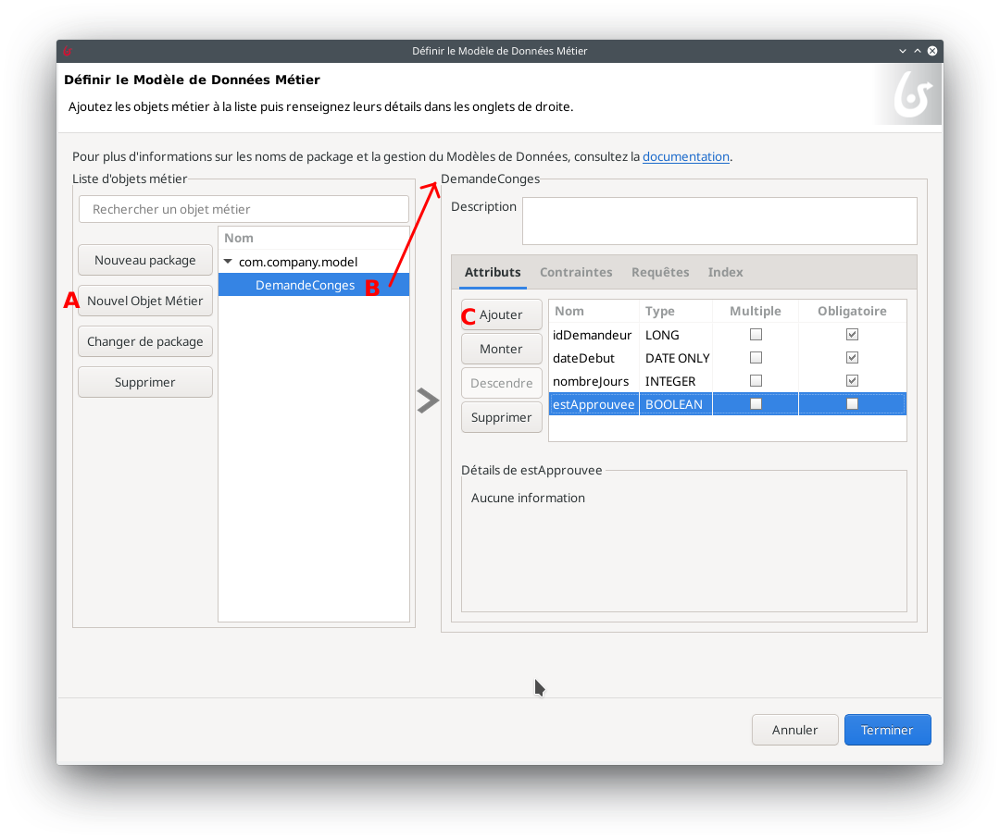
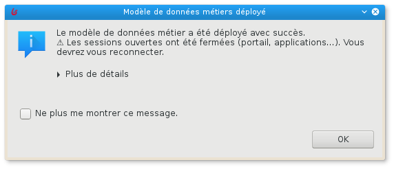
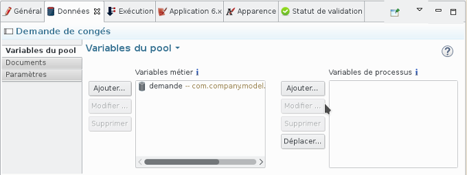
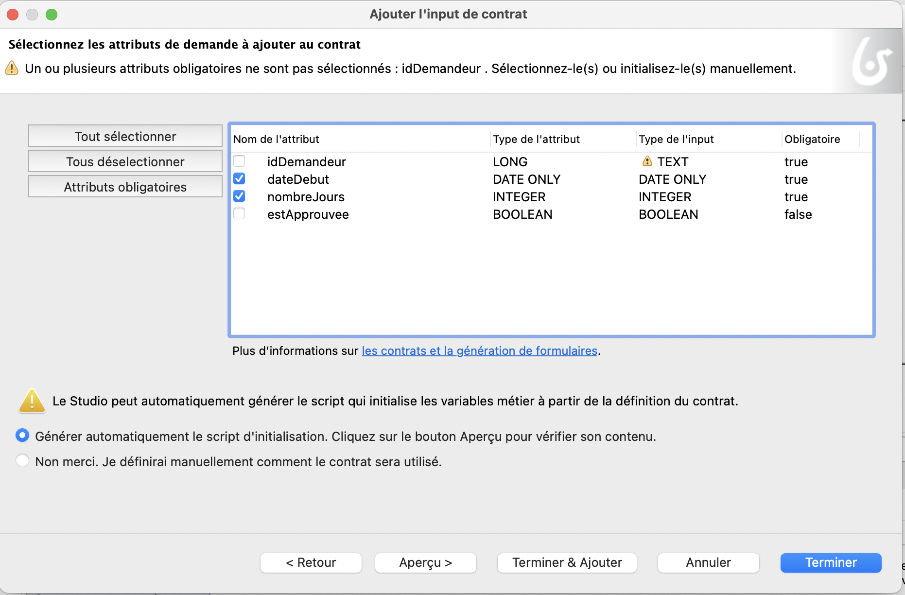
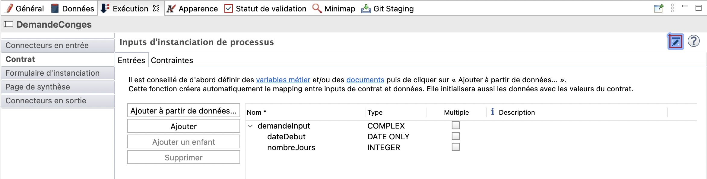
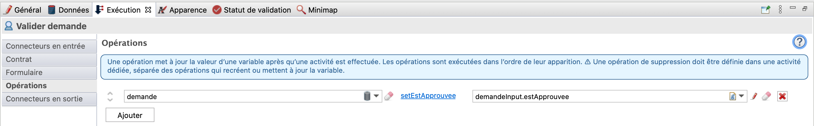
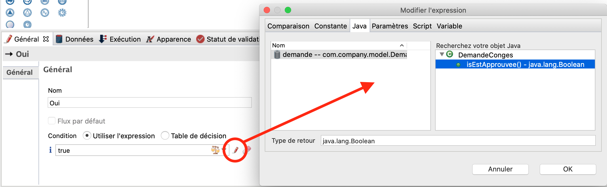
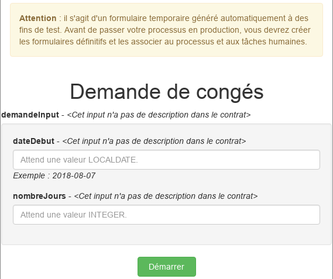

## Objectif

L'objectif de cet exercice est de continuer l'implémentation du processus de demande de congés en :

1. Configurant un modèle de données métier communément appelé BDM (Business Data Model)
1. Spécifiant des contrats pour l'instanciation du processus et l'exécution des étapes humaines

Une fois complété, le processus sera exécutable avec des formulaires générés automatiquement permettant la saisie de données.

> ⚠ Il est important de respecter strictement la casse et la syntaxe des noms techniques fournis dans les instructions.

## Instructions résumées

Dupliquer le diagramme de processus de l'exercice précédent pour créer une version 2.0.0.

Créer un objet BDM *DemandeConges* (il s'agit d'un nom technique, il faut donc omettre les espaces, accents et autres caractères spéciaux) avec les attributs suivants (n'utilisez pas l'option **Multiple**):

Nom | Type | Multiple | Obligatoire
--- | ---- | -------- | -----------
*idDemandeur* | `Long` | ◻ | ☑
*dateDebut* | `Date only` | ◻ | ☑
*nombreJours* | `Entier` | ◻ | ☑
*estApprouvee* | `Booléen` | ◻ | ◻

Déclarer une variable métier *demande* de type *DemandeConges* sur le pool.

À l'aide de l'assistant du Studio (i.e. **Ajouter à partir de données...**), générer un contrat d'instanciation ainsi que le script d'initialisation de la variable métier en utilisant la variable métier *demande* et en incluant donc les éléments suivants :

-   dateDebut
-   nombreJours

Initialiser la variable métier *demande* en utilisant la génération automatique à partir du contrat.

Ajouter un contrat sur l'étape *Valider demande* en utilisant l'assistant avec l'élément suivant :

-   estApprouvee

## Instructions pas à pas

1. Dupliquer le diagramme de processus existant pour créer une version *2.0.0* :
   - Dans l'explorateur du projet, faire un clic droit sur le diagramme et **Dupliquer**
   - Mettre à jour les numéros de version du diagramme ET du processus (pool)
1. Créer le BDM *DemandeConges* :
   - Cliquer sur l'icône **Vue d'ensemble**  du projet. Cliquer sur **Créer** de la section *Modèle de Données Métier*.
     
     L'éditeur de Modèle de données métier s'ouvre.
   - Renommer l'objet initialisé par défaut **BusinessObject** dans la liste d'objets métiers en *DemandeConges* (A) (il s'agit d'un nom technique, il faut donc omettre les espaces, accents et autres caractères spéciaux)
   - Avec l'objet *DemandeConges* sélectionné, ajouter les attributs suivants (B) :

    Nom | Type | Multiple | Obligatoire
    --- | ---- | -------- | -----------
    *idDemandeur* | `Long` | ◻ | ☑
    *dateDebut* | `Date only` | ◻ | ☑
    *nombreJours* | `Integer` | ◻ | ☑
    *estApprouvee* | `Boolean` | ◻ | ◻

    
    
    - Sauvegarder. Le message suivant s'affiche pour indiquer qu'il faut déployer le BDM
    
    
    
    - Cliquer sur le bouton  dans l'éditeur de BDM pour déployer le BDM.  
    Le message suivant indique que le BDM a été déployé avec succès.
    
    
    
    - Cocher l'option **Ne plus me montrer ce message**
    - Cliquer sur **Ok**
1. Déclarer une variable métier de type *DemandeConges* dans le processus :
   - Sélectionner le pool du processus
   - Naviguer dans l'onglet **Données / Variables du pool**
   - Cliquer sur **Ajouter...** dans la section **Variables métier**
   - Nommer la variable *demande* et sélectionner le type d'objet métier *com.company.model.DemandeConges*
   - Cliquer sur **Terminer**
   
   
   
1. Configurer le contrat d'instanciation :
   - Sélectionner le pool de processus
   - Naviguer dans l'onglet **Exécution / Contrat / Entrées**
   - Cliquer sur le bouton **Ajouter à partir de données...**
   - Sélectionner la variable métier *demande*
   - Garder le nom par défaut *demandeInput*
   - Cliquer sur **Suivant**
   - Décocher les attributs *idDemandeur* et *estApprouvee*
   
   
   
   - Cliquer sur **Terminer** (pas sur **Terminer & Ajouter**) et ignorer les messages d'avertissement concernant l'initialisation partielle de la variable métier
   
   
   
1. Modifier l'initialisation de la variable métier *demande* pour pouvoir récupérer l'initiateur de la nouvelle demande :
   - Sélectionner le pool du processus et naviguer dans l'onglet **Données / Variables du pool**
   - Sélectionner la variable *demande*
   - Cliquer sur **Modifier...**
   - Cliquer sur l'icône **crayon** associé au champ **Valeur par défaut** pour ouvrir l'éditeur d'expression. Le script a déjà été initialisé.
   - Dans le menu de gauche, sélectionnez **Modèles de code/Utilisateurs Bonita** (A) et faites glisser le modèle *processInitiatorUser* avant la dernière ligne commençant par `return
     Le script permettant de récupérer l'instance du processus et l'initiateur est créé automatiquement.
   - Saisissez `demandeCongesVar.idDemandeur = processInitiator.id` pour récupérer l'id de l'initiateur de l'instance dans l'attribut *idDemandeur* (B).
   
   
   
   - Le script va initialiser la variable métier en utilisant les données du contrat et l'identifiant de l'auteur de la demande
   - Cliquer sur le bouton **OK** pour fermer l'éditeur d'expression
   - Cliquer à nouveau sur le bouton **OK** pour valider la modification de la variable métier
1. Configurer le contrat de l'étape *Valider demande* :
   - Sélectionner l'étape *Valider demande*
   - Naviguer dans l'onglet **Exécution / Contrat / Entrées**
   - Cliquer sur le bouton **Ajouter à partir de données...**
   - Sélectionner la variable métier *demande*, garder le nom de l'input par défaut *demandeInput*
   - Cliquer sur **Suivant**
   - Sélectionner seulement l'attribut *estApprouvee*
   - Cliquer sur **Terminer** (et pas sur **Terminer & Ajouter**) et ignorer les messages d'avertissement concernant l'initialisation partielle de la variable métier
1. Noter qu'une opération (**Exécution / Opérations**) sur la tâche *Valider demande* pour mettre à jour la demande a automatiquement été générée

   
   
1. Configurer la condition sur la transition *Oui* à partir de l'attribut *estApprouvee* du BDM *demande* :
   - Sélectionner la transition *Oui*
   - Naviguer dans l'onglet **Général / Général**
   - Cliquer sur l'icône crayon à côté du champ **Condition** pour ouvrir l'éditeur d'expression
   - Dans l'éditeur d'expression, sélectionner **Variables métier/estApprouvee** et le glisser dans l'éditeur d'expression à la place de `true`
   
   
   
1. Enregistrer le processus :
   - Cliquer sur le bouton **Enregistrer** de la barre de menu supérieur du Studio
1. Exécuter le processus :
   - Lancer le processus et remplir les formulaires automatiquement générés

> ℹ Information :
> - pour le champ *dateDebut*, le format de date attendu est AAAA-MM-JJ
> - pour le champ *estApprouvee*, une valeur booléenne est attendue : soit `true` ou `false`

   

[Exercice suivant : création de formulaires](03-forms.md)
