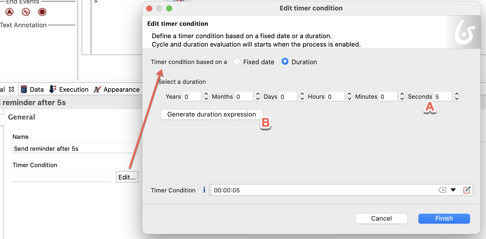

## Objectif

   L'objectif de cet exercice est d'enrichir la modélisation du processus de demande de congés en créant une notification pour le valideur s'il n'a pas réalisé sa tâche à temps, sans pour autant interrompre le processus.

   Cela est réalisé en ajoutant un événement de type "timer" dans le processus.

> ⚠ Il est important de respecter strictement la casse et la syntaxe des noms techniques fournis dans les instructions.

## Instructions simples

1. Dupliquer le diagramme de processus de l'exercice précédent pour créer une version 1.1.0.
1. Ajouter une minuterie (timer) non-interruptive sur la tâche *Valider demande*. 
   La durée de la minuterie est de **5 secondes** (pour les besoins de l'exercice).
1. Ajouter une tâche de service nommée *Envoyer rappel validation* et un événement de fin nommé *Fin - rappel envoyé*.

## Instructions pas-à-pas

### Dupliquer le diagramme de processus existant pour créer une version *1.1.0*
1. Dans l'explorateur du projet, faire un clic droit sur le diagramme et cliquer sur **Dupliquer ...**
1. Mettre à jour les numéros de version du diagramme ET du processus (pool) avec *"1.1.0"*
1. Cliquer sur **OK**

### Ajouter une minuterie non-interruptive sur la tâche *Valider demande*
1. Cliquer sur la tâche *Valider demande*

1. En bas au milieu de la tâche, cliquer sur l'icon **Ajouter un événement en bordure..."

1. Cliquer sur **Minuterie non-interruptive**. 
   

1. Dans la boîte à outils contextuelle, cliquer sur la tâche puis glisser-déposer dans la lane. 
   Le type de tâche par défaut est automatique, et c'est ce que nous souhaitons.

1. Cliquer sur le nom de la tâche puis renommer en *Envoyer rappel validation* 

1. Ajouter un événement de fin après la tâche automatique et le nommer *Fin - rappel envoyé*.

1. Configurer l'événement de minuterie :
   - Sélectionner l'événement de minuterie
   - Dans la zone de propriétés, l'onglet *Général* et sous-onglet *Général* sont déjà sélectionnés
   - Dans *Nom*, modifier le nom par défaut en *"Envoyer rappel après 5 sec"*
   - Au bout du champ *Condition de la minuterie*, cliquer sur **Modifier ...**
   - Dans la fenêtre modale, pour le champ *Condition de minuterie basée sur une*, sélectionner **Durée**
   - Dans le cham *Secondes*, indiquer *"5"*
   - Cliquer sur **Générer l'expression d'une durée** 
   - Cliquer sur **Terminer**
   
   - La condition de la minuterie va être automatiquement générée et apparaît dans l'onglet *Général*

Le connecteur pour l'envoi du mail une fois la minuterie écoulée sera configuré plus tard.

[Exercice suivant : création de données et définition de contrats](03-data-contract.md)
