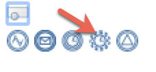

## Objectif

L'objectif de cet exercice est d'enrichir la modélisation du processus de demande de congés en ajoutant un événement de type "timer" dans le processus.

Le timer va automatiquement envoyer une notification au validateur si la tâche n'est pas réaliser à temps, sans interrompre le processus.

> ⚠ Il est important de respecter strictement la casse et la syntaxe des noms techniques fournis dans les instructions.

## Instructions résumées

Dupliquer le diagramme de processus de l'exercice précédent pour créer une version 1.1.0.

AJouter une minuterie (timer) non-interruptive sur la tâche *Valider demander*. La durée de la minuterie est de **5 secondes**.

Ajouter une tâche de service nommée *Envoyer rappel validation* et un événement de fin nommé *Fin - rappel envoyé*.

## Instructions pas à pas

1. Dupliquer le diagramme de processus existant pour créer une version *1.1.0*

1.Ajouter une minuterie non-interruptive à la tâche *Valider la demande*
   - Cliquer sur la tâche *Validate request*
   - Ajouter un boundary event et sélectionner **l'événement de minuterie non-interruptive** dans la liste. Il va être automatiquement ajouté à la tâche. 
   

1.Créer une tâche de service après le timer en glissant la tâche depuis l'événement dans la lane, et la nommer *Envoyer rappel validation* 
1.Ajouter un événement de fin après la tâche de service et le nommer *Fin - rappel envoyé*.

1.Configurer l'événement de minuterie :
   - Sélectionner l'événement de minuterie
   - Aller dans l'onglet **Général/Général**
   - Ajouter le nom de la minuterie *Envoyer rappel après 5s*
   - Ajouter la condition de la minuterie en cliquant sur **Editer**
   - Dans le panneau de configuration, sélectionner **Durée** pour ajouter la condition et indiquer *5* dans le champ **Secondes**
   - Cliquer sur **Générer l'expression de durée** 
   - Cliquer sur **Terminer**
   - La condition de la minuterie va être automatiquement générée et apparaît dans le menu *Général*

Le connecteur pour l'envoi de mail sera configuré plus tard.

[Exercice suivant : création de données et définition de contrats](03-data-contract.md)
