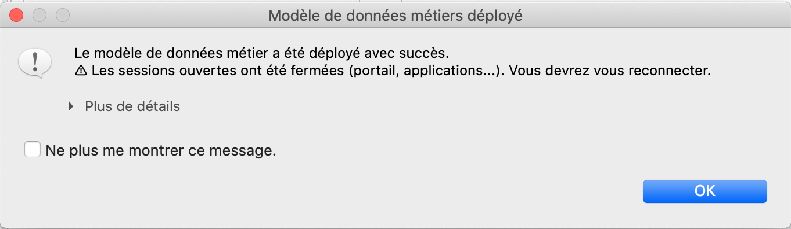
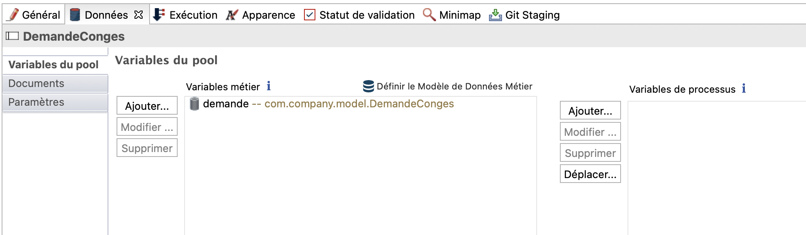
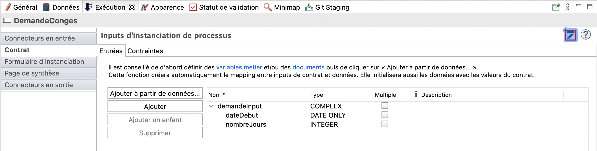
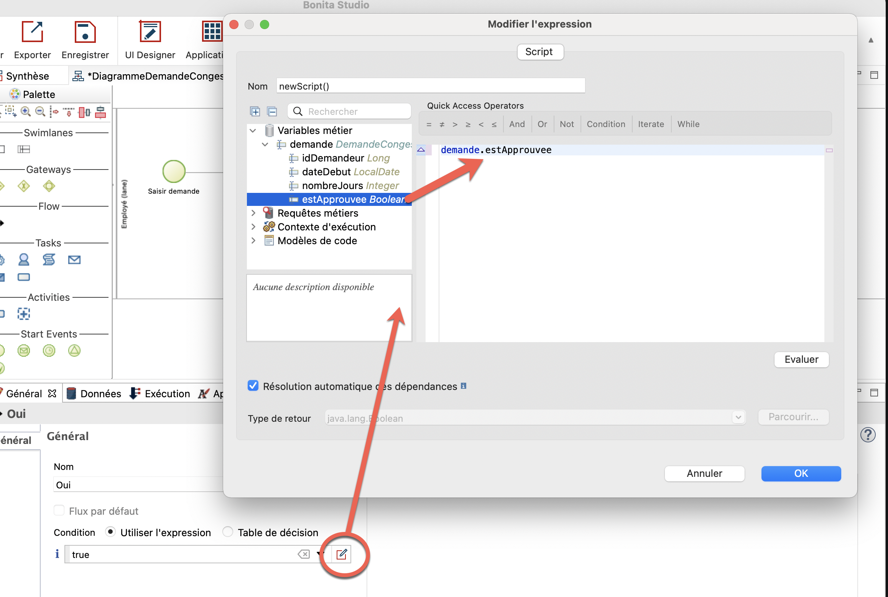

## Objectif

L'objectif de cet exercice est de continuer l'implémentation du processus dans l'application de gestion de demande de congés en :

- Créant un Modèle de Données Métier
- Spécifiant des variables métier en lien avec le modèle de données dans le processus
- Spécifiant des contrats entre le processus et les formulaires, pour l'instanciation du processus comme pour l'exécution de la tâche humaine

Une fois complété, le processus sera exécutable, toujours en utilisant les formulaires générés automatiquement, et qui permettent la saisie de données.

> ⚠ Il est important de respecter strictement la casse et la syntaxe des noms techniques fournis dans les instructions.

## Instructions simples

1. Dupliquer le diagramme de processus et le processus de l'exercice précédent, pour créer des versions 2.0.0.
1. Créer un objet métier *"DemandeConges"* puis les attributs suivants :

   Nom | Type | Multiple | Obligatoire
   --- | ---- | -------- | -----------
   *idDemandeur* | `Long` | ◻ | ☑
   *dateDebut* | `Date only` | ◻ | ☑
   *nombreJours* | `Entier` | ◻ | ☑
   *estApprouvee* | `Booléen` | ◻ | ◻

1. Déclarer une variable métier *demande* de type *DemandeConges* sur le pool.

1. Générer un contrat à l'instanciation du processus, en incluant les éléments suivants :

         -  dateDebut
         -  nombreJours

Utiliser pour ce faire l'assistant *Ajouter à partir de données...*.

1. Modifier l'initialisation de la variable métier *demande* pour récupérer automatiquement *idDemandeur*.

1. Ajouter un contrat sur l'étape *Valider demande* en utilisant l'assistant avec l'élément suivant :

         -  estApprouvee

1. Configurer la condition sur la transition *Oui* pour en faire l'attribut *estApprouvee* de l'objet *demande*

## Instructions pas-à-pas

### Dupliquer le diagramme de processus et le processus de l'exercice précédent, pour créer des versions 2.0.0.

1. Revenir au studio.
1. Dupliquer le diagramme de processus existant pour créer une version *2.0.0* :
   - Dans l'explorateur du projet, faire un clic droit sur le diagramme et cliquer sur **Dupliquer ...**
   - Mettre à jour les numéros de version du diagramme ET du processus (pool) avec *"2.0.0"*
   - Cliquer sur **OK**

### Créer un objet métier *"DemandeConges"*
  1. Dans la Cool Bar, cliquer sur l'icon **Vue d'ensemble** . Dans la section "Modèle de Données Métier", cliquer sur **Créer**.
     L'éditeur de Modèle de Données Métier s'ouvre. Il peut être utile de cliquer sur l'onglet **Editeur de Modèle de Données Métier**.
  
  1. Dans la liste des objets métier, cliquer sur l'objet initialisé par défaut *BusinessObject* puis le renommer en *"DemandeConges"* (A). 
     Il s'agit d'un nom technique, il ne faut donc pas d'espaces, accents et autres caractères spéciaux. C'est un objet, il débute par une majuscule.
  
  1. Dans la section *Attributs*, cliquer sur l'attribut initialisé par défaut **attribute** puis le renommer en *"idDemandeur"*.
     Il s'agit d'un attribut, il débute par une minuscule.
  
  1. Pour le *Type*, sélectionner **LONG**, pour *Multiple*, ne rien faire et pour *Obligatoire*, cocher la case.

      Nom | Type | Multiple | Obligatoire
      --- | ---- | -------- | -----------
      *idDemandeur* | `LONG` | ◻ | ☑
  
  1. En haut du tableau, cliquer sur **Ajouter** puis ajouter les attributs suivants (B) :
    
      Nom | Type | Multiple | Obligatoire
      --- | ---- | -------- | -----------
      *dateDebut* | `DATE ONLY` | ◻ | ☑
      *nombreJours* | `INTEGER` | ◻ | ☑
      *estApprouvee* | `BOOLEAN` | ◻ | ◻

   
    
  1. Dans l'explorateur du projet, à gauche de l'écran, le message suivant s'est affiché pour indiquer qu'il faut déployer le Modèle de Données Métier :
    
   
    
  1. Dans la toolbar de l'éditeur, cliquer sur le bouton .
    La fenêtre modale *Enregistrer la ressource* propose d'enregistrer les modifications avant de déployer. Cliquer sur **Enregistrer et déployer**.
    Le message suivant indique qu'il a été déployé avec succès. 
    
   
    
  1. Cocher l'option **Ne plus me montrer ce message**
   
  1. Cliquer sur **OK**

    Pensez bien à déployer votre modèle de données métier après chaque modification. Cela rend les objets et attributs disponibles pour générer les contrats et tous les scripts Groovy, et permet au moteur d'exécution BPM d'en avoir connaissance au moment de tester le processus.
    
### Déclarer une variable métier *demande* de type *DemandeConges* sur le pool.
 1. Revenir à l'onglet *DiagrammeDemandeConges (2.0.0)*
 
 1. Sélectionner le pool du processus
 
 1. Dans la zone de propriétés en bas de l'écran, cliquer sur l'onglet **Données**. Le sous-onglet *Variables du pool* est déjà sélectionné.
 
 1. Dans la section *Variables métier*, cliquer sur **Ajouter...** 
 
 1. Nommer la variable *"demande"* (avec une minuscule). Dans *Objet Métier*, **com.company.model.DemandeConges** est sélectionné par défaut

 1. Cliquer sur **Terminer**
   
   
   
### Générer un contrat à l'instanciation du processus 
 1. Dans la zone de propriétés, cliquer sur l'onglet **Exécution**, puis le sous-onglet **Contrat**. L'onglet *Entrées* est déjà sélectionné.
 
 1. Sur le côté gauche du tableau, cliquer sur le bouton **Ajouter à partir de données...**
 
 1. Les options *Variable métier* et *Instancier* sont déjà sélectionnées
 
 1. La variable métier *demande* est déjà sélectionnée
 
 1. Dans *Nom de l'input*, garder le nom par défaut *demandeInput*
 
 1. Cliquer sur **Suivant>**
 
 1. Décocher les attributs *idDemandeur* et *estApprouvee*. Le premier sera récupéré automatiquement. Le second n'est pas nécessaire pour initialiser la demande.
   
   
   
 1. Cliquer sur **Terminer** (pas sur **Terminer & Ajouter**). Sur la fenêtre *Génération de contrat*, cliquer **OK**.
   
   
   > La création du contrat crée également le script d'initialisation de la variable *demande*, exécuté lorsque le contrat est validé après remplissage du formulaire. 
   
### Modifier l'initialisation de la variable métier *demande* pour récupérer automatiquement *idDemandeur*
    *iDemandeur* est le username de l'utilisateur initiateur de la nouvelle demande.
    
1. Dans la zone de propriétés, cliquer sur l'onglet **Données**. Le sous-onglet *Variables du pool* est déjà sélectionné.

1. Sélectionner la variable **demande**

1. Cliquer sur **Modifier ...**

1. En bout de champ *Valeur par défaut*, cliquer sur l'icon **crayon**.

1. L'éditeur d'expression s'ouvre. Le script a déjà été initialisé lors de la création du contrat et le choix de l'option "Instancier".

1. Dans le menu de gauche, ouvrir les sections *Modèles de code* puis *Utilisateurs Bonita* (A).

1. Cliquer sur le modèle **processInitiatorUser** puis faire un glisser-déposer avant la dernière ligne (qui commene par `return`).
   Le script permettant de récupérer l'instance du processus et son initiateur est créé automatiquement.

1. Juste avant `}catch`, saisir `demandeCongesVar.idDemandeur = processInitiator.id` pour récupérer l'id de l'initiateur de l'instance dans l'attribut *idDemandeur* (B).
   
   
   
   Le script va initialiser la variable métier en utilisant les données du contrat et l'identifiant de l'auteur de la demande.

1. Cliquer sur le bouton **OK** pour fermer l'éditeur d'expression

1. Cliquer à nouveau sur le bouton **OK** pour valider la modification de la variable métier
   
### Ajouter un contrat sur l'étape *Valider demande* en utilisant l'assistant 

1. Dans le pool, sélectionner la tâche *Valider demande*

1. Dans la zone de propriétés, cliquer sur l'onglet **Exécution**. Le sous-onglet *Contrat* et l'onglet *Entrées* sont déjà sélectionnés.

1. A gauche du tableau, cliquer sur le bouton **Ajouter à partir de données...**

1. Les options *Variable métier* et *Modifier* sont déjà sélectionnées

1. La variable métier *demande* est déjà sélectionnée

1. Dans *Nom de l'input*, garder le nom de l'input par défaut *demandeInput*

1. Cliquer sur **Suivant>**

1. Désélectionner les attributs *idDemandeur*, *dateDebut* et *nombreJours* pour ne garder que *estApprouvee*

1. Cliquer sur **Terminer**. Sur la fenêtre *Génération de contrat*, cliquer **OK**. Sur la fenêtre *La variable métier n'a pas été entièrement mise à jour*, cliquer **OK**.

   Note : dans la zone de propriétés, onglet *Exécution*, sous-onglet **Opérations**, une opération de mise à jour de la demande a été générée automatiquement.

   

### Configurer la condition sur la transition *Oui* pour en faire l'attribut *estApprouvee* de l'objet *demande*
 1. Sélectionner la transition *Oui*

 1. Dans la zone de propriétés, cliquer sur l'onglet **Général**. Le sous-onglet *Général* est déjà sélectionné.
 
 1. A côté du champ positionné sous *Condition*, cliquer sur l'icon **Crayon** pour ouvrir l'éditeur d'expression
 
 1. Dans la partie de gauche, ouvrir les sections *Variables métier* puis *demande*.
 
 1. Cliquer sur **estApprouvee** puis faire un glisser-déposer à la place de `true`
   
   
   
 1. Cliquer sur **OK**

 1. Enregistrer le processus : dans la Cool Bar, cliquer sur le bouton **Enregistrer**

 1. Exécuter le processus :
   - Cliquer sur le bouton **Lancer**
   - Remplir les formulaires automatiquement générés. Les champs proposés sont issus des contrats créés.

> ℹ Information :
> - pour le champ *dateDebut*, le format de date attendu est AAAA-MM-JJ
> - pour le champ *estApprouvee*, une valeur booléenne est attendue : soit `true` ou `false`

   

[Exercice suivant : création de formulaires](04-forms.md)
