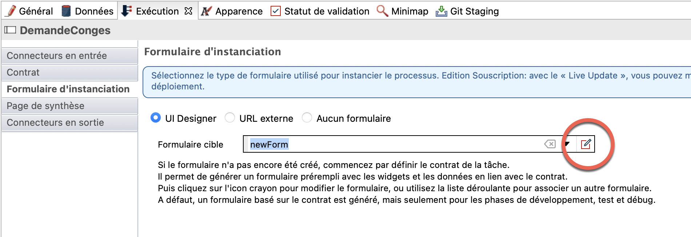
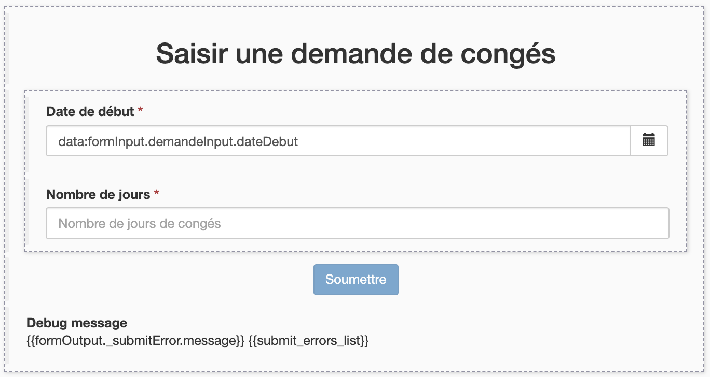
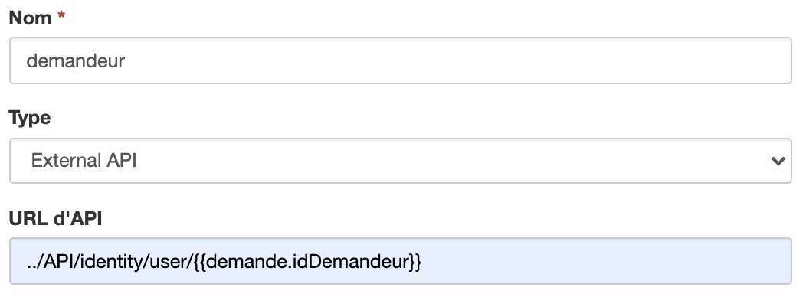
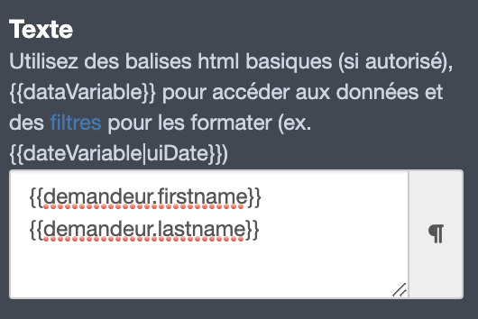

## Objectif

L'objectif de cet exercice est de fournir des formulaires simplifiés conviviaux et adaptés pour l'exécution du processus.

## Instructions résumées

Dupliquer le diagramme de processus de l'exercice précédent pour créer une version *2.1.0*.

Créer les formulaires suivants :
- Un formulaire d'instanciation de processus au niveau du pool permettant d'initialiser les attributs *dateDebut* et *nombreJours* de la variable métier *demande*
- Un formulaire d'étape permettant d'afficher les informations du demandeur et les données *dateDebut* et *nombreJours* en lecture seule puis d'alimenter la donnée *estApprouvee*

## Instructions pas à pas
1. Dupliquer le diagramme de processus de l'exercice précédent pour créer une version 2.1.0
1. Créer un formulaire d'instanciation :
   - Sélectionner le pool du processus
   - Naviguer dans l'onglet **Exécution / Formulaire d'instanciation**
   - Cliquer sur l'icône **Crayon** du champ **Formulaire cible**
   
   
   
   - Cela va ouvrir l'UI Designer dans votre navigateur web avec un nouveau formulaire généré automatiquement à partir de la définition du contrat d'instanciation
   
   
   
1. Renommer le formulaire :
   - Utiliser le champ texte en haut de l'écran pour renommer le formulaire depuis *newForm* vers *remplirDemandeConges* (il s'agit d'un nom technique, il faut donc omettre les espaces, accents et autres caractères spéciaux)
   - Cliquer sur le bouton **Enregistrer**
1. Changer le titre du formulaire :
   - Sélectionner le widget **Titre** *Demande* en haut du formulaire.
   - Dans la section à droite de l'écran, éditer les propriétés suivantes :

   Propriété | Valeur
   --------- | ------
   Texte | *Saisir une demande de congés*
   Niveau du titre | Niveau 2
   Alignement | au centre

1. Changer le widget **Date Picker** *Date Debut* :
   - Sélectionner le widget *Date Debut* et éditer les propriétés suivantes :

   Propriété | Valeur
   --------- | ------
   Libellé | Date de début
   Format technique de la date | dd/MM/yyyy
   Placeholder | jj/mm/aaaa
   Afficher le bouton Aujourd'hui | non

1. Changer le widget **Input** *Nombre Jours* :
   - Sélectionner le widget *Nombre Jours* et éditer les propriétés suivantes :

   Propriété | Valeur
   --------- | ------
   Libellé | Nombre de jours
   Placeholder | Nombre de jours de congés
   Valeur minimum (à ne pas confondre avec la propriété **Longueur minimum de la valeur**) | 1

1. Changer le widget **Button** *Submit* :
   - Sélectionner le widget *Submit*
   - Changer son libellé en *Soumettre*

1. Vérifier le formulaire :
   - Vérifier que le formulaire ressemble à ceci dans l'éditeur :
   
   
   
   - Cliquer sur le bouton **Enregistrer** en haut de l'écran
   - Cliquer sur le bouton **Aperçu** en haut de l'écran
   - Vérifier que l'aperçu ressemble à ceci :
   
   
   
   - On notera les points suivants dans l'aperçu :
     - Le widget présentant l'erreur n'est pas visible
     - Il est possible de tester l'aperçu sur différents périphériques, du mobile au grand écran
     - Le bouton *Soumettre* est désactivé par défaut (ceci est dû à la validation fournie par le conteneur de formulaire)
     - Le bouton *Soumettre* est activé quand le contenu du formulaire est valide  

   > **Note :** il n'est pas possible de soumettre le formulaire depuis l'aperçu même lorsque ce dernier est valide.

1. Fermer la fenêtre d'aperçu

1. Créer un formulaire pour l'étape *Valider demande* :
   - Dans le Studio, sélectionner l'étape *Valider demande*
   - Naviguer dans l'onglet **Exécution / Formulaire**
   - Cliquer sur l'icône **Crayon** du champ **Formulaire cible** pour ouvrir l'UI Designer sur un nouveau formulaire
   - Répondre **Oui** à la question concernant l'ajout de widgets en lecture seule 

   > **Note :** le formulaire a été généré automatiquement à partir du BDM et du contrat, et affiche en lecture seule les données du BDM qui ne sont pas attendues par le contrat à cette étape.

1. Renommer le formulaire :
   - Depuis le UI Designer, renommer le formulaire en  *validerDemandeConges* et l'enregistrer

1. Récupérer les informations concernant le demandeur
   - Cliquer sur le bouton **Créer une nouvelle variable** pour définir une variable avec les propriétés suivantes :

   
   > **Note :** vous pouvez utiliser les exemples qui vous permettent de récupérer automatiquement des modèles d'appels API. Ici on va récupérer `identity API` car on cherche les informations liées à un utilisateur.

1. Modifier le titre du formulaire
   - Sélectionner le widget de type **Titre** situé en haut du formulaire
   - Configurer le widget de la manière suivante :

   Propriété | Valeur
   --------- | ------
   Texte | Valider une demande de congés
   Niveau du titre | Niveau 2

1. Modifier le widget *Id demandeur* pour présenter le prénom et nom du demandeur :
   - Changer la valeur du libellé du widget **Texte** et indiquer *Demandeur*
   - Configurer le champ **Texte** avec les variables : `{{demandeur.firstname}} {{demandeur.lastname}}`
     

1. Changer le widget **Button** *Submit* :
   - Sélectionner le widget *Submit*
   - Changer son libellé en *Soumettre*

1. Vérifier le formulaire :
   - S'assurer que le formulaire ressemble à ceci :
   
   

1. Enregistrer le formulaire :
    - Utiliser le bouton **Enregistrer** en haut au centre de l'écran pour enregistrer le formulaire

1. Tester l'exécution du processus :
   - Lancer l'exécution du processus par le biais du Studio
   - Valider à partir de l'historique des cas que le bon chemin a bien été emprunté jusqu'à la fin du processus

[Exercice suivant : définition des acteurs](04-actors.md)
