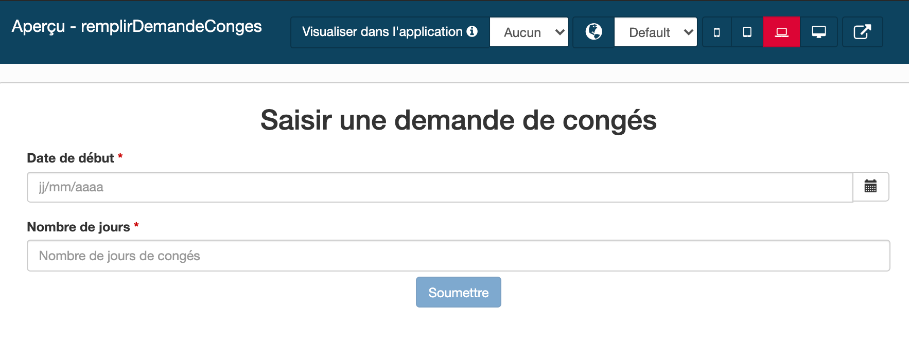

## Objectif

L'objectif de cet exercice est de fournir des formulaires simples, conviviaux et adaptés aux utilisateurs, affichés à l'exécution du processus.

## Instructions simples

1. Dupliquer le diagramme de processus de l'exercice précédent pour créer une version *2.1.0*.
1. Créer le formulaire d'instanciation de processus au niveau du pool permettant d'initialiser les attributs *dateDebut* et *nombreJours* de la variable métier *demande*
1. Créer le formulaire d'exécution de tâche permettant d'afficher les informations du demandeur et les données *dateDebut* et *nombreJours* en lecture seule puis d'alimenter la donnée *estApprouvee*

## Instructions pas-à-pas

### Dupliquer le diagramme de processus de l'exercice précédent
A partir de la version *2.0.0*, créer les versions *"2.1.0"* du diagramme ET du pool.

### Créer le formulaire d'instanciation

 1. Sélectionner le pool
 
 1. Dans la zone de propriétés, cliquer sur l'onglet **Exécution** puis le sous-onglet **Formulaire d'instanciation**
 
 1. Dans le champ **Formulaire cible**, cliquer sur l'icon **Crayon**
   
   
   
   Le UI Designer s'ouvre dans votre navigateur web avec un nouveau formulaire généré automatiquement à partir du contrat d'instanciation.
   
   
   
 1. Changer le nom technique du formulaire :
   - Dans le champ texte en haut de l'écran, changer le nom par défaut *newForm* en *"remplirDemandeConges"*. Il s'agit d'un nom technique, donc sans espaces, accents ou autres caractères spéciaux.
   - Cliquer sur le bouton **Enregistrer**
   
 1. Changer le titre du formulaire, visible pour l'utilisateur :
   - Sélectionner le widget de type **Titre** pré-rempli par *Demande* en haut du formulaire.
   - Dans la zone de propriétés à droite de l'écran, éditer les propriétés suivantes :

   Propriété | Valeur
   --------- | ------
   Texte | Saisir une demande de congés
   Niveau du titre | Niveau 2
   Alignement | au centre

1. Changer le widget *Date Picker* *Date Debut* :
   - Sélectionner le widget de type **Date Picker** pré-rempli par *Date Debut* et éditer les propriétés suivantes :

   Propriété | Valeur
   --------- | ------
   Libellé | Date de début
   Format technique de la date | dd/MM/yyyy
   Placeholder | jj/mm/aaaa
   Afficher le bouton Aujourd'hui | non

1. Changer le widget **Input** *Nombre Jours* :
   - Sélectionner le widget de type **Input** pré-rempli par *Nombre Jours* et éditer les propriétés suivantes :

   Propriété | Valeur
   --------- | ------
   Libellé | Nombre de jours
   Placeholder | Nombre de jours de congés
   Valeur minimum (à ne pas confondre avec la propriété *Longueur minimum de la valeur*) | 1

1. Changer le widget *Button* *Submit* :
   - Sélectionner le widget de type **Button** pré-rempli par *Submit*
   - Changer son *Libellé* en *"Soumettre"*

1. Vérifier le formulaire :
   - Vérifier que le formulaire ressemble à ceci dans l'éditeur :
   
   
   
   - Cliquer sur le bouton **Enregistrer** en haut de l'écran
   - Cliquer sur le bouton **Aperçu** à côté
   - Vérifier que l'aperçu ressemble à ceci :
   
   
   
   - On notera les points suivants dans l'aperçu :
     - Le widget présentant l'erreur n'est pas visible
     - Il est possible de tester l'aperçu sur différents appareils, du téléphone mobile au grand écran
     - Le bouton *Soumettre* est désactivé par défaut (ceci est dû à la validation fournie par le container de formulaire)
     - Le bouton *Soumettre* est activé quand le contenu du formulaire est valide  

   > **Note :** il n'est pas possible de soumettre le formulaire depuis l'aperçu, même lorsque ce dernier est valide.

1. Fermer la fenêtre d'aperçu

### Créer le formulaire d'exécution de la tâche *Valider demande*

 1. De retour dans Bonita Studio, sélectionner l'étape *Valider demande*
 
 1. Dans la zone de propriétés, l'onglet *Exécution* est déjà sélectionné. Cliquer le sous-onglet **Formulaire**.
 
 1. Dans le champ  **Formulaire cible**, cliquer sur l'icon **Crayon** pour ouvrir un nouveau formulaire dans le UI Designer
 
 1. A la question concernant l'ajout de widgets en lecture seule, répondre **Oui** 

   > **Note :** le formulaire a été généré automatiquement à partir du modèle de données métier et du contrat, et affiche en lecture seule les données qui ne sont pas attendues par le contrat à cette étape.

1. Changer le nom technique du formulaire :
   - Dans le champ en haut, renommer le formulaire en *validerDemandeConges* et l'enregistrer

1. Récupérer les informations concernant le demandeur
   - Dans le panneau en bas de l'écran, cliquer sur le bouton **Créer une nouvelle variable** et définir une variable avec les propriétés suivantes :

   Propriété | Valeur
   --------- | ------
   Nom | demandeur
   Type | External API
   URL d'API | ../API/Identity/user//{{demande.idDemandeur}}

   
   
   > **Note :** vous pouvez utiliser les exemples qui vous permettent de récupérer automatiquement des modèles d'appels API. Ici on va récupérer `identity API` car on cherche les informations liées à un utilisateur.

1. Modifier le titre du formulaire
   - Sélectionner le widget de type **Titre** pré-rempli par *{{ task.displayName }}* situé en haut du formulaire
   - Configurer le widget de la manière suivante :

   Propriété | Valeur
   --------- | ------
   Texte | Valider une demande de congés
   Niveau du titre | Niveau 2

1. Modifier le widget *Id Demandeur* pour présenter le prénom et nom du demandeur :
   - Sélectionner le widget de type **Texte** pré-rempli par *id Demandeur* 
   - Changer la valeur du *Libellé* en *"Demandeur"*
   - Configurer le champ *Texte* avec les variables : `{{demandeur.firstname}} {{demandeur.lastname}}`
     

1. Changer le widget *Button* *Submit* :
   - Sélectionner le widget de type **Button** pré-rempli par *Submit*
   - Changer son *Libellé* en *"Soumettre"*

1. Vérifier le formulaire : S'assurer que le formulaire ressemble à ceci :
   
   

1. Enregistrer le formulaire : Cliquer sur le bouton **Enregistrer** en haut au centre de l'écran pour enregistrer le formulaire

## Tester le projet

 1. De retour dans le studio, lancer l'exécution du processus. Remplir et soumettre le premier formulaire.
 
 1. Dans la User Application, prendre la tâche puis remplir et soumettre le second formulaire
 
 1. En haut à droite de la barre de menu, cliquer l'icon **mosaïque** et choisir **Bonita Administrator Application**
 
 1. Cliquer sur le menu **BPM/Cas**, puis sur l'onglet **Cas archivés**
 
 1. Sur la ligne du cas, cliquer sur **...** pour accéder aux détails. 
 
 1. Dans la partie *Monitoring/Liste des tâches pour ce cas*, cliquer sur **En échec (0), En attente (0), Faites (2)**
  
 1. Cliquer sur l'onglet **Tâches faites**
 
 1. Valider que les tâches attendues ont été exécutées

[Exercice suivant : définition des acteurs](05-actors.md)
