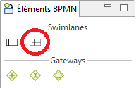
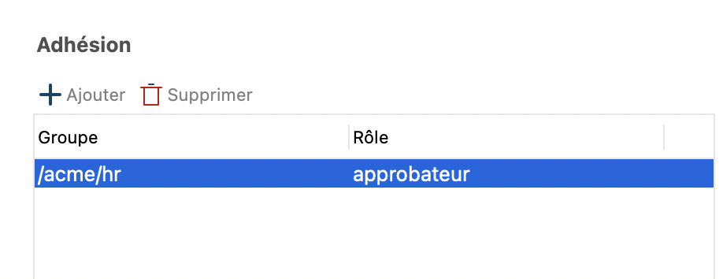

## Objectif

L'objectif de cet exercice est d'apporter une notion de contribution partagée au processus existant, en distribuant les tâches entre deux acteurs : le demandeur et l'approbateur.

## Instructions simples

 1. Dupliquer le diagramme de processus de l'exercice précédent pour créer une version *"3.0.0"*.
 1. Ajouter une lane *"Approbateur"* au diagramme et y déplacer la tâche *Valider demande*.
 1. Créer l'acteur *"Approbateur"* et l'associer à la lane *Approbateur*
 1. Définir un rôle *"Approbateur"* dans l'organisation, y associer Helen Kelly, manager de Walter Bates.
 1. Associer le rôle *Approbateur* à l'acteur de la lane *Approbateur*.

## Instructions pas-à-pas

### Dupliquer le diagramme de processus de l'exercice précédent pour créer une version *3.0.0*

Vous êtes maintenant au point sur le mode opératoire. Créez la version *"3.0.0"* du diagramme ET du pool.

### Ajouter une lane *Approbateur* au diagramme et y déplacer la tâche *Valider demande*.

1. Entre l'explorateur de projet et le diagramme, dans la *Palette* d'éléments BPMN, cliquer sur **lane** puis faire un glisser-déposer dans le pool.
   
   
   
1. Dans la zone de propriétés, l'onglet *Général* est déjà sélectionné. Cliquer sur le sous-onglet **Lane**.

1. Dans *Nom*, modifier le nom par défaut en *"Approbateur"*

1. Renommer la première lane en *Demandeur*

1. Faire glisser la tâche *Valider demande* et la tâche associée au timer dans la lane *Approbateur*

1. Vérifier que le diagramme ressemble à ceci :

   
   
### Créer l'acteur *"Approbateur"* et l'associer à la lane *Approbateur*

 1. Cliquer dans la lane **Approbateur**
 
 1. Dans la zone de propriétés, sélectionner le sous-onglet **Acteurs**
 
 1. Tout au bout du champ *Choisissez un acteur*, cliquer sur le bouton **Ajouter ...**
   
 
 1. Dans le champ **Nom** indiquer *"Approbateur"*. Ne pas cocher la case **Marquer "initiateur"** car l'initiateur de chaque nouvelle instance du processus sera le demandeur.
 
 1. Cliquer sur **Terminer**
 
 1. Vérifier que l'acteur défini dans la lane *Demandeur* est bien l'acteur par défaut *Employee actor*

### Définir un rôle *"Approbateur"* dans l'organisation, y associer Helen Kelly, manager de Walter Bates.

 1. A gauche du studio, dans l'explorateur du projet, double-cliquer sur **Organisations** et puis sur l'organisation de test **ACME.organisation**.   
 
 1. L'éditeur d'organisation s'ouvre, avec la vue d'ensemble sur les groupes, les rôles et les utilisateurs.
     
 
 1. Dans la partie *Rôles de l'organisation*, cliquer sur le **crayon**, à droite.
 
 1. Cliquer sur **Ajouter un rôle** (A).
 
 1. Modifier le nom métier par défaut en *"Approbateur"*.
   
     
 1. Associer ce nouveau rôle à l'utilisateur *Helen Kelly* qui est manager, en charge de la validation des congés de notre utilisateur par défaut *Walter Bates*.
   - En haut de l'éditeur de l'organisation, cliquer sur l'onglet **Utilisateurs** et sélectionner **Helen Kelly**.
   - Dans la section *Adhésion*, modifier le rôle, de *member* à *Approbateur*
     
     
 1. En haut de l'éditeur de l'organisation, cliquer sur l'icon **Déployer** pour propager les changements dans le moteur BPM de Bonita
 
 1. Dans les différentes fenêtres modales, cliquer sur le bouton **Enregistrer et déployer**, puis **Déployer** et enfin sur **OK**.

### Associer le rôle *Approbateur* à l'acteur de la lane *Approbateur*

 1. Dans la Cool Bar, cliquer sur l'icon *Configurer*  qui va permettre d'associer les acteurs aux entités de l'organisation
 
 1. Dans la fenêtre modale, section **Association acteurs/utilisateurs**, *Employee actor* est déjà associé à un groupe (*/acme*).
 
 1. Cliquer sur l'acteur **Approbateur** (A) puis sur le bouton **Rôles ...** (B)
 
 1. Dans la fenêtre, sélectionner le rôle **Approbateur** (C), cliquer sur le bouton **Terminer**, puis sur **Terminer** dans la modale principale.
     
   
   >**Note** Pour aller plus loin, il est aussi possible de définir un *filtre d'acteur*. Cette méthode est décrite dans un prochain exercice.

[Exercice suivant : Ajout d'un filtre d'acteur et d'un connecteur](06-extensions.md)
