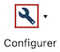
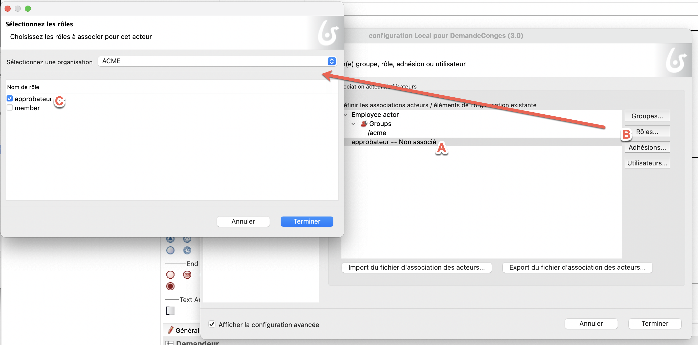

## Objectif

L'objectif de cet exercice est d'apporter une notion de collaboration au processus existant en distribuant les tâches entre deux acteurs : le demandeur et l'approbateur.

## Instructions résumées

Dupliquer le diagramme de processus de l'exercice précédent pour créer une version *3.0.0*.

Ajouter une lane *Validateur* au diagramme et y déplacer la tâche *Valider demande*.

Définir un rôle *validateur* dans l'organisation et l'associer à l'acteur de la lane *Approbateur*.

Ajouter un filtre d'acteur de type **manager de l'initiateur** sur la tâche *Valider demande*.

## Instructions pas à pas

1. Dupliquer le diagramme de processus de l'exercice précédent pour créer une version *3.0.0*

1. Ajouter une lane *Validateur* au diagramme :
   - Sélectionner l'élément lane à partir de la palette d'éléments BPMN présente sur le côté gauche du Studio :
   
   
   
   - Cliquer dans le pool du processus pour ajouter la lane
   - Sélectionner la lane
   - Naviguer dans l'onglet **Général / Lane**
   - Modifier le nom en *Validateur*

1. Renommer l'autre lane en *Demandeur*

1. Faire glisser la tâche *Valider demande* et la tâche associée au timer dans la lane *Validateur*

1. Vérifier que le diagramme ressemble à ceci :

   
   
1. Définir les acteurs du processus
   - sélectionner la lane *validateur*
   - Naviguer dans l'onglet **Général / Acteur**
   - Cliquer sur le bouton **Ajouter**
   
   - Dans le champ **Nom** indiquer *validateur*. Ne pas cocher la case **Initiateur** car l'initiateur est le demandeur.
   - Cliquer sur **Terminer**
   - Vérifier que l'acteur défini dans la lane *Demandeur* est bien l'acteur par défaut *Employee actor*

### Option 1 - définir un rôle
1. Créer un rôle *validateur* dans l'organisation :
   - Dans l'explorateur du projet, cliquer sur **Organisation** et sélectionner l'organisation de test *ACME.organisation*.   
     L'éditeur d'organisation s'ouvre, avec la vue d'ensemble sur les groupes, les rôles et les utilisateurs.
     
   - Cliquer sur le crayon pour éditer les rôles. 
   - Cliquer sur **Ajouter un rôle** (A) puis éditer (B) le nom technique du rôle (en cliquant sur le crayon) pour indiquer *validateur*.
   - Nommer le rôle *Validateur*.
   
     Associer ce nouveau rôle à l'utilisateur *Helen Kelly* qui est en charge de la validation des congés de notre utilisateur par défaut *Walter Bates*.
   - Aller dans l'onglet **Utlisateur** et sélectionner *Helen Kelly*.
   - Dans la section **Adhésion**, modifier le rôle de *member* à *validateur*
     
   - Déployer l'organisation pour prendre en compte les changements en cliquant sur l'icône **Déployer**.  
   >**Note** Pour aller plus loin, il est aussi possible de définir un filtre d'acteur. Cette méthode est décrite dans un prochain exercice.

### Option 2 - définir un filtre d'acteur
1. Sélectionner la lane *Validateur*

2. Configurer un filtre d'acteur de type **Manager de l'initiateur du processus** sur la lane *Validateur* :
   - Sélectionner la lane *Validateur*
   - Naviguer dans l'onglet **Général / Acteurs**
   - Sélectionner l'acteur *Employee actor* à partir du menu déroulant (vous pouvez aussi définir l'acteur *validateur*
   - Cliquer sur le bouton **Définir...** associé au filtre
   - Si aucun filtre n'a été défini, il vous sera suggéré d'en installer un
   
   - Sélectionner un filtre de type **Manager de l'initiateur** dans le MarketPlace des extensions
    
   - Sélectionner la définition du filtre **Manager de l'initiateur du processus** 
   - Cliquer sur **Suivant**
   - Nommer le filtre *managerInitiateur*
   - Cliquer sur **Terminer**

4. Lier l'organisation aux acteurs du processus :
   - Cliquer sur l'icône *Configurer*  qui va permettre d'associer les acteurs aux bons rôles dans l'organisation.
   - Dans l'éditeur, sélectionner **Association acteurs/utilisateurs**. L'employee actor est déjà associé à un groupe, il faut donc faire de même avec l'acteur **validateur**
   - Sélectionner l'acteur **validateur** (A) puis cliquer sur le bouton **Rôles** (B)
   - Dans la fenêtre, sélectionner le rôle **validateur** (C)
    

5. Exécuter le processus avec les deux acteurs :
   - Lancer le processus à partir du Studio (l'utilisateur Walter Bates sera utilisé)
   - Soumettre le formulaire de *Saisie demande congés*. Si les acteurs sont correctement configurés, la tâche *Valider demande de congés* ne devrait pas être proposée
   - Se déconnecter de l'application utilisateur en naviguant sur le nom d'utilisateur dans le coin supérieur droit puis **Déconnexion** :

   
   
   - Se connecter avec l'utilisateur *helen.kelly* et le mot de passe *bpm*
   - Si le filtre d'acteur s'est bien exécuté, la tâche *Valider demande de congés* devrait être disponible dans la liste des tâches à faire

[Exercice suivant : configuration d'un connecteur](06-connectors.md)
