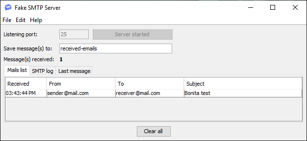
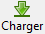

## Objectif

L'objectif de cet exercice est de traiter une interaction entre le processus et un système externe par le biais d'un connecteur. Nous nous intéresserons ici à la notification du résultat de la demande de congés par le biais d'un connecteur d'envoi d'email.

> ⚠ En fonction de votre configuration réseau, de votre firewall ou de la configuration de sécurité de votre serveur d'email, il est possible que vous ne soyez pas autorisé à envoyer un email depuis Bonita.  
> Afin de s'abstraire de ces contraintes techniques, cet exercice sera effectué avec un logiciel simulant un serveur d'email (FakeSMTP).

## Instructions résumées

Obtenir et démarrer le serveur [FakeSMTP](http://nilhcem.github.com/FakeSMTP/downloads/fakeSMTP-latest.zip).

Dupliquer le diagramme de processus de l'exercice précédent pour créer une version *3.1.0*.

Ajouter un connecteur d'envoi d'email sur les tâches automatiques *Notifier approbation* et *Notifier refus*. Ceux-ci enverront un email au demandeur avec le statut de validation de sa demande.

Le code ci-dessous sera utilisé pour récupérer l'email du demandeur dans le connecteur :

```groovy
BonitaUsers.getProcessInstanceInitiatorProfessionalContactInfo(apiAccessor,processInstanceId).email
```

## Instructions pas à pas

1. Mise en place de FakeSMTP :
   - Récupérer le binaire de FakeSMTP depuis cette URL : [http://nilhcem.github.com/FakeSMTP/downloads/fakeSMTP-latest.zip](http://nilhcem.github.com/FakeSMTP/downloads/fakeSMTP-latest.zip)
   - Décompresser l'archive `fakeSMTP-latest.zip`
   - Lancer FakeSMTP en double cliquant sur le fichier JAR ou en lançant la commande suivante : `java -jar fakeSMTP-2.0.jar`
   - Une fois l'interface graphique de FakeSMTP affichée, configurer le port d'écoute sur *2525* et cliquer sur le bouton **Démarrer le serveur**

1. Dupliquer le diagramme de processus de l'exercice précédent pour créer une version *3.1.0*

1. Tester le connecteur d'envoi d'email pour obtenir la bonne configuration SMTP :
   - Naviguer dans le menu **Développement / Connecteurs / Tester un connecteur...** de la barre supérieur du Studio
   - Sélectionner un connecteur de type **Courriel** à partir du filtre ou depuis la catégorie **Communications**
   - Cliquer sur le bouton **Suivant**
   - Remplir les paramètres de connexion suivants :

   Propriété | Valeur
   --------- | ------
   Hôte SMTP | *localhost*
   Port SMTP | *2525* (le port spécifié dans FakeSMTP)
   SSL (sous l'onglet **Sécurité**) | décoché

   - Passer à la page suivante
   - Entrer des emails (pas nécessairement existants) en tant que  destinataire et expéditeur
   - Passer à la page suivante
   - Entrer *Bonita test* comme sujet
   - Cliquer le bouton **Test**
   - Confirmer sans cocher de dépendance
   - Un message similaire à celui ci-dessous devrait s'afficher, cliquer sur le bouton **OK** :
   
   
   
   - S'assurer que l'email est bien reçu par FakeSMTP comme illustré ci-dessous :
   
   
   
   - Une fois la configuration validée, cliquer sur 
   - Nommer la configuration *configEmail* et la sauvegarder
   - Fermer l'interface de test du connecteur

1. Ajouter un connecteur d'envoi d'email sur la tâche *Notifier approbation* :
   - Sélectionner la tâche *Notifier approbation*
   - Naviguer dans l'onglet **Exécution / Connecteurs en entrée**
   - Cliquer sur **Ajouter\...**
   - Sélectionner un connecteur de type **Courriel**
   - Cliquer sur le bouton **Suivant**
   - Spécifier *envoiEmailApprobation* comme nom
   - Passer à la page suivante
   - Ne pas remplir les paramètres de la page
   - Cliquer sur 
   - Sélectionner la configuration *configEmail*
   - Passer à la page de configuration du destinataire
   - Entrer *rh@acme.com* comme adresse email dans le champ expéditeur **De**
   - Utiliser l'icône **crayon** pour éditer l'expression sur le champ destinataire **A**
   - Changer le **Type d'expression** à **Script**
   - Nommer le script *recupEmailDemandeur*
   - Coller le code ci-dessous dans la zone d'édition du script :
   
   ```groovy
   BonitaUsers.getProcessInstanceInitiatorProfessionalContactInfo(apiAccessor,processInstanceId).email
   ```
   
   - Cliquer sur le bouton **OK** pour fermer l'éditeur de script
   - Passer à la page suivante
   - Spécifier *Demande de congés approuvée* comme sujet
   - Cliquer sur **Terminer**

1. Ajouter un connecteur d'envoi d'email sur la tâche *Notifier refus* :
   - Répéter l'étape précédente en nommant le connecteur *envoiEmailRefus* et en spécifiant *Demande de congés refusée* comme sujet

   Alternativement, vous pouvez utiliser la fonctionnalité qui permet de copier un connecteur configuré sur une tâche vers une autre tâche.

1. Tester le processus :
   - Exécuter deux fois le processus pour tester les différents chemins et s'assurer que les emails sont bien envoyés et interceptés par FakeSMTP

[Exercice suivant : création d'une application](06-applications)
