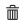
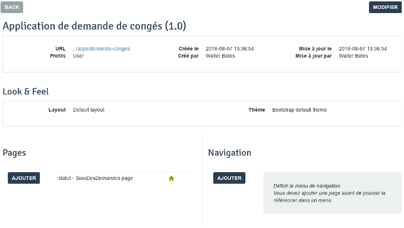

## Objectif

L'objectif de cet exercice est de fournir aux utilisateurs une application qui permette le suivi et la création de demandes de congés.

## Instructions résumées

Ouvrir l'UI Designer et créer une nouvelle **Page d'application** nommée *SuiviDesDemandes* qui permet le suivi des demandes de congés initiés par l'utilisateur connecté.

Cette page contient un container multiple qui liste les demandes de congés ouvertes. Pour chaque demande, la date de début, le nombre de jours et le statut sont affichés.

Déployer la page d'application en utilisant le bouton **Déployer** du Studio.

Créer une nouvelle application et y ajouter la page *SuiviDesDemandes*.

Accéder à l'application nouvellement créer en utilisant l'URL unique générée.

Optionnel : Ajouter un widget date et un widget input pour collecter les informations nécessaires à la création d'une nouvelle demande de congés. Puis ajouter et configurer un bouton pour soumettre la nouvelle demande.

## Instructions pas à pas

1. Créer une page d'application :
   - Dans le Studio, cliquer sur le bouton **UI Designer**
   - Cliquer sur le bouton **Créer**
   - Sélectionner **Page d'application**
   - Saisir le nom *SuiviDesDemandes*
   - Cliquer sur **Créer**
   
   
   
   - La vue de conception devrait maintenant être affichée

1. Ajouter un titre à votre page :
   - Glisser le widget **Title** (A) depuis la palette et placer le en haut de la page (B)
   - Sélectionner le widget
   - Dans le panneau de droite entrer *Application de gestion des demandes de congés* dans le champ **Texte**
   - Sélectionner l'option **au centre** pour le paramètre **Alignement**
   
   

1. Ajouter un autre titre à votre page sous le titre principal :
   - Nommer le *Suivi des demandes*
   - Sélectionner l'option **Niveau 4** pour le paramètre **Niveau du titre**
   - Sélectionner l'option **au centre** pour le paramètre **Alignement**

1. Créer une variable pour stocker les informations de session :
   - Cliquer sur **Créer un nouvelle variable**
   - Nommer la *sessionInfo*
   - Choisir le type **External API**
   - Entrer dans le champ **API URL** : `../API/system/session/unusedId`
   
   

1. Créer une variable pour lister les demandes de congés :
   - Cliquer sur l'icône **Data model**
   - Glisser-déposser *DemandeConges* sur la page
   - Conserver le nom par défaut : *demandesConges*
   - Dans la section **"Find By" queries on an attribute**, sélectionner *idDemandeur*
   - Dans la section **"idDemandeur" value** saisir : `{{sessionInfo.user_id}}`
   - Cliquer sur le bouton **Enregistrer**

1. Déclarer une nouvelle expression JavaScript pour mettre en forme la liste :
   - Cliquer sur **Créer un nouvelle variable**
   - Nommer la *ajoutLibelleStatutDemandeConges*
   - Choisir le type **JavaScript expression**
   - Remplacer la valeur existante par le script suivant :
   ```javascript
   if($data.hasOwnProperty('demandeConges') && $data.demandeConges) {
     for (let demande of $data.demandeConges) {
       if(demande.estApprouvee)  {
         demande.estApprouveeLabel = "Approuvée";
       } else if(demande.estApprouvee === false) {
         demande.estApprouveeLabel = "Rejetée";
       } else {
         demande.estApprouveeLabel = "En cours";
       }
     }
   }

   return $data.demandeConges;
   ```

1. Créer un container multiple :
   - Glisser le widget **Container** depuis la palette et placer le sous le titre *Suivi des demandes*
   - Sélectionner le container
   - Dans le panneau de droite, entrer *demandesConges* dans le champ **Collections**

1. Ajouter 4 widgets dans le container :
   - Un widget **Input** avec les options suivantes :
   
     Propriété | Valeur
     --------- | ------
     Largeur | *3*
     Lecture seule | **Oui**
     Libellé | *Num*
     Valeur | `$index + 1`

   - Un widget **Date picker** avec les options suivantes :
   
     Propriété | Valeur
     --------- | ------
     Largeur | *3*
     Lecture seule | **Oui**
     Libellé | *Date de début*
     Valeur | `$item.dateDebut`
     Format technique de la date | *dd/MM/yyyy*
     Afficher le bouton Aujourd'hui | **Non**

   - Un widget **Input** avec les options suivantes :
     Propriété | Valeur
     --------- | ------
     Largeur | *3*
     Lecture seule | **Oui**
     Libellé | *Nombre de jours*
     Valeur | `$item.nombreJours`

   - Un widget **Input** avec les options suivantes :
     Propriété | Valeur
     --------- | ------
     Largeur | *3*
     Lecture seule | **Oui**
     Libellé | *Statut*
     Valeur | `$item.estApprouveeLabel`

   - Sauvegarder la page
   - La page devrait ressembler à cela :
   
   
   
   - Vous pouvez à n'importe quel moment pré-visualiser la page en cliquant sur **Aperçu**

   > Astuce : si vous êtes connectés au portail dans le même navigateur, les demandes de congés réelles seront affichés.

1. Déployer la page dans le portail :
   - Dans le Studio, dans l'**Explorateur** sur la gauche de la fenêtre, déplier **Pages/Formulaires/Layout**
   - Sélectionner la page *SuiviDesDemandes*
   - Faire un clic droit et choisir **Déployer**
   - Cliquer sur le bouton **OK**
   
1. Créer une nouvelle application :
   - Dans le portail, basculer en vue **Administrateur**
   - Naviguer vers le menu **Applications**
   - Cliquer sur le bouton **Nouveau**
   - Saisir *Application de demande de congés* dans le champ **Nom affiché** (A)
   - Saisir *demande-conges* dans le champ **URL** (B)
   - Laisser les valeurs par défaut dans les champs **Version** (C) et **Profils** (D)
   
   
   
   - Cliquer sur le bouton **Créer** pour créer l'application
   - Cliquer sur **...** pour accéder à l'écran de configuration
   - Aller dans la section **Pages**, situé dans la partie basse de l'écran
   - Cliquer sur le bouton **Ajouter**
   - Sélectionner la page *custompage_SuiviDesDemandes*
   - Saisir *statut* dans le champ **URL**
   - Cliquer sur le bouton **Ajouter**
   - Définir la page *SuiviDesDemandes* en tant que page d'accueil en cliquant sur l'icône **maison** 
   - Une fois cela fait, cliquer sur l'icône **corbeille**  pour supprimer la page par défaut
   - Vérifier que la page de configuration ressemble à ceci :
   
   
   
   - Cliquer sur le lien *../apps/demande-conges* pour accéder à l'application :
   
   

1. Ajouter un nouveau form container :
   - Retourner dans l'UI designer pour éditer la page de gestion des demandes de congés
   - Glisser un form container depuis la palette et le placer entre les deux titres

1. Créer une nouvelle variable pour stocker les informations liées à la demande de congés :
   - Cliquer sur **Créer sur une nouvelle variable**
   - Nommer la variable *nouvelleDemandeConges*
   - Choisir le type **JSON**
   - Dans le champ texte **Valeur**, taper le script suivant :
   ```json
   {
     "demandeInput" : {
       "dateDebut" : null,
       "nombreJours" : null
     }
   }
   ```

1. Créer une nouvelle variable pour stocker les informations liés au processus :
   - Cliquer sur **Créer une nouvelle variable**
   - Nommer la variable *informationDefinitionProcessus*
   - Choisir le type **External API**
   - Dans le champ **URL d'API**, taper : `../API/bpm/process?p=0&c=100&o=version%20DESC&f=name=DemandeConges`

1. Ajouter deux widgets dans le form container :
   - Un widget **Date picker** avec les options :
     - Largeur : *6*
     - Valeur : `nouvelleDemandeConges.demandeInput.dateDebut`
     - Libellé : *Date de début*
   - Un widget **Input** avec les options :
     - Largeur : *6*
     - Valeur : `nouvelleDemandeConges.demandeInput.nombreJours`
     - Libellé : *Nombre de jours*

1. Ajouter un bouton pour soumettre le formulaire :
   - Glisser le widget **Button** depuis la palette et placer le dans le form container en dessous des deux widgets
   - Entrer *Créer une nouvelle demande* dans le champ **Libellé**
   - Sélectionner **POST** dans la liste déroulante **Action**
   - Cliquer sur **fx** pour changer le mode du champ **Données envoyés au clic** et taper *nouvelleDemandeConges*
   - Dans le champ **URL à appeler**, taper : `../API/bpm/process/{{informationDefinitionProcessus[0].id}}/instantiation`
   - Dans le champ **URL cible en cas de succès**, taper : `/bonita/apps/demande-conges`
   - Enregistrer les changements
   - La page devrait maintenant ressembler à ceci :
   
   
   
   - Vous pré-visualiser la page pour vérifier qu'elle fonctionne correctement

1. Mettre à jour la page dans le portail : 
   - Répéter l'opération de déploiement
   - Rafraîchir l'application, les changements devraient être visibles
