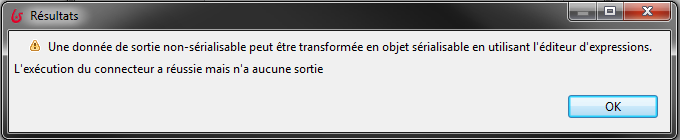
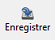
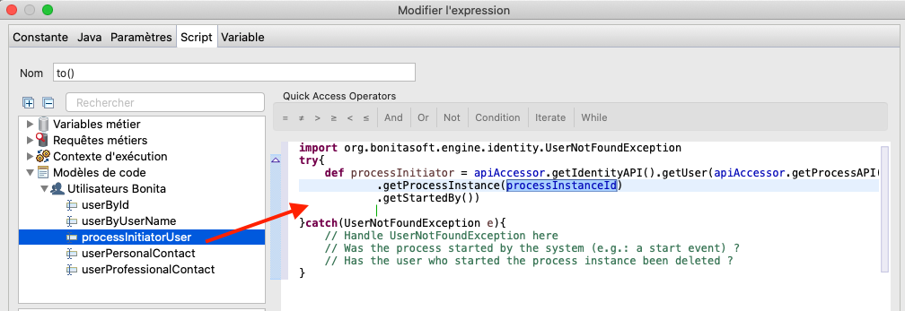
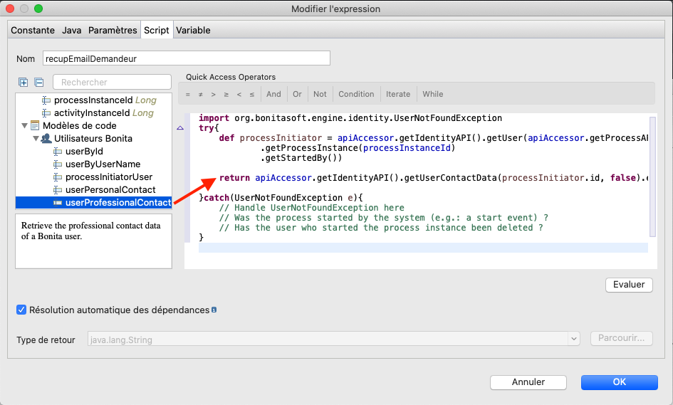

## Objectif

L'objectif de cet exercice est de traiter une interaction entre le processus et un système externe par le biais d'un connecteur. Nous nous intéresserons ici à la notification du résultat de la demande de congés par le biais d'un connecteur d'envoi d'email.

> ⚠ En fonction de votre configuration réseau, de votre firewall ou de la configuration de sécurité de votre serveur d'email, il est possible que vous ne soyez pas autorisé à envoyer un email depuis Bonita.  
> Afin de s'abstraire de ces contraintes techniques, cet exercice sera effectué avec un logiciel simulant un serveur d'email (FakeSMTP).

## Instructions résumées

Obtenir et démarrer le serveur [FakeSMTP](http://nilhcem.github.io/FakeSMTP/downloads/fakeSMTP-latest.zip).

Dupliquer le diagramme de processus de l'exercice précédent pour créer une version *3.1.0*.

Ajouter un connecteur d'envoi d'email sur les tâches automatiques *Notifier approbation* et *Notifier refus*. Ceux-ci enverront un email au demandeur avec le statut de validation de sa demande.

Le code ci-dessous sera utilisé pour récupérer l'email du demandeur dans le connecteur :

```groovy
BonitaUsers.getProcessInstanceInitiatorProfessionalContactInfo(apiAccessor,processInstanceId).email
```
## Instructions pas à pas

1. Mise en place de FakeSMTP :
   - Récupérer le binaire de FakeSMTP depuis cette URL : [http://nilhcem.github.com/FakeSMTP/downloads/fakeSMTP-latest.zip](http://nilhcem.github.com/FakeSMTP/downloads/fakeSMTP-latest.zip)
   - Décompresser l'archive `fakeSMTP-latest.zip`
   - Lancer FakeSMTP en double cliquant sur le fichier JAR ou en lançant la commande suivante : `java -jar fakeSMTP-2.0.jar`
   - Une fois l'interface graphique de FakeSMTP affichée, configurer le port d'écoute sur *2525* et cliquer sur le bouton **Démarrer le serveur**

1. Dupliquer le diagramme de processus de l'exercice précédent pour créer une version *3.1.0*

1. Ajouter un connecteur d'envoi d'email sur la tâche *Notifier approbation* :
   - Sélectionner la tâche *Notifier approbation*
   - Naviguer dans l'onglet **Exécution / Connecteurs en entrée**
   - Cliquer sur **Ajouter\...**
     Un avertissement  indique qu'aucun connecteur n'a été préalablement installé dans le projet et invite à le faire. 
     
     
     >**Note** : Les extensions peuvent être récupérées depuis le Bonita MarketPlace ou depuis des répertoires distants privés ou publiques. Si vous souhaitez aller plus loing, le développement et la gestion de ces extensions sont abordées dans un prochain exercice.
   - Cliquer sur OK pour accéder au MarketPlace et sélectionner le connecteur **Email** dans la liste.  
     
   - Cliquer sur **Installer**  
   - Sélectionner la définition de connecteur de type **Courriel**
   - Cliquer sur le bouton **Suivant**
   - Spécifier *envoiEmailApprobation* comme nom
   - Passer à la page suivante
   - Remplir les paramètres de connexion suivants :

   Propriété | Valeur
   --------- | ------
   Hôte SMTP | *localhost*
   Port SMTP | *2525* (le port spécifié dans FakeSMTP)
   SSL (sous l'onglet **Sécurité**) | décoché 

   - Passer à la page de configuration du destinataire
   - Entrer *rh@acme.com* comme adresse email dans le champ expéditeur **De**
   - Utiliser l'icône **crayon** pour éditer l'expression sur le champ destinataire **A**
   - Nommer le script *recupEmailDemandeur*
   - Dans l'éditeur de script, sélectionner *processInitiatorUser* dans le menu **Modèles de code/Utilisateurs Bonita**
   - Glisser et déposer le modèle dans l'éditeur. Un modèle de script est automatiquement généré.
   
   
   
   - Pour pouvoir retourner l'email de l'initiateur du processus, glisser et déposer *userProfessionalContact* depuis le menu **Modèles de code/Utilisateurs Bonita** entre `.getStartedBy()` et `}catch(UserNotFoundException e){`
   - Remplacer *userId* par `processInitiator.id`
   - Ajouter un "." et sélectionner *email : string* dans la liste déroulante
   - On peut remplacer `def proContactData = ` par `return`
   
   
   
   - Cliquer sur le bouton **OK** pour fermer l'éditeur de script
   - Passer à la page suivante
   - Spécifier *Demande de congés approuvée* comme sujet
   - Cliquer sur **Terminer**

1. Ajouter un connecteur d'envoi d'email sur la tâche *Notifier refus* :
   - Répéter l'étape précédente en nommant le connecteur *envoiEmailRefus* et en spécifiant *Demande de congés refusée* comme sujet

   Alternativement, vous pouvez utiliser la fonctionnalité qui permet de copier un connecteur configuré sur une tâche vers une autre tâche.

1. Tester le processus :
   - Exécuter deux fois le processus pour tester les différents chemins et s'assurer que les emails sont bien envoyés et interceptés par FakeSMTP

   [Exercice suivant : création d'une application](07-applications.md)
