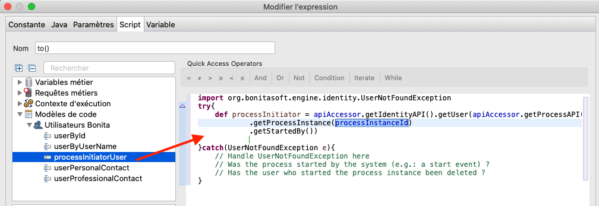

## Objectif

L'objectif de cet exercice est d'ajouter des points d'extensions au projet Bonita, avec un filtre d'acteur et un connecteur email. 

- Le filtre d'acteur *Manager de l'initiateur du processus* sera configuré pour chercher dynamiquement dans l'organisation le manager du demandeur.
- Le connecteur email permettra de notifier le demandeur du résultat de sa demande.

> ⚠ En fonction de votre configuration réseau, de votre firewall ou de la configuration de sécurité de votre serveur d'email, il est possible que vous ne soyez pas autorisé à envoyer un email depuis Bonita.  
> Afin de s'abstraire de ces contraintes techniques, cet exercice sera effectué avec un logiciel simulant un serveur d'email (FakeSMTP).

## Instructions simples

 1. Dupliquer le diagramme de processus de l'exercice précédent pour créer une version *3.1.0*.
 1. Ajouter un filtre d'acteur de type *Manager de l'initiateur* sur la lane *Approbateur*
 1. Ajouter un connecteur email sur les tâches *Notifier approbation* et *Notifier refus*
 - Télécharger et démarrer le serveur [FakeSMTP](http://nilhcem.github.io/FakeSMTP/downloads/fakeSMTP-latest.zip).
 - Le code ci-dessous sera utilisé pour récupérer l'adresse email du demandeur dans le connecteur :

   ```groovy
   BonitaUsers.getProcessInstanceInitiatorProfessionalContactInfo(apiAccessor,processInstanceId).email
   ```
   
## Instructions pas-à-pas

### Dupliquer le diagramme de processus de l'exercice précédent pour créer une version *3.1.0*.

### Ajouter un filtre d'acteur de type *Manager de l'initiateur* sur la lane *Approbateur*

 1. Sélectionner la lane *Approbateur*
 
 1. Dans la zone de propriétés, onglet *Général*, cliquer sur le sous-onglet **Acteurs**
 
 1. Dans *Filtre de l'acteur*, cliquer sur le bouton **Définir...**
 
 1. Une fenêtre modale propose d'installer un filtre à partir de la Bonita Marketplace
     
 
 1. Dans la maketplace, cliquer sur le filtre **Initiator manager** puis sur **Installer**
     
     La définition du filtre fait désormais partie de votre projet.
 
 1. De retour sur la fenêtre modale de configuration du connecteur dans la lane, sélectionner la définition du filtre **Manager de l'initiateur du processus**
 
 1. Cliquer sur **Suivant**
 
 1. Dans *Nom*, saisir *"managerInitiateur"*
 
 1. Cliquer sur **Terminer**

###  Ajouter un connecteur email sur les tâches *Notifier approbation* et *Notifier refus*

 1. Télécharger et démarrer le serveur [FakeSMTP](http://nilhcem.github.io/FakeSMTP/downloads/fakeSMTP-latest.zip).
   - Décompresser l'archive `fakeSMTP-latest.zip`
   - Lancer FakeSMTP en double cliquant sur le fichier JAR ou en lançant la commande suivante : `java -jar fakeSMTP-2.0.jar`
   - Une fois l'interface graphique de FakeSMTP affichée, configurer le port d'écoute sur *2525* et cliquer sur le bouton **Démarrer le serveur**

 1. Ouvrez le diagramme de processus version *3.1.0*
 
 1. Sélectionner la tâche *Notifier approbation*
 
 1. Dans la zone de propriétés, cliquer sur l'onglet **Exécution**. Le sous-onglet **Connecteurs en entrée** est sélectionné.
 
 1. Cliquer sur **Ajouter...**
    Une fenêtre modale propose d'installer un connecteur à partir de la Bonita Marketplace
     
     
  
  >**Note** : Les extensions peuvent être récupérées depuis la Bonita MarketPlace ou depuis des répertoires distants, privés ou publics. Si vous souhaitez aller plus loin, le développement et la gestion de ces extensions sont abordés dans un prochain exercice.
  
 1. Cliquer sur **OK** pour accéder à la MarketPlace et cliquer sur le connecteur **Email** dans la liste.  
     
   
 1. Cliquer sur **Installer**  
  
 1. Dans la fenêtre de configuration du connecteur pour la tâche *Notifier approbation*, sélectionner la définition de connecteur de type **Courriel**

 1. Cliquer sur le bouton **Suivant**
  
 1. Dans *Nom*, spécifier *"envoiEmailApprobation"* 
  
 1. Cliquer sur **Suivant**
  
 1. Remplir les paramètres de connexion suivants :

   Propriété | Valeur
   --------- | ------
   Hôte SMTP | localhost
   Port SMTP | 2525 (le port spécifié dans FakeSMTP)
   SSL (dans la section *Sécurité*) | décoché 

 1. Cliquer sur **Suivant**
  
 1. Dans le champ expéditeur **De**, entrer *"rh@acme.com"* comme adresse email
 
 1. Dans le champ destinataire **A**, utiliser l'icon **crayon** pour éditer l'expression 
  
 1. Dans *Nom*, saisir *"recupEmailDemandeur()"*
  
 1. Dans l'éditeur de script, menu **Modèles de code/Utilisateurs Bonita**, cliquer sur **processInitiatorUser** 

 1. Glisser et déposer le modèle dans l'éditeur. Un modèle de script est automatiquement généré.
   
   
   
 1. Pour pouvoir retourner l'adresse email de l'initiateur du processus, depuis le menu **Modèles de code/Utilisateurs Bonita**, glisser et déposer **userProfessionalContact** entre `.getStartedBy()` et `}catch(UserNotFoundException e){`
   - Remplacer *userId* par `processInitiator.id`
   - Ajouter un "." et sélectionner *email : string* dans la liste déroulante
   - On peut remplacer `def proContactData = ` par `return`
   
   
   
   - Cliquer sur le bouton **OK** pour fermer l'éditeur de script
   - Cliquer sur **Suivant**
   - Dans *Sujet*, spécifier *"Demande de congés approuvée"* 
   - Cliquer sur **Terminer**

 1. Répéter l'étape précédente en nommant le connecteur *"envoiEmailRefus"* et en spécifiant *"Demande de congés refusée"* comme sujet

   Alternativement, vous pouvez utiliser la fonctionnalité qui permet de copier un connecteur configuré sur une tâche vers une autre tâche.

## Tester le projet

 1. Lancer le processus à partir du studio (l'utilisateur *Walter Bates* sera utilisé)
 
 1. Soumettre le formulaire de *Saisie demande congés*. Les acteurs étant correctement configurés, la tâche *Valider demande de congés* n'est pas proposée à Walter Bates.
 
 1. Dans la barre de menu en haut à gauche, cliquer sur **Walter Bates**, puis sur **Déconnexion** :

   

 1. Se connecter avec l'utilisateur *"helen.kelly"* et le mot de passe *"bpm"*

 1. Le filtre d'acteur s'est bien exécuté, la tâche *Valider demande de congés* est disponible dans la liste des tâches à faire
 
 1. Exécuter deux fois le processus pour tester les différents chemins et s'assurer que les emails sont bien envoyés et interceptés par FakeSMTP

   [Exercice suivant : création d'une page application puis de son descripteur](07-applications.md)
