## Objectif

L'objectif de cet exercice est de fournir aux utilisateurs une application qui permette le suivi et la création de demandes de congés.

## Instructions résumées

Ouvrir l'UI Designer et créer une nouvelle **Page d'application** nommée *SuiviDesDemandes* qui permet le suivi des demandes de congés initiés par l'utilisateur connecté.

Cette page contient un container multiple qui liste les demandes de congés ouvertes. Pour chaque demande, la date de début, le nombre de jours et le statut sont affichés.
*Optionnel : Ajouter un widget date et un widget input pour collecter les informations nécessaires à la création d'une nouvelle demande de congés. Puis ajouter et configurer un bouton pour soumettre la nouvelle demande.*

Créer une nouvelle application et y ajouter la page *SuiviDesDemandes*.

Déployer l'application en utilisant le bouton **Déployer** du Studio.

Accéder à l'application nouvellement créer en utilisant l'URL unique générée.


## Instructions pas à pas

1. Créer une page d'application :
   - Dans le Studio, cliquer sur le bouton **UI Designer**
   - Cliquer sur le bouton **Créer**
   - Sélectionner **Page d'application**
   - Saisir le nom *SuiviDesDemandes*
   - Cliquer sur **Créer**
   
   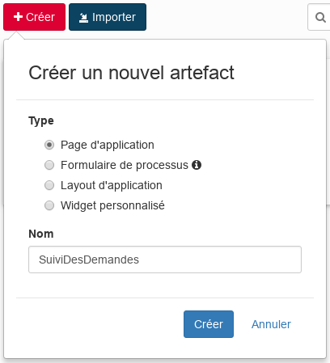
   
   - La vue de conception devrait maintenant être affichée

1. Ajouter un titre à votre page :
   - Glisser le widget **Title** (A) depuis la palette et placer le en haut de la page (B)
   - Sélectionner le widget
   - Dans le panneau de droite entrer *Application de gestion des demandes de congés* dans le champ **Texte**
   - Sélectionner l'option **au centre** pour le paramètre **Alignement**
   
   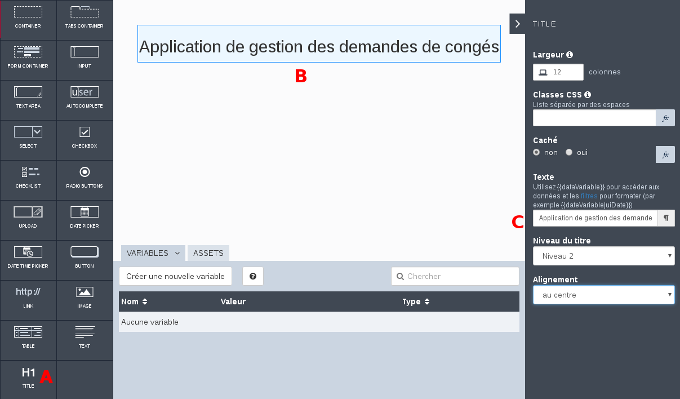

1. Créer une variable pour stocker les informations de session :
   - Cliquer sur **Créer un nouvelle variable**
   - Nommer la *sessionInfo*
   - Choisir le type **External API**
   - Entrer dans le champ **API URL** : `../API/system/session/unusedId`
   
   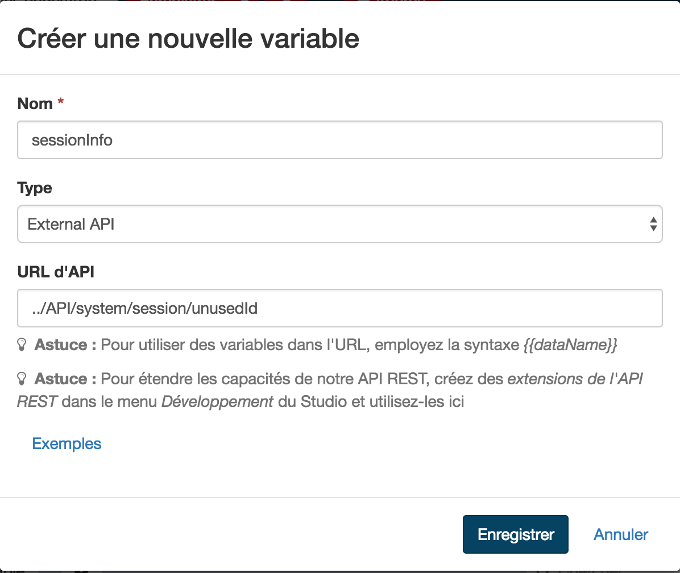

1. Créer une variable pour lister les demandes de congés :
   - Cliquer sur l'icône **Data model** 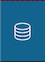
   - Glisser-déposser *DemandeConges* sur la page sous le titre
   - Conserver le nom par défaut : *demandeConges*
   - Dans la section **"Find By" queries on an attribute**, sélectionner *idDemandeur*
   - Dans la section **"Filtrer la requête finByIdDemandeur"** saisir la variable suivante :
   
   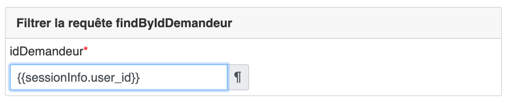
   
   - Cliquer sur le bouton **Enregistrer**.  
   
   Un container multiple est automatiquement généré avec un tableau présentant les attributs de l'objet DemandeConges.

   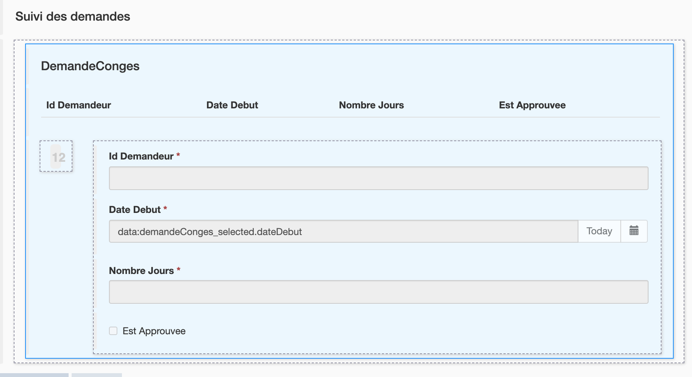

1. Remplacer le sous-titre *"DemandeConges"* du container et les libellés : 
   - Le nommer *Suivi des demandes*
   - Sélectionner l'option **Niveau 4** pour le paramètre **Niveau du titre**
   - Sélectionner l'option **au centre** pour le paramètre **Alignement** 
   - Sélectionner le widget Table
   - Dans le panneau de droite, dans le champ **En-têtes**, supprimer *IdDemandeur*
   - Remplacer *Date Debut* par *Date de début*, *Nombre Jours* par *Nombre de jours* et *EstApprouvée* par *Statut*


1. Déclarer une nouvelle expression JavaScript pour mettre en forme la colonne "Statut" de la liste :
   - Cliquer sur **Créer un nouvelle variable**
   - Nommer la *ajoutLibelleStatutDemandeConges*
   - Choisir le type **JavaScript expression**
   - Remplacer la valeur existante par le script suivant :
   ```javascript
   if($data.hasOwnProperty('demandeConges') && $data.demandeConges) {
     for (let demande of $data.demandeConges) {
       if(demande.estApprouvee)  {
         demande.estApprouveeLabel = "Approuvée";
       } else if(demande.estApprouvee === false) {
         demande.estApprouveeLabel = "Rejetée";
       } else {
         demande.estApprouveeLabel = "En cours";
       }
     }
   }

   return $data.demandeConges;
   ```

1. Afficher l'information dans les colonnes du tableau de façon plus claire :
    - Dans le panneau de droite, dans le champ **Clés des colonnes**, supprimer *idDemandeur*
    - Dans le même champ, remplacer *estApprouvee* par *estApprouveeLabel*
    - Supprimer le widget Input *IdDemandeur* dans le container de détails car cette information n'est pas utile 

1. Sélectionner le widget *Date Debut* et éditer les propriétés suivantes :
   
   
      Propriété | Valeur
      --------- | ------
      Libellé | Date de début
      Format technique de la date | dd/MM/yyyy
      Placeholder | jj/mm/aaaa
      Afficher le bouton Aujourd'hui | non
      
1. Sélectionner le widget *Nombre Jours* et éditer les propriétés suivantes :

      Propriété | Valeur
      --------- | ------
      Libellé | Nombre de jours
      Placeholder | Nombre de jours de congés
      Valeur minimum | 1
   
  
   La page devrait ressembler à cela :
   
   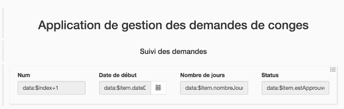
   
   - Vous pouvez à n'importe quel moment pré-visualiser la page en cliquant sur **Aperçu**

   > Astuce : si vous êtes connectés au portail dans le même navigateur, les demandes de congés réelles seront affichés.

1. Ajouter un nouveau form container :
   - Retourner dans l'UI designer pour éditer la page de gestion des demandes de congés
   - Glisser un form container depuis la palette et le placer entre les deux titres

1. Créer une nouvelle variable pour stocker les informations liées à la demande de congés :
   - Cliquer sur **Créer sur une nouvelle variable**
   - Nommer la variable *nouvelleDemandeConges*
   - Choisir le type **Javascript expression**
   - Dans le champ texte **Valeur**, taper le script suivant :
   ```
   var demande = {
     demandeInput : {
       dateDebut : null,
       nombreJours : null,
       idDemandeur : $data.sessionInfo.user_id
     }
   };
   return demande;
   ```

1. Créer une nouvelle variable pour stocker les informations liés au processus :
   - Cliquer sur **Créer une nouvelle variable**
   - Nommer la variable *informationDefinitionProcessus*
   - Choisir le type **External API**
   - Dans le champ **URL d'API**, taper : `../API/bpm/process?p=0&c=100&o=version%20DESC&f=name=DemandeConges`

1. Ajouter deux widgets dans le form container :
   - Un widget **Date picker** avec les options :
     - Largeur : *6*
     - Valeur : `nouvelleDemandeConges.demandeInput.dateDebut`
     - Libellé : *Date de début*
     
   - Un widget **Input** avec les options :
     - Largeur : *6*
     - Valeur : `nouvelleDemandeConges.demandeInput.nombreJours`
     - Libellé : *Nombre de jours*
     - Type : *number*
     - Valeur minimum : *1*

1. Ajouter un bouton pour soumettre le formulaire :
   - Glisser le widget **Button** depuis la palette et placer le dans le form container en dessous des deux widgets
   - Entrer *Créer une nouvelle demande* dans le champ **Libellé**
   - Sélectionner **POST** dans la liste déroulante **Action**
   - Cliquer sur **fx** pour changer le mode du champ **Données envoyés au clic** et taper *nouvelleDemandeConges*
   - Dans le champ **URL à appeler**, taper : `../API/bpm/process/{{informationDefinitionProcessus[0].id}}/instantiation`
   - Dans le champ **URL cible en cas de succès**, taper : `/bonita/apps/demande-conges`
   - Enregistrer les changements
   - La page devrait maintenant ressembler à ceci :
   
   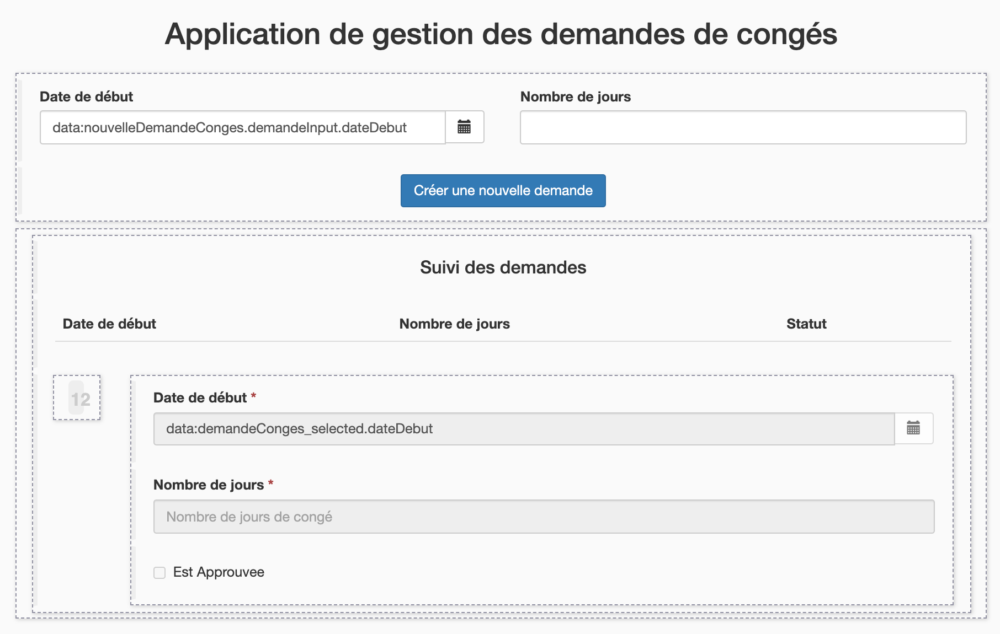
   
   - Vous pré-visualiser la page pour vérifier qu'elle fonctionne correctement

Nous allons maintenant déployer l'application dans le portail depuis le Studio.

1. Ajouter un descripteur d'application :
   - Dans le Studio, dans le menu **Développement/Descripteur d'application** sélectionner **Nouveau**. Un fichier .xml est automatiquement initialisé.
   - Cliquer sur *Ajouter un descripteur d'application*
   - Saisir *demande-conges* dans le champ **Token URL de l'application**
   - Saisir *Application de demande de congés* dans le champ **Nom affiché**
   - Cliquer sur le bouton **Ajouter**
   
   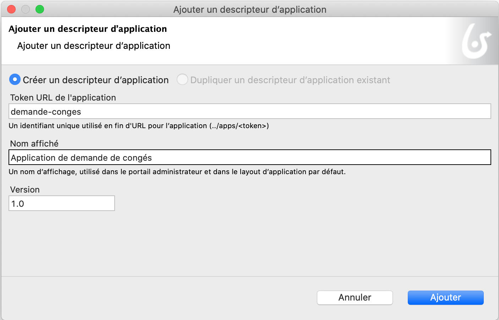
   
1. Créer une nouvelle application :
   - Dans le menu Navigation, cliquer sur *Ajouter une page à menu unique* (A)
   - Saisir *Suivi des demandes* dans le champ **Menu**
   - Sélectionner la page *custompage_SuiviDesDemandes* dans le champ **Page d'application** (B)
   - Saisir *suivi-demandes* dans le champ **Token** (C)  
   
   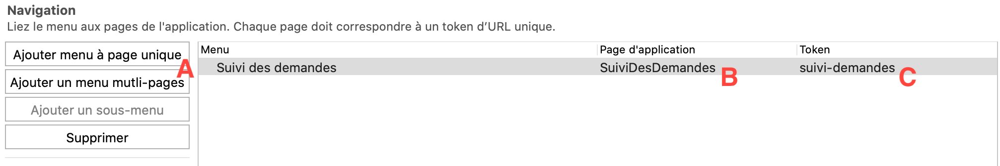
   
1. Définir la page *SuiviDesDemandes* en tant que page d'accueil de l'application :
   - Sélectionner le token *suivi-demandes* dans le Menu **Page d'accueil**
   
   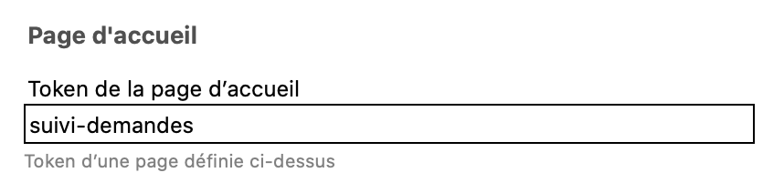
   
   - Enregistrer
   - Vérifier que la page de configuration ressemble à ceci :
   
   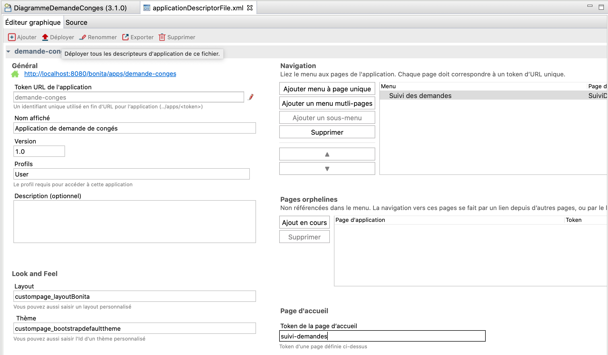
   
1. Déployer l'application dans le portail
   - Cliquer sur le lien *http://localhost:8080/bonita/apps/demand`e-conges* pour accéder à l'application. (A)
   - Une fenêtre de déploiement s'ouvre. Cliquer sur *Déployer* (B) 
   
   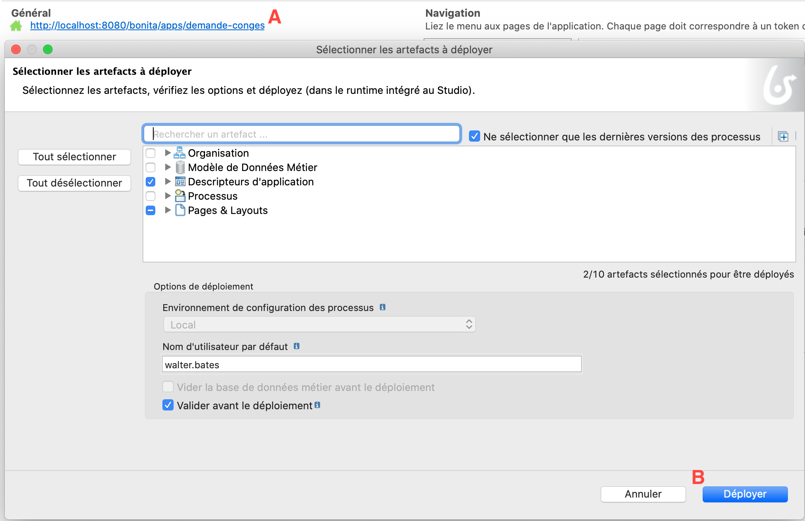
   
   - Pour ouvrir l'application, sélectionner *Application de demande de congés en tant que User*.
   - Cliquer sur *Ouvrir*
   
    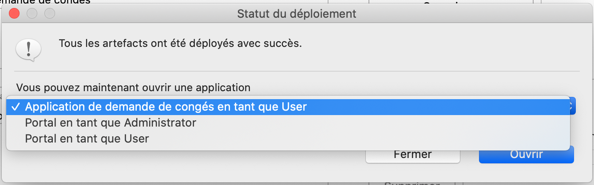
    
 L'application doit ressembler à ça une fois déployée :
 
   
   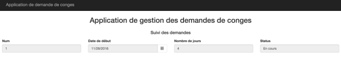

