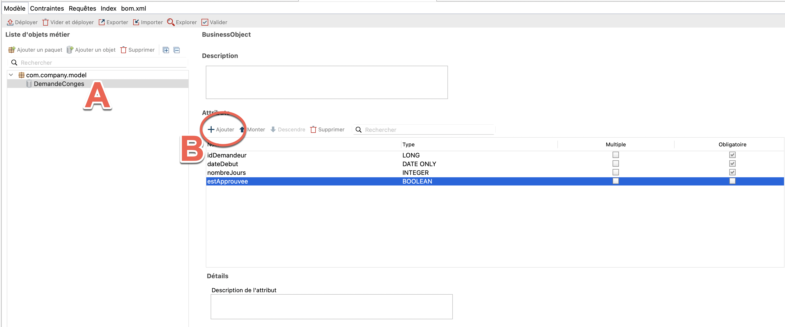
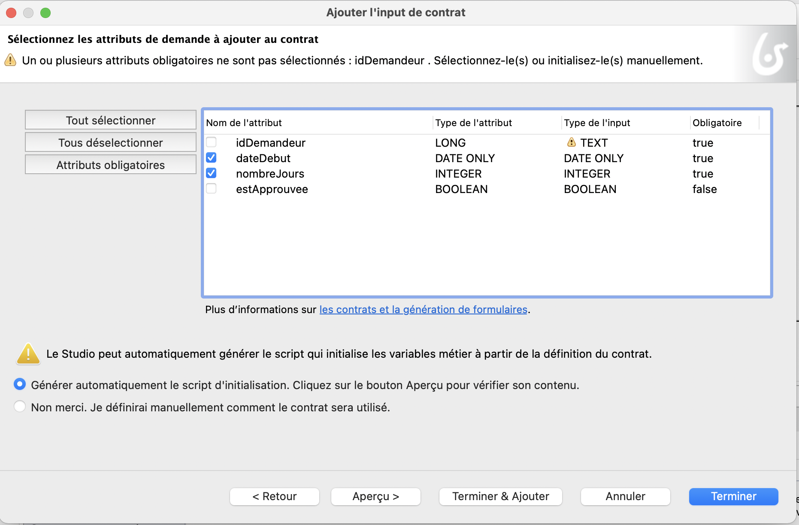
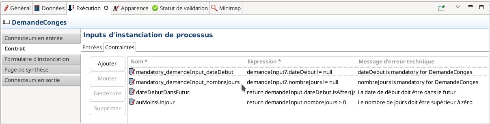
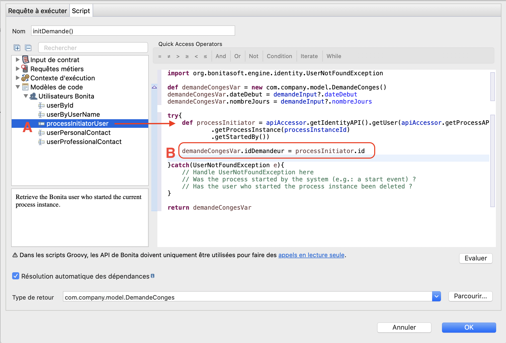
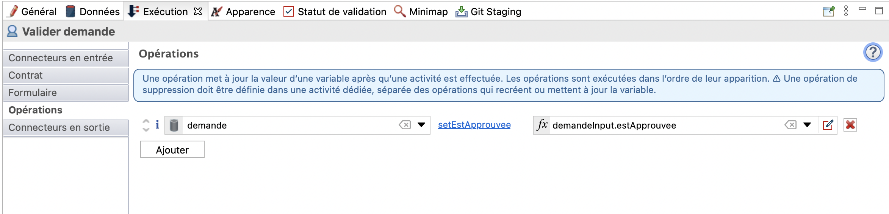

## Objectif

L'objectif de cet exercice est d'enrichir le processus de demande de congés en :

1. Ajoutant un événement de type "timer" dans le processus.
1. Spécifiant des contraintes sur les contrats pour l'instanciation du processus et l'exécution des étapes humaines

Une fois complété, les formulaires générés automatiquement prendront en compte ces contraintes.

> ⚠ Il est important de respecter strictement la casse et la syntaxe des noms techniques fournis dans les instructions.

## Instructions résumées

Dupliquer le diagramme de processus de l'exercice précédent pour créer une version 4.1.0.

Ajouter les deux contraintes suivantes sur le contrat d'instanciation :

-   *dateDebut* doit être dans le futur
-   *nombreJours* doit être strictement supérieur à zéro

Initialiser le BDM *demande* en utilisant la génération automatique à partir du contrat.

Ajouter un contrat sur l'étape *Valider demande* en utilisant l'assistant avec l'élément suivant :

-   estApprouvee

## Instructions pas à pas

1. Dupliquer le diagramme de processus existant pour créer une version *2.0.0* :
   - Dans le menu supérieur du Studio, cliquer sur **Fichier / Dupliquer le diagramme...**
   - Mettre à jour les numéros de version du diagramme ET du processus (pool)
1. Créer le BDM *DemandeConges* :
   - Naviguer dans le menu **Développement / Modèle de Données Métier / Définir...** L'éditeur de Modèle de données métier s'ouvre.
   - Renommer l'objet initialisé par défaut **BusinessObject** dans la liste d'objets métiers en *DemandeConges* (A) (il s'agit d'un nom technique, il faut donc omettre les espaces, accents et autres caractères spéciaux)
   - Avec l'objet *DemandeConges* sélectionné, ajouter les attributs suivants (B) :

    Nom | Type | Multiple | Obligatoire
    --- | ---- | -------- | -----------
    *idDemandeur* | `Long` | ◻ | ☑
    *dateDebut* | `Date only` | ◻ | ☑
    *nombreJours* | `Integer` | ◻ | ☑
    *estApprouvee* | `Boolean` | ◻ | ◻

    
    
    - Sauvegarder. Le message suivant s'affiche pour indiquer qu'il faut déployer le BDM
    
    
    
    - Cliquer sur le bouton  dans l'éditeur de BDM pour déployer le BDM.  
    Le message suivant indique que le BDM a été déployé avec succès.
    
    
    
    - Cocher l'option **Ne plus me montrer ce message**
    - Cliquer sur **Ok**
1. Déclarer une variable métier de type *DemandeConges* dans le processus :
   - Sélectionner le pool du processus
   - Naviguer dans l'onglet **Données / Variables du pool**
   - Cliquer sur **Ajouter...** dans la section **Variables métier**
   - Nommer la variable *demande* et sélectionner le type d'objet métier *com.company.model.DemandeConges*
   - Cliquer sur **Terminer**
   
   
   
1. Configurer le contrat d'instanciation :
   - Sélectionner le pool de processus
   - Naviguer dans l'onglet **Exécution / Contrat / Entrées**
   - Cliquer sur le bouton **Ajouter à partir de données...**
   - Sélectionner la variable métier *demande*
   - Garder le nom par défaut *demandeInput*
   - Cliquer sur **Suivant**
   - Décocher les attributs *idDemandeur* et *estApprouvee*
   
   
   
   - Cliquer sur **Terminer** (pas sur **Terminer & Ajouter**) et ignorer les messages d'avertissement concernant l'initialisation partielle de la variable métier
   
   
   
   - Toujours dans l'onglet **Exécution / Contrat**, basculer dans l'onglet **Contraintes**
   - Ajouter la contrainte suivante :

   Propriété | Valeur
   --------- | ------
   Nom         | dateDebutDansFutur
   Expression  | `demandeInput.dateDebut.isAfter(java.time.LocalDate.now())`
   Message d'erreur | La date de début doit être dans le futur

   - Ajouter une seconde contrainte :

   Propriété | Valeur
   --------- | ------
   Nom         | auMoinsUnJour
   Expression  | `demandeInput.nombreJours > 0`
   Message d'erreur | Le nombre de jours doit être supérieur à zéro

   
   
1. Modifier l'initialisation de la variable métier *demande* pour pouvoir récupérer l'initiateur de la nouvelle demande :
   - Sélectionner le pool du processus et naviguer dans l'onglet **Données / Variables du pool**
   - Sélectionner la variable *demande*
   - Cliquer sur **Modifier...**
   - Cliquer sur l'icône **crayon** associé au champ **Valeur par défaut** pour ouvrir l'éditeur d'expression. Le script a déjà été initialisé.
   - Dans le menu de gauche, sélectionnez **Modèles de code/Utilisateurs Bonita** (A) et faites glisser le modèle *processInitiatorUser* avant la dernière ligne commençant par `return
     Le script permettant de récupérer l'instance du processus et l'initiateur est créé automatiquement.
   - Saisissez `demandeCongesVar.idDemandeur = processInitiator.id` pour récupérer l'id de l'initiateur de l'instance dans l'attribut *idDemandeur* (B).
   
   
   
   - Le script va initialiser la variable métier en utilisant les données du contrat et l'identifiant de l'auteur de la demande
   - Cliquer sur le bouton **OK** pour fermer l'éditeur d'expression
   - Cliquer à nouveau sur le bouton **OK** pour valider la modification de la variable métier
1. Configurer le contrat de l'étape *Valider demande* :
   - Sélectionner l'étape *Valider demande*
   - Naviguer dans l'onglet **Exécution / Contrat / Entrées**
   - Cliquer sur le bouton **Ajouter à partir de données...**
   - Sélectionner la variable métier *demande*, garder le nom de l'input par défaut *demandeInput*
   - Cliquer sur **Suivant**
   - Sélectionner seulement l'attribut *estApprouvee*
   - Cliquer sur **Terminer** (et pas sur **Terminer & Ajouter**) et ignorer les messages d'avertissement concernant l'initialisation partielle de la variable métier
1. Noter qu'une opération (**Exécution / Opérations**) sur la tâche *Valider demande* pour mettre à jour la demande a automatiquement été générée

   
   
1. Configurer la condition sur la transition *Oui* à partir de l'attribut *estApprouvee* du BDM *demande* :
   - Sélectionner la transition *Oui*
   - Naviguer dans l'onglet **Général / Général**
   - Cliquer sur l'icône crayon à côté du champ **Condition** pour ouvrir l'éditeur d'expression
   - Dans l'éditeur d'expression, sélectionner **Java** comme type d'expression
   - Sélectionner la variable *demande* et la méthode *isEstAprouvee*
   
   
   
1. Enregistrer le processus :
   - Cliquer sur le bouton **Enregistrer** de la barre de menu supérieur du Studio
1. Exécuter le processus et tester les contraintes des contrats :
   - Lancer le processus et remplir les formulaires automatiquement générés

> ℹnformation :
> - pour le champ *dateDebut*, le format de date attendu est AAAA-MM-JJ
> - pour le champ *estApprouvee*, une valeur booléenne est attendue : soit `true` ou `false`

   

[Exercice suivant : création de formulaires](03-forms.md)
