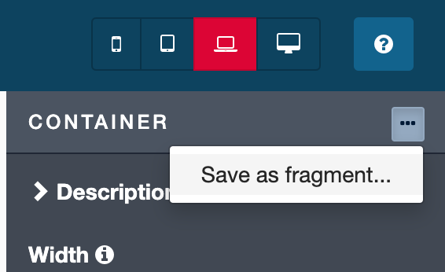
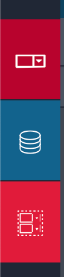
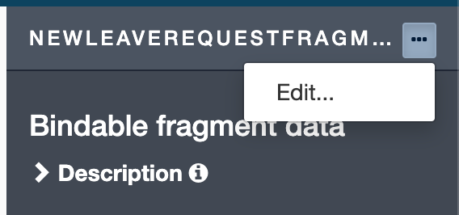
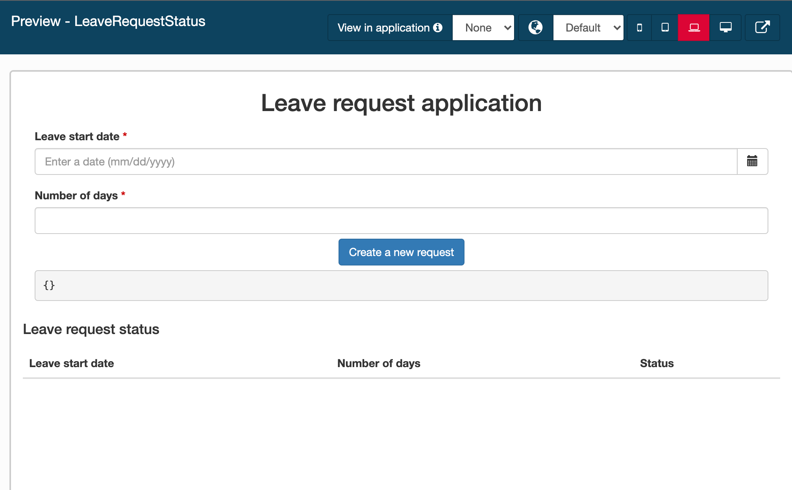
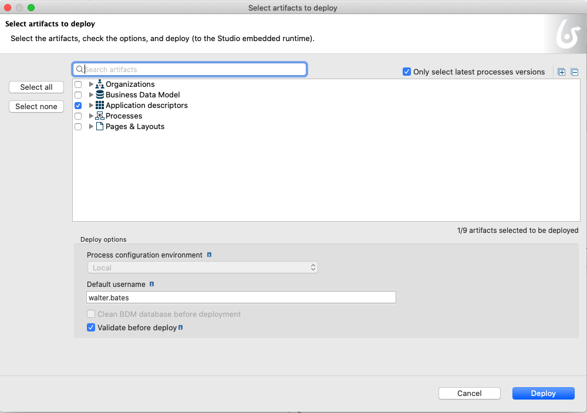
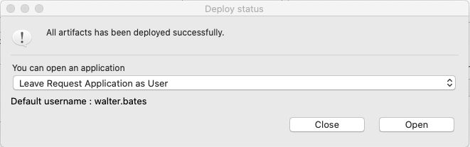

## Objectif

L'objectif de cet exercice est de créer un fragment avec l'information d'une demande de congés pour être réutilisé dans différentes pages d'une façon simple.

## Instructions résumées

Ouvrez l'UI Designer et allez sur la page *SuiviDesDemandes*.

Cette page contient déjà un "conteneur répétable" qui liste les demandes de congés en cours. Nous allons configurer ce conteneur pour l'enrichir. Pour chaque demande, un statut clair sera affiché.

Créez un fragment contenant un widget de date et un widget d'entrée pour collecter de nouvelles informations de demande de congé dans la page. Utilisez ce fragment dans la page et liez ses données.
Ajoutez ensuite un bouton Soumettre pour lancer une nouvelle demande de congé.

Redéployez la page de l'application à l'aide du bouton **Déployer** du descripteur de l'application dans Bonita Studio.

Accédez à l'application à l'aide de l'URL générée.

## Instructions pas à pas

1. Allez sur la page *SuiviDesDemandes*:
   - Dans le Studio, cliquez sur le bouton **UI Designer**.
   - Sélectionnez la page *SuiviDesDemandes* dans l'onglet **Pages**.
   - Vous devriez maintenant être sur la page du designer.
   
2. Créez un fragment à partir du formulaire *remplirDemandeConges*  qui sera réutilisé dans la page :
    - Dans le form *remplirDemandeConges*, sélectionnez le conteneur avec les 2 widgets *Date Debut* et *Nombre Jours*.
    - Dans le panneau de droite, cliquez sur **...** et sélectionnez **Enregistrer en tant que fragment**.  
 
    - Nommez-le *nouvelleDemandeFragment*.
    - Cliquez sur **Enregistrer**. Un nouvel onglet de menu apparaît sur le côté gauche de UI Designer.  
   
    - Enregistrez le formulaire et revenez à la page d'accueil de l'UI Designer.  
   
3. Ajoutez le fragment dans le conteneur de formulaire et configurez-le:
    - Faites glisser et déposez le *nouvelleDemandeFragment* du menu de gauche vers le conteneur de formulaire.
    - Sélectionnez le fragment et cliquez sur **Modifier...** pour configurer les variables du fragment.  
      
    - Cliquez sur **Créer une nouvelle variable**.
    - Nommez-le *dataExt*.
    - Cliquez sur **Oui** pour exposer les données du fragment à la page et **Enregistrer** la variable. 
    - Sélectionnez le widget *DatePicker*.
    - Dans le champ *Value* remplacer *formInput* par *dataExt*. 
    - Sélectionnez le widget *Input* et remplacez formInput par *dataExt* dans le champ *Value*. 
    - Cliquez sur **Enregistrer**.

4. Bindez les données du fragment aux données de la page.
5. Retournez à la page *SuiviDesDemandes*.
6. Dans le panneau de configuration, dans *Bindable fragment data* ajouter la variable *nouvelleDemandeConges*.
   - Enregistrer la page.
   - Cliquez sur **Overview**.
   - La page devrait ressembler à ça :
   
   
7. Déployez à nouveau l'application depuis le Bonita Studio :
   - Cliquez sur le bouton **Déployer**.
   - Une fenêtre de déploiement s'ouvre. Cliquez sur *Déployer*. 
   
   
   
   - Pour ouvrir l'application, sélectionnez *Application de demande de congés en tant qu'utilisateur*.
   - Cliquez sur *Ouvrir*.
   
    

L'application devrait ressembler à ceci une fois déployée :
 
   
      

Et c'est tout!
