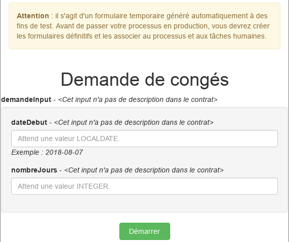

## Objectif

L'objectif de cet exercice est d'enrichir le processus de demande de congés en spécifiant des contraintes sur les contrats pour l'instanciation du processus et l'exécution des étapes humaines

Une fois complété, les formulaires générés automatiquement prendront en compte ces contraintes.

> ⚠ Il est important de respecter strictement la casse et la syntaxe des noms techniques fournis dans les instructions.

## Instructions résumées

Dupliquer le diagramme de processus de l'exercice précédent pour créer une version 4.1.0.

Ajouter les deux contraintes suivantes sur le contrat d'instanciation :

-   *dateDebut* doit être dans le futur
-   *nombreJours* doit être strictement supérieur à zéro

## Instructions pas à pas

1. Dupliquer le diagramme de processus existant pour créer une version *4.1.0* :
   - Dans le menu supérieur du Studio, cliquer sur **Fichier / Dupliquer le diagramme...**
   - Mettre à jour les numéros de version du diagramme ET du processus (pool)
   
1. Configurer le contrat d'instanciation :
   - Dans l'onglet **Exécution / Contrat**, basculer dans l'onglet **Contraintes**
   - Ajouter la contrainte suivante :

   Propriété | Valeur
   --------- | ------
   Nom         | dateDebutDansFutur
   Expression  | `demandeInput.dateDebut.isAfter(java.time.LocalDate.now())`
   Message d'erreur | La date de début doit être dans le futur

   - Ajouter une seconde contrainte :

   Propriété | Valeur
   --------- | ------
   Nom         | auMoinsUnJour
   Expression  | `demandeInput.nombreJours > 0`
   Message d'erreur | Le nombre de jours doit être supérieur à zéro

   

   
1. Enregistrer le processus :
   - Cliquer sur le bouton **Enregistrer** de la barre de menu supérieur du Studio
1. Exécuter le processus et tester les contraintes des contrats :
   - Lancer le processus et remplir les formulaires automatiquement générés

> ℹnformation :
> - pour le champ *dateDebut*, le format de date attendu est AAAA-MM-JJ
> - pour le champ *estApprouvee*, une valeur booléenne est attendue : soit `true` ou `false`

   

[Exercice suivant : ajout d'acteur filter](09-extensions.md)
