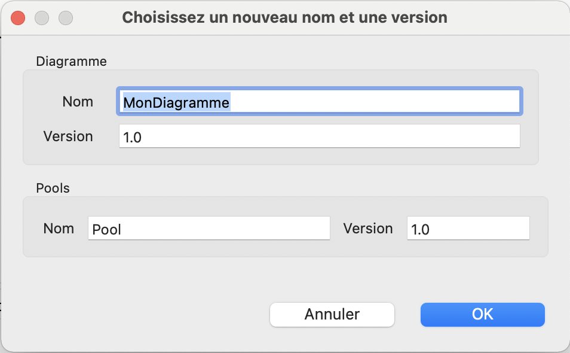
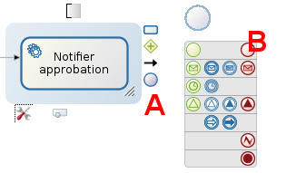

## Objectif

L'objectif de cet exercice est de récupérer les informations des instances déjà executées et archivées. Ces données sont aussi appelées données d'execution de processus. Elles permettront par la suite de les analyser afin d'optimiser le processus.

## Instructions simples

1. Créer un diagramme *"ExtractionDonnees"* contenant un pool *"ExtractorDonnees"* en version *"1.0.0"*.

1. Insérer dans la défintion du processus les éléments BPMN suivants :
    - Un événement de début *"Choisir processus"*
    - Une tâche automatique *"Récupérer instances terminées"*
    - Une tâche automatique *"Traiter données"*
    - Une tâche automatique *"Génerer CSV"*
    - Un événement de fin *"Fin d'extraction"*

1. Générer une interface d'instantiation qui affiche la liste des processus disponibles
1. Recupérer les instances terminées du processus choisi
1. Formater les données en les séparant par *;* afin de récupérer les éléments suivantes séparés par :
    - *"processInstanceId"*
    - *"completeTime"*
    - *"activityName"*
    - *"activityId"*
    - *"actorId"*
1. Générer un CSV

## Instructions pas-à-pas

   
### Créer un diagramme *"DiagrammeExtractionDonnees"* contenant un pool *"ExtractionDonnees"* en version *"1.0.0"*.

1. Créer un nouveau diagramme de processus 
   - Soit depuis la vue d'ensemble du projet, section _Diagramme de processus_, en cliquant sur **Créer**, puis à nouveau sur **Créer un nouveau diagramme de processus**
     
   - Soit depuis la *Cool Bar*, bouton *Nouveau*, en cliquant sur **Diagramme de processus**
    
     
1. Spécifier le nom et la version du diagramme et du processus :
   - Dans l'explorateur de projet à gauche, faire un clic droit sur le nom du diagramme *MonDiagramme-1.0.proc*, puis cliquer sur **Renommer**
   - Pour le diagramme, entrer *"DiagrammeExtractionDonnees"* pour le *Nom* et *"1.0.0"* pour la *Version*
   - Pour la définition de processus, entrer *"ExtractionDonnees"* pour le *"Nom"* et *"1.0.0"* pour la *Version* 
   - Cliquer sur **OK**  
   

### Insérer dans la défintion du processus les éléments BPMN 

1. Renommer l'événement de démarrage :
   - Sélectionner l'événement de démarrage présent dans le diagramme
   - Cliquer sur son nom, puis entrer *"Choisir processus"* 
   - Faire "Entrée" sur le clavier ou cliquer hors du champ de saisie pour valider la saisie

1. Créer une tâche automatique "Récupérer instances terminées" à partir de la l'événement de démarrage :
   - Depuis l'événement de démarrage sélectionné, cliquer sur l'icon contextuel de tâches (A), puis effectuer un glisser-déposer vers la droite  
   
   - Une fois la tâche automatique créée, la renommer en *"Récupérer instances terminées"* 

  1. A la suite de la tâche automatique *Récupérer instances terminées*, ajouter une nouvelle tâche automatique *"Formater données"* :
    - Sélectionner la tâche automatique *Récupérer instances terminées*
    - Cliquer sur l'icon contextuel d'événements (A), faire un glisser - déposer vers la droite puis sélectionner l'événement de fin (B)  
    
    - Une fois l'événement crée, le renommer en *"Fin - Demande approuvée"*

1. A partir de la tâche automatique *"Formater données"*, créer une autre tâche automatique *"Génerer CSV"*
1. De même, à la suite de la tâche automatique *"Génerer CSV"*, ajouter un événement de terminaison *"Fin d'extraction"

### Générer une interface d'instantiation qui affiche la liste des processus disponibles
 
   
1. De même, à la suite de la tâche automatique *Notifier refus*, ajouter un événement de terminaison *"Fin - Demande refusée"

1. Nommer les 2 transitions entre la porte logique et les tâches automatiques :
   - Sélectionner la transition menant à l'étape *Notifier approbation*
   - Dans la zone de propriétés, en bas de l'écran, onglet *Général*, sous-onglet *Général*, entrer le nom *"Oui"*.
   - Répéter pour l'autre transition qui se nommera *"Non"*, pour répondre à la question posée dans la porte logique ("Demande approuvée ?")
   - La validation de la saisie est automatique. Vous pouvez cliquer ailleurs, et la nouvelle valeur est enregistrée
   
1. Configurer la *condition* sur la transition *Oui* pour que le flot suive cette branche :
   - Sélectionner la transition
   - Dans la zone de propriétés, mêmes onglet et sous-onglet, propriété *Condition* : entrer la valeur *"true"* (cas peu réaliste d'une condition toujours vraie, mais utile pour l'exercice). Si vous ne voyez pas le champ *Condition*, c'est probablement parce que la porte logique est parallèle, et non exclusive. Voir "Ajouter une porte logique ..." ci-dessus.
   
   
1. Configurer la transition *Non* en tant que flux par défaut :
   - Sélectionner la transition *Non*
   - Dans l'onglet *Général* et sous-onglet *Général*, cocher la case **Flux par défaut**
   
1. Mettre à jour la validation du diagramme :
   - Cliquer sur l'onglet **Statut de validation**
   - Cliquer sur le bouton **Rafraîchir**
   - Ignorer les 3 avertissements concernant les formulaires. Nous nous en occuperons plus tard
   
1. Vous pouvez, si vous le souhaitez, réajuster la position des éléments et la forme des transitions pour améliorer l'esthétique et la lisibilité du diagramme

1. Vérifier que le diagramme ressemble à ceci :  
   
   
1. Enregistrer le processus :
   - Ctrl + S ou bien clique-droit sur le diagramme puis séléctionner **Enregistrer**
   
1. Exécuter le processus pour le tester :
   - Sélectionner la définition du processus (élément *Pool* qui contient tous les autres éléments)
   - Cliquer sur le bouton  de la Cool Bar. Si le bouton est désactivé, assurez-vous que le pool est bien sélectionné.
   - Votre navigateur s'ouvre et présente un formulaire (généré automatiquement à des fins de test) 
   - Soumettre le formulaire. Cette action crée une nouvelle instance du processus.
   - L'affichage passe à la liste des tâches de la Bonita User Application
   - Sélectionner la tâche *Valider demande*
   - Cliquer sur **Prendre** en haut à droite de l'écran  
   
   - Soumettre le formulaire de l'étape *Valider demande* en cliquant sur le bouton **Exécuter**. Cette action termine le cas

[Exercice suivant : ajout d'une minuterie à la tâche de validation](02-timers.md)
